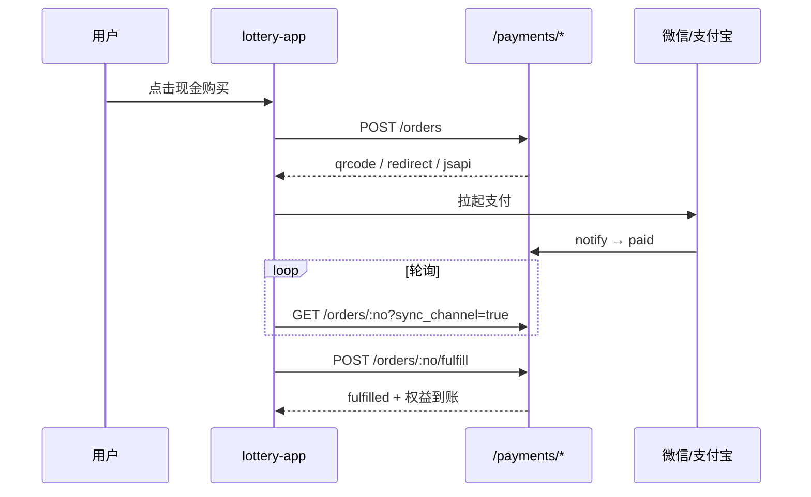

# 更新日志 — C 端支付按钮接入与业务履约

> **日期**：2026-05-27  
> **标签**：`payment-frontend-v1`  
> **范围**：对照《支付相关前端按钮审计报告》，补齐 C 端现金支付拉起、支付成功后业务履约，及接入文档更新  
> **前置依赖**：`changelog/2026-05-27-支付模块封装与后端接入.md`（`payment-module` + 后端 `/api/v1/payments/*` 网关）

---

## 概述

本次更新落实审计报告中的 **P0 / P1** 项：在 `PAYMENT_ENABLED=true` 时，首充礼包、月卡、现金商店、付费战令走 `POST /api/v1/payments/orders` 收银台（扫码 / H5 / 微信 JSAPI），支付成功后由前端轮询查单并调用 **`POST /api/v1/payments/orders/:orderNo/fulfill`** 发放权益。

支付未启用时行为与改造前一致（积分购买、免费首充 `claim` 等），不破坏现有主流程。

---

## 一、支付模块扩展（`payment-module`）

| 变更 | 说明 |
|------|------|
| `PaymentOrderRecord.fulfilledAt` | 记录业务履约完成时间 |
| 订单状态 `fulfilling` / `fulfilled` | 与 `paid` 区分，支持幂等履约 |
| `MemoryOrderStore.beginFulfillment` / `completeFulfillment` | 履约过程状态推进 |
| `PaymentModule` 暴露上述方法 | 供后端网关调用 |

---

## 二、后端：业务履约

### 2.1 新增接口

| 方法 | 路径 | 鉴权 | 说明 |
|------|------|------|------|
| `POST` | `/api/v1/payments/orders/:orderNo/fulfill` | Bearer | 支付订单 `paid` 后发放游戏内权益（幂等） |

实现文件：

- `backend-server/app/api/v1/payments/orders/[orderNo]/fulfill/route.ts`
- `backend-server/src/server/payment-fulfillment.ts`

### 2.2 支持的 `business_type`

| `business_type` | `business_id` | 履约行为 | 金额校验 |
|-----------------|---------------|----------|----------|
| `first_recharge_pack` | 礼包 ID | `claimFirstRechargeByUserId`（不扣积分） | 以订单 `amount_cents` 为准 |
| `membership` | `monthly` 等卡型 | `grantMonthCardByUserId` | 月卡须为 **2800** 分 |
| `shop_item` | 商店道具 ID | `grantShopItemByUserId`（不扣积分） | — |
| `battle_pass` | 赛季 ID（字符串） | `grantBattlePassByUserId` | 须为 **6800** 分 |
| `points_pack` | 档位 ID | `grantPointsPackByUserId` | 按 `amount_cents` 充值积分 |

### 2.3 领域层 grant 方法（不扣积分）

`memory-store.ts` / `lottery-service.ts` 新增或复用：

- `grantMonthCard`、`grantShopItem`、`grantBattlePass`、`grantMemberPoints`
- `claimFirstRechargeByUserId`、`grantMonthCardByUserId`、`grantShopItemByUserId`、`grantBattlePassByUserId`、`grantPointsPackByUserId`

### 2.4 错误码

| code | 场景 |
|------|------|
| `payment_not_paid` | 订单未支付即请求履约 |
| `payment_forbidden` | 非本人订单 |
| `payment_amount_mismatch` | 月卡/战令金额与约定不符 |
| `unsupported_business_type` | 未知业务类型 |
| `payment_disabled` | `PAYMENT_ENABLED=false` |

### 2.5 回调与履约分工

渠道异步通知（`/wechat/notify`、`/alipay/notify`）仅将订单更新为 **`paid`**，**不**在回调内履约（无用户 Token）。C 端在用户完成支付后：**轮询查单 → `fulfill`**。

---

## 三、前端：支付客户端与 C 端 UI

### 3.1 新增文件

| 路径 | 说明 |
|------|------|
| `front-page/src/types/payment.ts` | 收银台、订单、渠道类型 |
| `front-page/src/client/payment-api.ts` | `config/public`、建单、查单、轮询、`fulfill` |
| `front-page/src/client/payment-checkout.ts` | `runPaymentCheckout`（H5 / JSAPI / 二维码）、`resumePendingPayment` |

### 3.2 `lottery-app.tsx` 按钮行为（`paymentEnabled` 时）

| 审计项 | 页面 | 按钮 | 改造后 |
|--------|------|------|--------|
| P0 | 商店 | 领取礼包（首充） | `cash_price > 0` → 现金支付 + `first_recharge_pack` 履约 |
| P0 | 会员 | 购买月卡 | `membership` / `monthly`，2800 分；未启用仍走积分 `month-card/buy` |
| P0 | 商店 | 购买（道具） | 展示 `price_cash`；现金 / 积分分按钮 |
| P1 | 会员 | 购买战令（原缺失） | 新增按钮：`battle_pass` 6800 分或积分 `battle-pass/buy` |
| P1 | 系列详情 | 单抽 / 十连 | **仍为积分**；新增「现金充值积分」入口（`points_pack`） |

### 3.3 支付流程（C 端）



电脑端：弹层展示二维码（`api.qrserver.com` 生成图片）；手机端：H5 跳转或微信 JSAPI。

---

## 四、文档更新

| 文件 | 变更 |
|------|------|
| `docs/payment-module-integration.md` | 新增 §4.6 履约 API；§5 改为 `payment-api` / `payment-checkout` 示例；联调清单增加 `fulfill` 步骤 |

---

## 五、验证

```bash
# 支付模块
cd payment-module && npm run build && npm test

# 类型检查
cd backend-server && npm run typecheck
cd front-page && npm run typecheck
```

### 本地联调（mock）

1. `payment-module` 已 `npm run build`
2. `backend-server/config/payment.config.json` 自 example 复制，`mock: true`
3. `.env.local`：`PAYMENT_ENABLED=true`、`PAYMENT_CONFIG_PATH=config/payment.config.json`
4. 登录 C 端 → 首充 / 月卡 / 现金商店 → 扫码或 mock notify → 确认权益到账

Mock 回调示例见 `docs/payment-module-integration.md` §8。

---

## 六、已知限制（与审计报告一致）

| 项 | 状态 |
|----|------|
| 抽盒单抽/十连 | 仍仅扣积分；未做「余额不足自动拉起支付」 |
| 限时抢购 | 仍仅积分（P2，待产品确认） |
| `cash_balance` / 钱包页 | C 端仍未展示 |
| 订单存储 | `payment-module` 内存仓储，进程重启丢失 |
| 生产 | 需 `mock: false`、HTTPS 回调、MySQL 落库（见 `docs/payment-module-design.md`） |

---

## 七、文件清单（主要变更）

```
payment-module/src/types.ts                          # fulfilledAt、状态
payment-module/src/store/memory-order-store.ts       # 履约状态机
payment-module/src/core/payment-service.ts           # begin/complete fulfillment

backend-server/src/server/payment-fulfillment.ts     # 新增
backend-server/src/server/memory-store.ts            # grant* 方法
backend-server/src/server/lottery-service.ts         # *ByUserId 门面
backend-server/src/server/errors.ts                  # payment_* 错误
backend-server/app/api/v1/payments/orders/[orderNo]/fulfill/route.ts  # 新增

front-page/src/types/payment.ts                      # 新增
front-page/src/client/payment-api.ts                 # 新增
front-page/src/client/payment-checkout.ts            # 新增
front-page/src/features/lottery/lottery-app.tsx      # 支付按钮接入

docs/payment-module-integration.md                   # 履约与前端封装
changelog/2026-05-27-C端支付按钮接入与业务履约.md     # 本文件
```

---

## 八、与上一版 changelog 的关系

| 文档 | 内容 |
|------|------|
| `2026-05-27-支付模块封装与后端接入.md` | 独立包 + 后端收银台/回调 API，**无** C 端 UI |
| **本文件** | C 端按钮 + `fulfill` 履约，闭合「收款 → 发权益」链路 |
