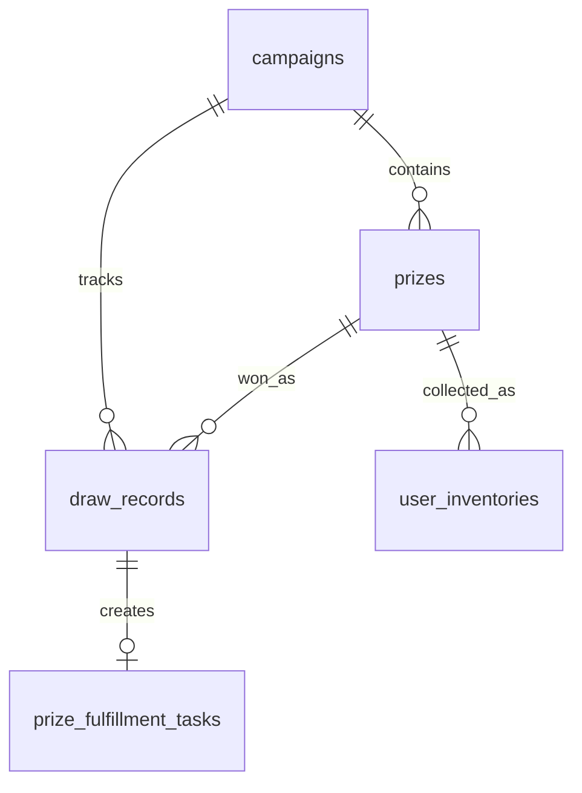
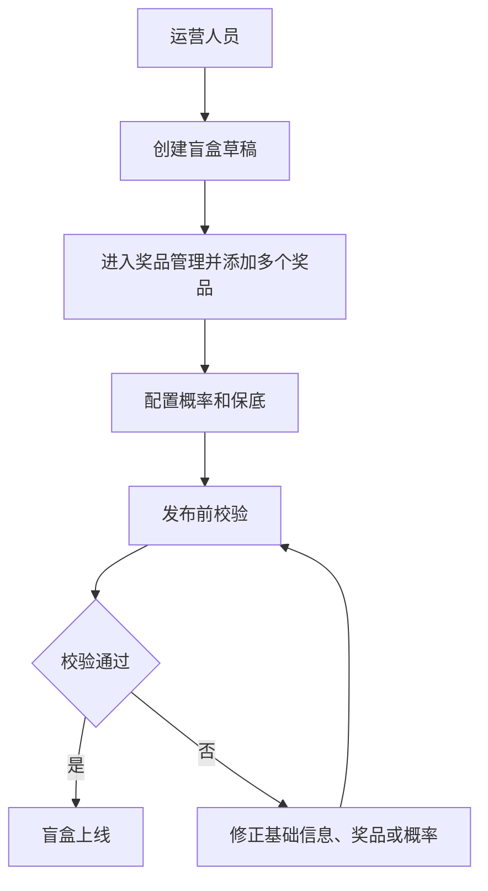
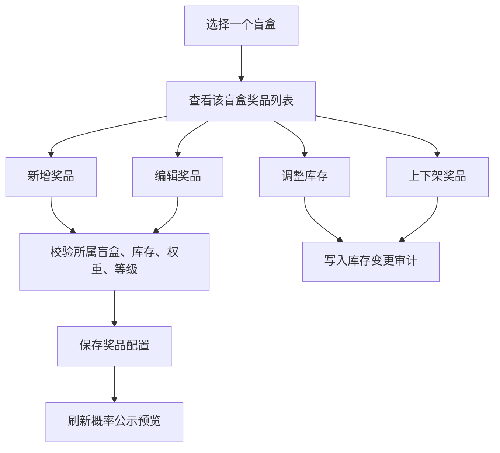
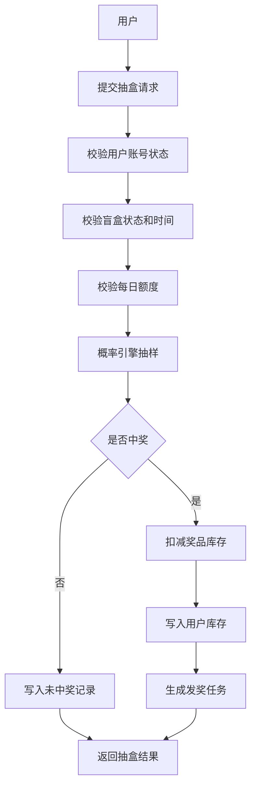
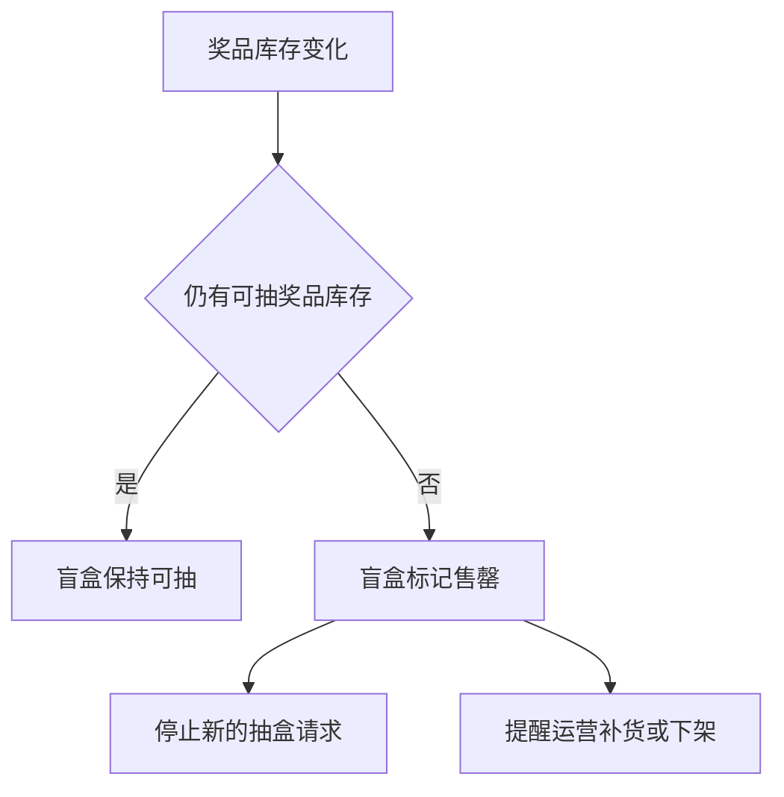

# 盲盒管理模块设计文档

> 文档版本：v1.0  
> 生成日期：2026-05-26  
> 适用范围：管理端盲盒管理、奖品管理、概率配置、抽奖记录、发奖履约与生产化演进

## 1. 背景与目标

盲盒管理模块用于支撑运营人员在后台完成盲盒系列的配置、上架、奖品维护、概率管理、库存监控、抽奖记录查看与发奖履约。现有代码中“盲盒”主要由 `Campaign` 承载，前端管理端暂展示为“活动管理”；“奖品”由 `Prize` 承载，前端管理端暂展示为“礼品管理”。

本文档在现有文档和代码基础上收敛后台设计，并明确一个核心关系：

- 一个盲盒对应多个奖品。
- 一个奖品只归属于一个盲盒。
- 管理端入口按“盲盒管理 > 奖品管理”组织，奖品管理是盲盒管理的子项。

## 2. 设计依据

本设计对齐以下现有资料和实现：

- `docs/modules.md`：定义用户端、管理端、后端模块边界。
- `docs/api-design.md`：定义 `/api/v1` 用户端与管理端接口。
- `docs/database-design.md`：定义生产化逻辑表结构和抽盒事务边界。
- `产品功能设计文档.md`：定义盲盒平台定位、管理端能力、概率体系和合规要求。
- `backend-server/src/server/types.ts`：后端 `Campaign`、`Prize`、`PityConfig`、`DrawRecord`、`FulfillmentTask` 等类型源。
- `front-page/src/types/api.ts`：前端共享 API 类型。
- `front-page/src/features/admin/admin-app.tsx`：当前管理端页面结构。
- `backend-server/app/api/v1/[...path]/route.ts`：当前 `/api/v1/**` 路由分发。
- `backend-server/src/server/lottery-service.ts`：当前业务服务编排。
- `backend-server/src/server/memory-store.ts`：当前内存态数据存储和种子数据。

## 3. 模块定位与边界

盲盒管理是管理端的核心运营模块，负责管理用户可抽取的盲盒系列。奖品管理是盲盒管理下的子项，负责维护该盲盒内可被抽中的多个奖品款式。

模块内包含：

- 盲盒系列管理：基础信息、状态、上下架时间、每日抽取限制、展示资源、发布校验。
- 奖品管理：奖品款式、等级、库存、权重、图片、排序、上下架、批量导入、变更审计。
- 概率配置：未中奖权重、软保底、硬保底、UP 池、概率公示。
- 库存管理：奖品库存、低库存预警、售罄联动、库存调整记录。
- 抽奖记录：按用户、盲盒、奖品、结果、时间筛选抽奖日志。
- 发奖履约：中奖后生成履约任务，支持审核、发货、驳回、备注和物流信息。
- 统计分析：抽取次数、中奖次数、奖品消耗、库存消耗、概率偏离、转化表现。

模块外依赖：

- 用户管理：用户状态、账号封禁、冻结和手机号绑定。
- 积分与资产：抽盒消耗、积分流水、用户库存。
- 认证与权限：管理员登录、后台角色权限。
- 审计与风控：操作日志、异常抽取、敏感操作审批。

## 4. 核心数据关系

### 4.1 一对多关系

一个盲盒对应多个奖品，奖品必须挂载在某一个盲盒下。数据上表现为：

- `campaigns.id` 是盲盒主键。
- `prizes.campaign_id` 指向所属盲盒。
- `campaigns ||--o{ prizes` 表示一个盲盒拥有零个或多个奖品。
- 发布上线时，一个盲盒必须至少拥有一个可抽取奖品。

### 4.2 命名映射

当前实现中存在产品命名和代码命名差异，文档统一如下：

- 产品侧“盲盒”对应代码中的 `Campaign`。
- 产品侧“奖品”对应代码中的 `Prize`。
- 当前管理端“活动管理”后续建议更名为“盲盒管理”。
- 当前管理端“礼品管理”后续建议更名为“奖品管理”，并作为盲盒管理子项。

## 5. 角色与权限

### 5.1 超级管理员

超级管理员负责系统级配置和高风险操作：

- 创建、编辑、删除盲盒。
- 管理所有奖品。
- 修改概率、保底和 UP 池。
- 调整库存。
- 查看完整抽奖记录和审计日志。
- 管理后台角色和权限。

### 5.2 运营人员

运营人员负责日常盲盒配置和活动维护：

- 创建草稿盲盒。
- 编辑未上线盲盒信息。
- 维护奖品基础信息、图片、排序和上下架状态。
- 配置概率草稿并提交审核。
- 查看统计数据和抽奖记录。

### 5.3 履约客服

履约客服负责中奖后的发奖处理：

- 查看待发奖任务。
- 更新发奖状态。
- 填写物流公司、快递单号、备注。
- 处理驳回、补发和异常反馈。

### 5.4 只读审计

只读审计角色只允许查看数据，不允许修改：

- 查看盲盒配置。
- 查看奖品配置。
- 查看概率公示和历史版本。
- 查看抽奖记录、发奖记录和后台操作日志。

## 6. 功能设计

### 6.1 盲盒管理

盲盒管理是一级模块，管理一个可被用户抽取的盲盒系列。

基础字段建议包含：

- 盲盒 ID：系统生成，对应 `campaigns.id`。
- 名称：对应 `Campaign.name`。
- 唯一标识：对应 `Campaign.slug`，用于路由、埋点和运营识别。
- 状态：对应 `Campaign.status`，可为 `draft`、`online`、`offline`、`soldout`。
- 开始时间和结束时间：对应 `starts_at`、`ends_at`。
- 每日抽取上限：对应 `daily_draw_limit`。
- 未中奖权重：对应 `miss_weight`。
- Banner 图：对应 `banner_image_url`。
- 简介：对应 `campaign_summary`。
- 概率配置：对应 `pity_config`。

生产化建议补充：

- 盲盒类型：普通、限时、联名、活动、测试。
- 售价或消耗积分：用于后续商业化结算。
- SKU 编码：用于对接订单、库存和财务。
- 封面图和详情图：支持多图素材。
- 低库存阈值：用于售罄预警。
- 发布版本号：用于追踪线上配置。
- 审核状态：草稿、待审核、审核通过、驳回。
- 操作人和更新时间：用于审计。

### 6.2 奖品管理

奖品管理是盲盒管理的子项。进入路径建议为：

- 管理端左侧或顶部入口：`盲盒管理`。
- 盲盒列表操作区：点击某个盲盒的 `奖品管理`。
- 奖品管理页面根据 `campaign_id` 展示该盲盒下的全部奖品。

每个奖品必须属于一个盲盒。当前接口已经体现父子关系：

- `GET /api/v1/admin/campaigns/:id/prizes`：查看某个盲盒下的奖品。
- `POST /api/v1/admin/campaigns/:id/prizes`：在某个盲盒下创建奖品。
- `PUT /api/v1/admin/prizes/:id`：更新奖品。
- `DELETE /api/v1/admin/prizes/:id`：删除奖品。

奖品基础字段建议包含：

- 奖品 ID：系统生成，对应 `Prize.id`。
- 所属盲盒 ID：对应 `Prize.campaign_id`。
- 奖品名称：对应 `Prize.name`。
- 奖品等级：对应 `Prize.level`，当前支持 `common`、`rare`、`secret`、`limited`、`S`、`A`、`B`。
- 库存：对应 `Prize.stock`。
- 概率权重：对应 `Prize.probability_weight`。
- 状态：对应 `Prize.status`，可为 `active`、`inactive`。
- 图片地址：对应 `Prize.image_url`。
- 排序值：对应 `Prize.sort_order`。
- 展示概率：对应 `Prize.display_prob`，用于前端概率公示。

生产化建议补充：

- 奖品编码：用于库存、物流、财务对账。
- 外部 SKU：用于第三方仓储或供应链对接。
- 成本价和市场价：用于毛利和运营统计。
- 是否隐藏款：用于概率和展示控制。
- 是否实物发货：区分实物、积分、道具、虚拟权益。
- 发货模板：绑定物流或虚拟发放规则。
- 库存锁定量：并发抽奖时防止超卖。
- 安全库存阈值：触发低库存告警。
- 变更原因：库存、概率、状态修改时必填。

### 6.3 概率与保底配置

概率配置隶属于盲盒维度，影响该盲盒下全部奖品的抽取逻辑。

当前已有字段：

- `enabled`：是否启用保底。
- `soft_pity_n`：软保底起始次数。
- `pity_factor`：软保底递增因子。
- `hard_pity_n`：硬保底次数。
- `target_prize`：保底目标奖品。
- `up_pool_enabled`：是否启用 UP 池。
- `up_prize_id`：UP 奖品 ID。
- `up_multiplier`：UP 权重倍数。
- `up_level`：UP 等级。
- `up_start_at`、`up_end_at`：UP 生效时间。

发布前校验规则：

- 至少存在一个 `active` 状态奖品。
- 所有 `active` 奖品库存必须大于 0，或明确允许虚拟奖品无限库存。
- `probability_weight` 不能为负数。
- 可抽奖品总权重大于 0。
- `target_prize`、`up_prize_id` 必须属于当前盲盒。
- 硬保底次数必须大于等于软保底起始次数。
- 概率公示应能解释未中奖、普通奖、稀有奖、隐藏款和 UP 池规则。

### 6.4 库存与售罄

库存管理以奖品为最小单位，以盲盒为聚合维度。

规则建议：

- 用户每次中奖时扣减对应奖品库存。
- 奖品库存降为 0 后自动不可抽取。
- 盲盒下所有可抽奖品库存均为 0 时，盲盒状态可自动变为 `soldout`。
- 运营手动调整库存必须记录操作人、调整前库存、调整后库存和原因。
- 生产环境中库存扣减必须在数据库事务或 Redis 原子操作中完成。
- 抽奖记录、用户库存、发奖任务必须与库存扣减处于同一事务边界。

### 6.5 抽奖记录

抽奖记录用于客服排查、用户申诉、概率审计和运营统计。

当前已有接口：

- `GET /api/v1/admin/draw-records`：后台抽奖记录。
- `GET /api/v1/admin/statistics`：后台统计。
- `GET /api/v1/me/draw-records`：用户自己的抽奖记录。

记录字段建议包含：

- 记录 ID。
- 用户 ID。
- 盲盒 ID。
- 奖品 ID。
- 奖品名称快照。
- 抽奖结果：中奖或未中。
- 抽奖时间。
- 保底命中标记。
- UP 命中标记。
- 抽奖后剩余次数或额度。
- 请求 ID：用于幂等和排查重复请求。
- 概率版本号：用于审计当时生效配置。

### 6.6 发奖履约

中奖后需要生成发奖任务。当前实现中已有：

- `GET /api/v1/admin/fulfillment-tasks`：发奖任务列表。
- `PATCH /api/v1/admin/fulfillment-tasks/:id`：更新发奖状态。
- `POST /api/v1/admin/delivery/approve`：批量审核。

生产化发奖状态建议：

- `pending`：待审核。
- `approved`：审核通过。
- `rejected`：审核驳回。
- `shipping`：已发货。
- `fulfilled`：已完成。
- `cancelled`：已取消。
- `failed`：发奖失败。

发奖信息建议补充：

- 收件人信息快照。
- 物流公司。
- 快递单号。
- 发货时间。
- 完成时间。
- 驳回原因。
- 操作备注。
- 操作人 ID。

## 7. 核心流程

### 7.1 创建盲盒并上线

### 7.2 奖品管理子流程

### 7.3 用户抽盒到发奖

### 7.4 库存与售罄联动

## 8. 数据模型设计

### 8.1 campaigns

`campaigns` 表承载盲盒主体。

现有字段：

- `id`
- `name`
- `slug`
- `status`
- `starts_at`
- `ends_at`
- `daily_draw_limit`
- `miss_weight`
- `banner_image_url`
- `campaign_summary`
- `pity_config_json`
- `created_at`
- `updated_at`

建议补充字段：

- `box_type`
- `price_points`
- `sku_code`
- `cover_image_url`
- `detail_image_urls_json`
- `stock_warning_threshold`
- `publish_version`
- `review_status`
- `reviewed_by`
- `reviewed_at`
- `deleted`
- `deleted_at`

### 8.2 prizes

`prizes` 表承载奖品款式，是盲盒的子资源。

现有字段：

- `id`
- `campaign_id`
- `name`
- `level`
- `stock`
- `probability_weight`
- `status`
- `image_url`
- `sort_order`
- `created_at`
- `updated_at`

建议补充字段：

- `prize_code`
- `external_sku`
- `cost_price`
- `market_price`
- `is_hidden`
- `is_physical`
- `fulfillment_template_id`
- `locked_stock`
- `stock_warning_threshold`
- `display_probability`
- `last_changed_by`
- `last_change_reason`
- `deleted`
- `deleted_at`

关键约束：

- `prizes.campaign_id` 必须存在于 `campaigns.id`。
- 建议增加索引 `idx_prizes_campaign_id(campaign_id)`。
- 同一个盲盒内奖品排序建议使用 `campaign_id + sort_order`。
- 删除盲盒前必须处理其下奖品，生产环境建议软删除。

### 8.3 draw_records

`draw_records` 表承载抽奖事实记录。

关键字段：

- `id`
- `campaign_id`
- `user_id`
- `prize_id`
- `prize_name`
- `result`
- `chance_after`
- `request_id`
- `created_at`

建议补充：

- `pity_hit`
- `up_pool_hit`
- `probability_version`
- `draw_count_in_request`
- `client_trace_id`
- `ip`
- `device_id`

### 8.4 prize_fulfillment_tasks

`prize_fulfillment_tasks` 表承载中奖后的履约任务。

建议字段：

- `id`
- `draw_record_id`
- `campaign_id`
- `prize_id`
- `user_id`
- `status`
- `receiver_snapshot_json`
- `logistics_company`
- `tracking_no`
- `operator_note`
- `rejected_reason`
- `fulfilled_at`
- `created_at`
- `updated_at`

### 8.5 admin_operation_logs

生产化建议新增后台操作日志。

建议字段：

- `id`
- `operator_id`
- `operator_name`
- `module`
- `action`
- `target_type`
- `target_id`
- `before_snapshot_json`
- `after_snapshot_json`
- `reason`
- `request_id`
- `ip`
- `created_at`

## 9. API 设计

### 9.1 当前已实现接口

盲盒管理：

- `GET /api/v1/admin/campaigns`
- `POST /api/v1/admin/campaigns`
- `GET /api/v1/admin/campaigns/:id`
- `PUT /api/v1/admin/campaigns/:id`
- `DELETE /api/v1/admin/campaigns/:id`

奖品管理：

- `GET /api/v1/admin/campaigns/:id/prizes`
- `POST /api/v1/admin/campaigns/:id/prizes`
- `PUT /api/v1/admin/prizes/:id`
- `DELETE /api/v1/admin/prizes/:id`

概率配置：

- `GET /api/v1/admin/campaigns/:id/pity-config`
- `PUT /api/v1/admin/campaigns/:id/pity-config`

发奖和记录：

- `GET /api/v1/admin/fulfillment-tasks`
- `PATCH /api/v1/admin/fulfillment-tasks/:id`
- `POST /api/v1/admin/delivery/approve`
- `GET /api/v1/admin/draw-records`
- `GET /api/v1/admin/statistics`

### 9.2 建议新增接口

盲盒发布：

- `POST /api/v1/admin/campaigns/:id/validate`：发布前校验。
- `POST /api/v1/admin/campaigns/:id/publish`：发布上线。
- `POST /api/v1/admin/campaigns/:id/offline`：下架盲盒。
- `GET /api/v1/admin/campaigns/:id/audit-logs`：查看盲盒操作日志。

奖品增强：

- `POST /api/v1/admin/campaigns/:id/prizes/batch-import`：批量导入奖品。
- `GET /api/v1/admin/campaigns/:id/prizes/export`：导出奖品配置。
- `PATCH /api/v1/admin/prizes/:id/status`：单独上下架奖品。
- `POST /api/v1/admin/prizes/:id/stock-adjustments`：调整奖品库存。
- `GET /api/v1/admin/prizes/:id/audit-logs`：查看奖品变更日志。

概率增强：

- `POST /api/v1/admin/campaigns/:id/probability/preview`：预览概率公示。
- `POST /api/v1/admin/campaigns/:id/probability/simulate`：抽样模拟。
- `GET /api/v1/admin/campaigns/:id/probability/versions`：查看概率版本。

履约增强：

- `PATCH /api/v1/admin/fulfillment-tasks/:id/logistics`：更新物流。
- `POST /api/v1/admin/fulfillment-tasks/:id/reject`：驳回发奖。
- `POST /api/v1/admin/fulfillment-tasks/:id/retry`：重试发奖。

## 10. 前端交互设计

### 10.1 信息架构

建议管理端导航调整为：

- 总览。
- 用户管理。
- 盲盒管理。
- 发奖管理。
- 抽奖记录。
- 统计分析。
- 商店与会员。

其中盲盒管理内部包含：

- 盲盒列表。
- 盲盒详情。
- 奖品管理。
- 概率配置。
- 库存与售罄。
- 操作日志。

### 10.2 盲盒列表

列表展示：

- 盲盒名称。
- 状态。
- 上下架时间。
- 奖品数量。
- 总库存。
- 今日抽取次数。
- 中奖次数。
- 最后更新人。
- 最后更新时间。

操作按钮：

- 查看详情。
- 奖品管理。
- 概率配置。
- 上线或下线。
- 复制盲盒。
- 删除草稿。

### 10.3 奖品管理页面

页面顶部展示所属盲盒信息：

- 盲盒名称。
- 盲盒状态。
- 奖品数量。
- 当前可抽奖品数量。
- 总库存。
- 概率权重合计。

奖品列表展示：

- 奖品图片。
- 奖品名称。
- 奖品等级。
- 库存。
- 锁定库存。
- 概率权重。
- 展示概率。
- 状态。
- 排序。
- 更新时间。

操作按钮：

- 新增奖品。
- 批量导入。
- 批量导出。
- 编辑。
- 调整库存。
- 上架或下架。
- 查看变更日志。

### 10.4 发布校验

盲盒上线前应弹出发布校验结果：

- 基础信息是否完整。
- 是否已配置展示图。
- 是否存在可抽奖品。
- 奖品库存是否充足。
- 概率权重是否有效。
- 保底目标奖品是否存在。
- UP 奖品是否属于当前盲盒。
- 概率公示是否可生成。
- 高风险配置是否需要二次确认。

## 11. 业务规则

### 11.1 盲盒与奖品关系规则

- 创建奖品时必须指定所属盲盒。
- 奖品不能脱离盲盒单独存在。
- 奖品不能跨盲盒直接迁移；如需迁移，应创建新奖品并记录审计。
- 删除盲盒前必须确认该盲盒下是否存在奖品、抽奖记录和发奖任务。
- 已经产生抽奖记录的奖品不建议物理删除，只允许下架或软删除。

### 11.2 上下架规则

- `draft` 状态盲盒允许完整编辑。
- `online` 状态盲盒限制修改关键字段，概率、库存和奖品状态修改必须记录审计。
- `offline` 状态盲盒不允许新的抽盒请求。
- `soldout` 状态盲盒不允许新的抽盒请求，可补货后重新上线。
- 已上线盲盒下架奖品时，如果影响概率公示，需要生成新的概率版本。

### 11.3 概率规则

- 概率公示必须与实际抽样配置一致。
- 未中奖权重、奖品权重、保底和 UP 池共同决定实际结果。
- 保底目标奖品必须存在且可抽。
- UP 池奖品必须属于当前盲盒。
- 概率配置发布后应生成版本快照。
- 后台修改概率需要记录操作原因。

### 11.4 事务规则

生产化抽盒必须在一个事务边界内完成：

- 校验用户账号状态。
- 校验盲盒状态。
- 校验每日额度。
- 扣减积分或抽盒次数。
- 执行概率抽样。
- 扣减奖品库存。
- 写入抽奖记录。
- 写入用户库存。
- 创建发奖任务。
- 更新保底状态。

如果任一步骤失败，应回滚本次抽盒相关变更。

### 11.5 账号状态拦截

当前用户状态包括：

- `pending_phone`
- `active`
- `frozen`
- `disabled`
- `cancelled`

规则建议：

- 只有 `active` 用户可以执行抽盒、兑换、赠礼、购买等资产行为。
- `frozen` 用户允许登录和查看，但禁止资产变化。
- `disabled` 和 `cancelled` 用户应禁止继续使用有效会话。
- 管理端调整用户状态后，抽盒接口应立即生效。

## 12. 风控与合规

### 12.1 概率透明

- 用户端必须展示概率公示。
- 概率配置更新后应记录版本。
- 抽奖记录应关联当时生效的概率版本。
- 对外展示概率应避免与实际抽样权重不一致。

### 12.2 操作审计

以下操作必须记录审计：

- 创建、编辑、删除盲盒。
- 上线、下线盲盒。
- 新增、编辑、删除奖品。
- 调整奖品库存。
- 修改概率和保底。
- 修改 UP 池。
- 批量发奖。
- 驳回或重试发奖。

审计记录应包含：

- 操作人。
- 操作时间。
- 操作对象。
- 操作前快照。
- 操作后快照。
- 操作原因。
- 请求 ID。
- IP 和设备信息。

### 12.3 幂等与防重

- 抽盒请求应携带 `request_id`。
- 相同用户、相同 `request_id` 的抽盒请求只能成功一次。
- 发奖审核、库存调整、概率发布应防止重复提交。
- 前端按钮禁用不能替代后端幂等。

### 12.4 异常监控

需要监控：

- 奖品库存低于阈值。
- 同一用户短时间高频抽盒。
- 中奖率偏离配置概率。
- 保底触发异常。
- 发奖失败率异常。
- 后台高风险操作频繁发生。

## 13. 与现有代码的对应关系

当前实现已具备 MVP 基础：

- 后端入口：`backend-server/app/api/v1/[...path]/route.ts`。
- 业务编排：`backend-server/src/server/lottery-service.ts`。
- 内存仓储：`backend-server/src/server/memory-store.ts`。
- 概率引擎：`backend-server/src/server/probability.ts`。
- 后端类型：`backend-server/src/server/types.ts`。
- 管理端页面：`front-page/src/features/admin/admin-app.tsx`。
- 前端类型：`front-page/src/types/api.ts`。

当前管理端已经有：

- 活动列表和创建。
- 按活动查看礼品。
- 创建礼品。
- 概率和 UP 池默认保存。
- 发奖任务列表与确认发奖。
- 抽奖记录。
- 后台统计。

后续建议调整：

- 将“活动管理”命名为“盲盒管理”。
- 将“礼品管理”命名为“奖品管理”。
- 将奖品管理从平级 Tab 调整为盲盒详情内的子项。
- 在 API 和数据模型中保留 `campaign` 命名，前端产品文案映射为“盲盒”。

## 14. 分阶段落地

### 14.1 MVP 阶段

目标是对齐当前演示后台能力：

- 支持盲盒列表、创建和基础编辑。
- 支持一个盲盒下创建多个奖品。
- 支持奖品列表、库存、权重和上下架状态展示。
- 支持基础概率和 UP 池配置。
- 支持抽奖记录和发奖任务查看。
- 保持 `MemoryStore` 演示实现。

### 14.2 生产化阶段

目标是支撑真实运营：

- 迁移到 MySQL 持久化存储。
- 使用 Redis 或数据库事务保证库存原子扣减。
- 持久化保底状态。
- 增加后台 RBAC 权限。
- 增加审计日志。
- 增加请求幂等。
- 增加概率版本和抽样模拟。
- 增加完整发奖物流字段。

### 14.3 运营增强阶段

目标是提升运营效率：

- 奖品批量导入和导出。
- 盲盒复制。
- 概率配置模板。
- 库存低量预警。
- 售罄自动下架或提醒补货。
- 多维统计看板。
- 异常中奖率告警。
- 操作审批流。

## 15. 验收标准

文档层面验收：

- 明确说明“一个盲盒对应多个奖品”。
- 明确奖品管理是盲盒管理的子项。
- 数据模型中体现 `campaigns` 与 `prizes` 的一对多关系。
- API 设计中体现 `/admin/campaigns/:id/prizes` 的父子资源路径。
- 功能设计覆盖盲盒、奖品、概率、库存、记录、发奖、统计、审计和合规。
- 与现有代码和文档命名保持可追溯。

实现层面后续验收：

- 管理端可从盲盒列表进入奖品管理。
- 同一个盲盒下可维护多个奖品。
- 发布盲盒前校验奖品和概率配置。
- 用户抽盒只会从当前盲盒下的有效奖品池抽取。
- 中奖后扣减对应奖品库存并生成发奖任务。
- 后台可追踪奖品、库存、概率和发奖操作日志。
