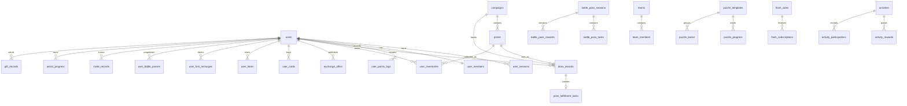

# 逻辑数据库表结构与 ER 设计

## 设计说明

当前实现仍使用 `MemoryStore`，本文件描述生产化落库时的逻辑表结构。字段命名采用 `snake_case`，时间字段统一 `created_at`、`updated_at`，核心业务表建议增加 `deleted`、`deleted_at` 支持软删除。

## ER 图

## 核心表

### users

用户基础表：`id`、`nickname`、`mobile`、`status`、`created_at`、`updated_at`。

索引：`PRIMARY KEY(id)`、`idx_users_mobile(mobile)`。

### user_sessions

用户会话：`token`、`user_id`、`expires_at`、`created_at`。

索引：`PRIMARY KEY(token)`、`idx_user_sessions_user_id(user_id)`。

### admin_users

后台用户：`id`、`username`、`password_hash`、`display_name`、`status`、`created_at`、`updated_at`。

索引：`UNIQUE(username)`。

### campaigns

活动/系列：`id`、`name`、`slug`、`status`、`starts_at`、`ends_at`、`daily_draw_limit`、`miss_weight`、`banner_image_url`、`campaign_summary`、`pity_config_json`、`created_at`、`updated_at`。

索引：`UNIQUE(slug)`、`idx_campaigns_status(status)`。

### prizes

奖品/款式：`id`、`campaign_id`、`name`、`level`、`stock`、`probability_weight`、`status`、`image_url`、`sort_order`、`created_at`、`updated_at`。

索引：`idx_prizes_campaign_id(campaign_id)`、`idx_prizes_level(level)`。

### draw_records

抽奖记录：`id`、`campaign_id`、`user_id`、`prize_id`、`prize_name`、`result`、`chance_after`、`request_id`、`created_at`。

索引：`idx_draw_records_user_id(user_id)`、`idx_draw_records_campaign_id(campaign_id)`、`idx_draw_records_created_at(created_at)`。

### user_campaign_quotas

每日抽奖额度：`id`、`user_id`、`campaign_id`、`quota_date`、`used_count`、`created_at`、`updated_at`。

索引：`UNIQUE(user_id, campaign_id, quota_date)`。

### user_inventories

用户库存：`id`、`user_id`、`prize_id`、`prize_name`、`prize_level`、`campaign_id`、`source`、`created_at`。

索引：`idx_user_inventories_user_id(user_id)`、`idx_user_inventories_prize_id(prize_id)`、`idx_ui_user_campaign(user_id, campaign_id)`。

### exchange_offers

交换挂单：`id`、`user_id`、`user_nickname`、`have_prize_id`、`have_prize_name`、`want_prize_id`、`want_prize_name`、`status`、`created_at`、`updated_at`。

索引：`idx_exchange_offers_user_id(user_id)`、`idx_exchange_offers_status(status)`。

### user_members 与 user_points_logs

会员信息：`user_id`、`level`、`points`、`total_draws`、`total_spent`、`created_at`、`updated_at`。

积分流水：`id`、`user_id`、`points`、`balance`、`reason`、`remark`、`created_at`。

## 商业化表

- `user_cards`：用户周卡/月卡/季卡，包含 `card_type`、`price`、`started_at`、`expires_at`、`daily_free_used`、`free_date`。
- `shop_items`：商品配置，包含价格、道具类型、库存、每日限购、分类、上下架状态。
- `user_items`：用户道具库存，唯一键 `user_id + item_type`。
- `user_first_recharges`：用户首充领取记录，建议礼包领取明细拆到 `user_first_recharge_claims`。
- `battle_pass_seasons`、`battle_pass_tasks`、`battle_pass_rewards`、`user_battle_passes`、`battle_pass_task_progress`：战令赛季、任务、奖励和用户进度。

## 社交与活动表

- `share_cards`：分享卡片。
- `invite_records`：邀请关系。
- `assist_progress`、`assist_actions`：助力进度和防刷记录。
- `teams`、`team_members`：组队开盒。
- `gift_records`：礼物赠送。
- `puzzle_templates`、`puzzle_progress`、`puzzle_teams`：拼图模板、用户进度和拼图小队。
- `flash_sales`、`flash_subscriptions`、`flash_purchases`：抢购活动、预约和购买记录。
- `activities`、`activity_rewards`、`activity_participations`：运营活动、奖励和参与记录。

## 事务边界

生产化时抽盒必须在一个事务内完成：扣积分、扣每日额度、抽样结果落库、库存扣减、库存入账、发奖任务创建、积分/战令/拼图进度更新。交换、合成、赠礼、抢购也需要事务保证资产一致性。
