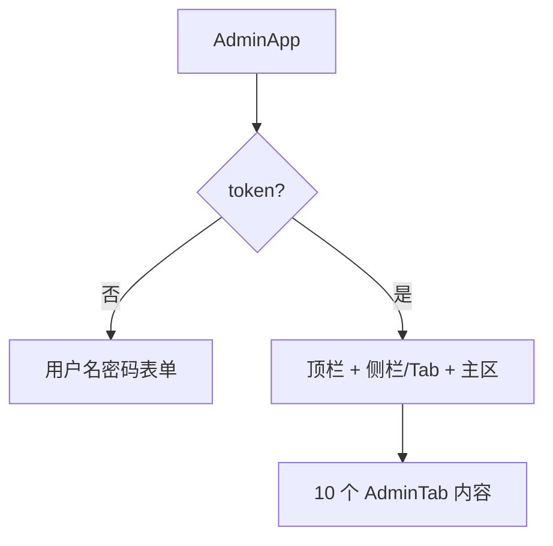

# 管理端登录与壳层

## 1. 模块概述

| 项 | 说明 |
|----|------|
| 用户目标 | 运营人员登录后台并在各 Tab 间切换 |
| 入口 | `/admin` → `AdminApp` |
| API | `POST /api/v1/admin/login`；各 Tab 懒加载 `GET /api/v1/admin/*` |

## 2. 信息架构

## 3. 界面清单

| 区域 | 说明 |
|------|------|
| 登录页 | 用户名、密码、`LockKeyhole` 品牌区 |
| 顶栏 | 当前 Tab 标题、退出（清除 token） |
| Tab 导航 | 总览/用户/盲盒/奖品/概率/入口/发奖/记录/月卡/商店 |
| 主内容 | 随 `tab` 切换 |

## 4. 核心用户流程

### 4.1 登录 **[已实现]**

1. 填写 `loginSchema`：username、password 均 `min(1)`
2. 提交 → `POST admin/login` → `setToken(atk_*)`
3. 默认 hint：`NEXT_PUBLIC_ADMIN_USER_HINT` 预填用户名

### 4.2 Tab 切换 **[已实现]**

1. 点击 Tab → `setTab(key)`
2. React Query `enabled: tab === 'xxx'` 懒加载数据

### 4.3 退出 **[已实现]**

清除 `token` 回登录门（组件内逻辑）。

## 5. 交互状态表

| 状态 | UI |
|------|-----|
| login pending | 提交按钮 Loader |
| 无 token | 仅登录表单 |
| 有 token | 全 Tab 可用 |

## 6. 权限

- Bearer `atk_*`，与用户 `utk_*` 隔离 **[已实现]**
- 无角色分级 UI **[规划中]**

## 7. 关联文档

- 各 `admin/02`–`08` 模块
