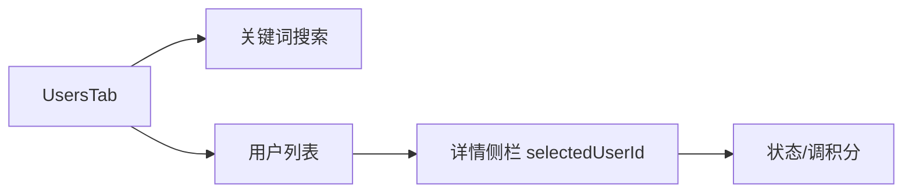

# 用户运营

## 1. 模块概述

| 项 | 说明 |
|----|------|
| 用户目标 | 搜索用户、查看详情、调整状态与积分 |
| 入口 | `users` Tab |
| API | `admin/users`、`admin/users/:id`、`PATCH status`、`POST points-adjust` |

业务规则：[user-management-admin-design.md](../../user-management-admin-design.md)。

## 2. 信息架构

## 3. 界面清单

| 元素 | 交互 |
|------|------|
| 搜索框 | `userKeyword` → 查询 `keyword` 参数 |
| 用户行 | 点击 → `setSelectedUserId` |
| 侧栏 | 资料、会员、积分、状态日志 |
| 状态操作 | PATCH status（active/frozen/disabled 等） |
| 调积分 | `window.prompt` 输入调整值 → `points-adjust` |

## 4. 核心用户流程 **[已实现]**

1. 输入关键词 → 回车或触发搜索 → `usersQuery` 刷新
2. 选中用户 → `userDetailQuery` 加载详情
3. 修改状态 → mutation → invalidate 列表与详情
4. 调积分 → prompt → POST → invalidate

## 5. 交互状态表

| 状态 | UI |
|------|-----|
| list loading | 表格区 Loader |
| detail loading | 侧栏骨架 |
| 未选用户 | 侧栏占位提示 |

## 6. 与产品文档差异表

| 能力 | 状态 | 备注 |
|------|------|------|
| 踢出会话 | kick-sessions API | **[规划中]** UI 无 |
| 高级筛选/export | | **[规划中]** |
| prompt 调积分 | 简易运营 | **[部分实现]** | 无表单校验弹窗 |

## 7. 关联文档

- [user-management-admin-design.md](../../user-management-admin-design.md)
- [c-end/01-auth-login.md](../c-end/01-auth-login.md)
