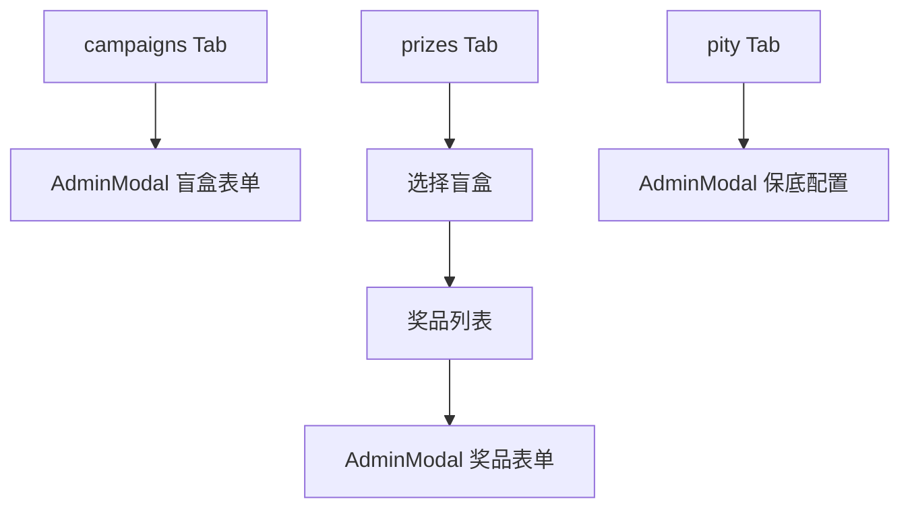

# 盲盒、奖品与概率配置

## 1. 模块概述

| Tab | 职责 |
|-----|------|
| `campaigns` | 盲盒（Campaign）CRUD、上下线、校验、删除 |
| `prizes` | 选中盲盒下的奖品 CRUD、图片上传 |
| `pity` | 保底/UP 池配置 |

业务规则：[blind-box-management-design.md](../../blind-box-management-design.md)。

## 2. 信息架构

## 3. 盲盒 Tab **[已实现]**

### 界面

- 列表：名称、状态标签（`statusClass`）、操作按钮
- 操作：新建、编辑、上线、下线、校验、删除

### 流程

1. **新建/编辑** → `setCampaignEditor` → `AdminModal` + react-hook-form
2. **保存** → POST 或 PUT `admin/campaigns`
3. **校验** → POST `.../validate` → 展示 `CampaignPublishValidation`
4. **上下线** → 更新 status 字段
5. **删除** → 确认后 DELETE

## 4. 奖品 Tab **[已实现]**

### 界面

- 顶部 select 选择 `selectedCampaignId`
- 奖品表格 + 新建/编辑/删除
- 图片：`POST admin/uploads/prizes` → 填入 `image_url`

### 流程

1. 必须先选盲盒
2. `prizeEditor` Modal → 等级/库存/权重/status
3. 保存 POST/PUT；删除 DELETE `admin/prizes/:id`

## 5. 概率 Tab **[已实现]**

1. 选择盲盒 → 加载当前 `pity-config`
2. `pityEditor` Modal：软/硬保底、UP 池字段
3. `PUT admin/campaigns/:id/pity-config`

## 6. 弹窗 `AdminModal` **[已实现]**

- 居中遮罩、标题、表单区、取消/保存
- 保存时对应 mutation `isPending` 禁用按钮

## 7. 与产品文档差异表

| 能力 | 状态 | 备注 |
|------|------|------|
| 批量导入奖品 | | **[规划中]** |
| 库存预警 UI | | **[规划中]** |
| 操作审计日志 | | **[规划中]** |
| 盲盒/奖品命名统一 | 活动/礼品 | **[部分实现]** | UI 已标盲盒/奖品 |

## 8. 关联文档

- [blind-box-management-design.md](../../blind-box-management-design.md)
- [c-end/02-series-activities-draw.md](../c-end/02-series-activities-draw.md)
