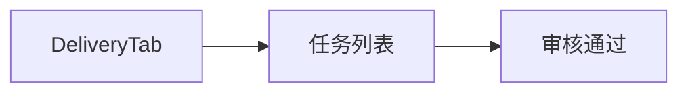

# 发奖履约

## 1. 模块概述

| 项 | 说明 |
|----|------|
| 用户目标 | 审核中奖履约任务，标记通过/完成 |
| 入口 | `delivery` Tab（界面文案「发奖」） |
| API | `GET admin/fulfillment-tasks`、`PATCH admin/fulfillment-tasks/:id` |

## 2. 信息架构

## 3. 界面清单

| 列/元素 | 说明 |
|---------|------|
| 任务行 | 用户、奖品、状态（pending/fulfilled 等） |
| 操作 | 「审核通过」等按钮 |

## 4. 核心用户流程 **[已实现]**

1. 进入发奖 Tab → `deliveryQuery`
2. 点击审核 → PATCH 更新状态（如 `fulfilled`）
3. invalidate `admin-delivery`

## 5. 交互状态表

| 状态 | UI |
|------|-----|
| loading | Loader |
| empty | 无任务提示 |

## 6. 与产品文档差异表

| 能力 | 产品描述 | 状态 | 备注 |
|------|----------|------|------|
| 物流单号录入 | 发货流程 | **[规划中]** | |
| 驳回+备注 | | **[部分实现]** | 以 PATCH 字段为准 |
| 批量审核 | | **[规划中]** | |

## 7. 关联文档

- [blind-box-management-design.md](../../blind-box-management-design.md)
- [02-overview-records.md](./02-overview-records.md)
