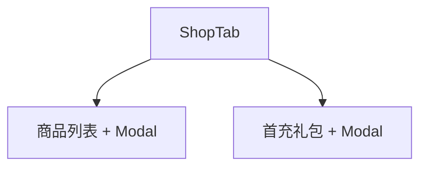

# 商店与首充配置

## 1. 模块概述

| 项 | 说明 |
|----|------|
| 用户目标 | 配置积分/现金商品与首充礼包 |
| 入口 | `shop` Tab（上下两区块） |
| API | `admin/shop-items` CRUD、`admin/first-recharge/packs` CRUD、图片上传 |

## 2. 信息架构

## 3. 商店商品 **[已实现]**

### 流程

1. 列表展示 `shopQuery`
2. 新建/编辑 → `shopItemEditor` + `AdminModal`
3. 字段：名称、类型（hint_card/see_through 等）、积分价、现金价、库存、状态
4. 可选上传图 → `image_url`
5. 保存 POST/PUT；删除 DELETE

## 4. 首充礼包 **[已实现]**

### 流程

1. `firstRechargeQuery` 列表
2. `firstRechargeEditor` Modal：价格、道具 items 数组等
3. CRUD 对应 admin first-recharge 路由

## 5. 与产品文档差异表

| 能力 | 状态 | 备注 |
|------|------|------|
| 限时折扣配置 | **[规划中]** | |
| 排序拖拽 | **[规划中]** | 有 sort_order 字段 |

## 6. 关联文档

- [c-end/07-shop-first-recharge.md](../c-end/07-shop-first-recharge.md)
- [payment-checkout.md](../cross-cutting/payment-checkout.md)
