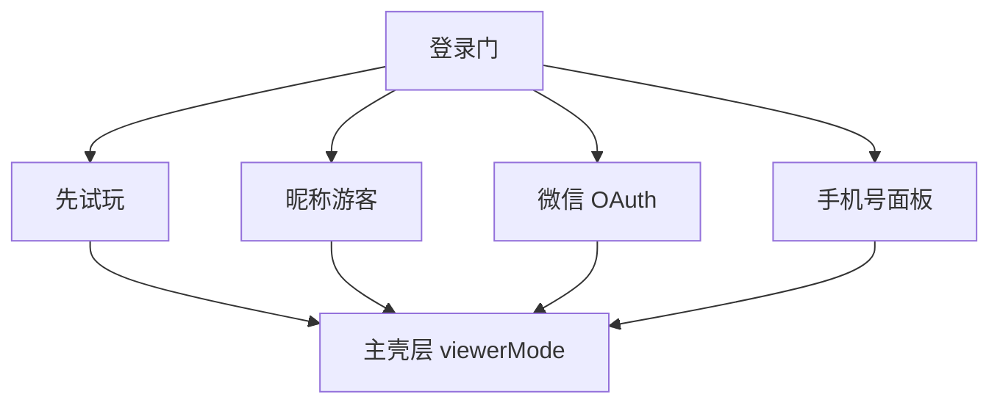

# 认证与登录

## 1. 模块概述

| 项 | 说明 |
|----|------|
| 用户目标 | 进入平台、绑定身份、领取匿名试玩中奖 |
| 入口 | `/` 无 `token` 且非 `viewerMode` 时全屏登录门 |
| API | `config/public`、`auth/guest-login`、`auth/wechat/*`、`auth/phone/*` |

业务规则见 [user-management-user-design.md](../../user-management-user-design.md)。

## 2. 信息架构

## 3. 界面清单

| 元素 | 说明 |
|------|------|
| 品牌区 | BOX·MAGIC 标题与副文案 |
| 昵称输入 | `loginForm` 可选 nickname，max 32 |
| 「开始抽盒」 | 提交游客登录 |
| 「先试玩抽盒」 | `setViewerMode(true)` |
| 微信一键登录 | `isWechatQuickLoginEnabled` 时显示 |
| 手机号码登录 | 展开/收起 `showPhoneLogin` 面板 |
| 错误条 | `wechatError` 红色提示区 |

## 4. 核心用户流程

### 4.1 游客登录 **[已实现]**

1. 用户输入昵称（可选）→ 点击「开始抽盒」
2. `POST /api/v1/auth/guest-login`（带匿名头合并待领）
3. 设置 `token`、`nickname`，清除 `viewerMode`、匿名 token
4. 若 `claimed_pending_draws > 0`，可提示已合并（后端字段）

### 4.2 先试玩 **[已实现]**

1. 点击「先试玩抽盒」→ `viewerMode=true`，无 token
2. 进入主壳层，仅 `series` Tab 可用
3. 抽盒使用 `X-Anonymous-Draw-Token`，中奖 `requires_login` 提示登录领取

### 4.3 微信 OAuth **[已实现]**

1. 点击微信 → 跳转 OAuth URL（后端返回）
2. 回调 `?code=` → 挂载时自动 `POST auth/wechat/login`
3. `history.replaceState` 清除 code
4. 成功设 token；失败显示 `wechatError`

### 4.4 手机号登录 **[已实现]**

1. 展开面板 → 输入 11 位手机
2. mock：`SMS mock` 时验证码框 disabled，确认直登；否则「获取验证码」→ `POST auth/phone/code`
3. 确认 → `POST auth/phone/verify` 或 mock 下 `phone-login`
4. 校验失败：`wechatError` 展示

## 5. 交互状态表

| 状态 | 触发 | UI | 操作 |
|------|------|-----|------|
| loading | `wechatLoggingIn` | 「微信授权中...」+ 旋转图标 | 等待 |
| loading | `phoneLoginMutation` | 确认按钮 disabled + Loader | 等待 |
| error | 登录失败 | 红色 `wechatError` | 重试 |
| disabled | `publicConfigQuery.isLoading` | 短信说明「正在读取配置」 | 等待 |

## 6. 表单与校验

| 表单 | 规则 |
|------|------|
| `loginSchema` | `nickname` 可选，`max(32)` |
| 手机号 | 正则 `^1[3-9]\d{9}$`，失败 setWechatError |
| 验证码 | mock 可空；非 mock 必填 |

## 7. 权限与门槛

| 状态 | C 端表现 |
|------|----------|
| `pending_phone` | 登录后主壳层顶部琥珀条提示 **[已实现]** |
| `frozen` / `disabled` | 琥珀条 + 后端拦截资产操作 **[部分实现]** |

## 8. 与产品文档差异表

| 能力 | 产品描述 | 状态 | 备注 |
|------|----------|------|------|
| 运营商一键登录 | 本机号 | **[规划中]** | |
| 实名/未成年 | 合规拦截 UI | **[规划中]** | |
| 游客+微信+手机四入口 | 降低门槛 | **[已实现]** | |

## 9. 异常与边界

- 微信 code 重复使用：后端错误 → `wechatError`
- 匿名 token 持久化：`localStorage` `campaign-lottery-anonymous-draw-token`

## 10. 关联文档

- [navigation-shell.md](../cross-cutting/navigation-shell.md)
- [02-series-activities-draw.md](./02-series-activities-draw.md)
- [user-management-user-design.md](../../user-management-user-design.md)
