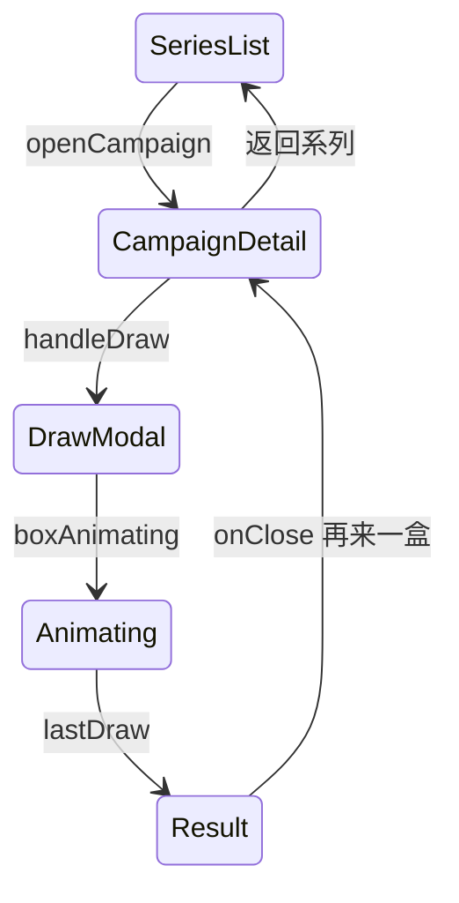

# 系列、运营活动与抽盒

## 1. 模块概述

| 项 | 说明 |
|----|------|
| 用户目标 | 浏览盲盒系列、查看概率与进度、单抽/十连、查看开盒结果 |
| 入口 | `series` Tab；顶栏横向活动卡片；`selectedCampaignId` 详情 |
| API | `activities`、`blindbox/campaigns`、`series-progress`、`probabilities`、`blindbox/draw` |

## 2. 信息架构

## 3. 界面清单

| 区域 | 内容 |
|------|------|
| 顶栏活动条 | 最多 5 个 campaign 横滑卡片，点击进入详情 |
| 系列 Tab | 运营活动 `activitiesQuery`（`POST /api/v1/activities`）+ 盲盒网格 `campaignsQuery` |
| 盲盒详情 | 名称、简介、收集进度条、奖品网格、概率区块 |
| 操作区 | 「单抽 100 积分」「十连 950 积分」 |
| 开盒弹窗 | `showBoxModal`：动画 → `DrawResultView` 或错误 |

## 4. 核心用户流程

### 4.0 运营活动横幅 **[部分实现]**

1. 系列 Tab 顶部渲染 `activities` 列表（标题、奖励说明等）
2. 参与/领奖深度流程若仅 API 无完整 UI，标 **[部分实现]**（`activities/:id/join`、`activities/claim`）

### 4.1 浏览系列 **[已实现]**

1. 未登录：`POST /api/v1/campaigns`；已登录：`blindbox/campaigns`（含进度）
2. 展示卡片：封面、状态标签、名称、简介
3. 点击 → `openCampaign(id)`

### 4.2 单抽 / 十连 **[已实现]**

1. `handleDraw(1|10)` → `showBoxModal=true`，`boxAnimating=true`
2. `POST blindbox/draw` + 可选匿名头
3. 约 900ms 后展示 `lastDraw`；刷新 member/inventory/progress
4. 匿名中奖返回 `anonymous_draw_token` 写入 localStorage

### 4.3 结果页 `DrawResultView` **[已实现]**

| 按钮 | 行为 |
|------|------|
| 再来一盒 | `onClose` 关闭弹窗，可再次抽 |
| 登录领取 | `requires_login` 时，`setViewerMode(false)` 回登录门 |
| 炫耀 | `onShare`（分享占位） |

展示：最高稀有度款式、NEW 角标、十连列表滚动区。

## 5. 交互状态表

| 状态 | 触发 | UI | 操作 |
|------|------|-----|------|
| loading | `campaignsQuery` | `SkeletonGrid` | — |
| loading | `drawMutation.isPending` | 弹窗内动画 | 按钮 disabled |
| error | draw 失败 | 弹窗内红色文案 | 关闭 |
| empty | 无活动 | `EmptyState` | — |

## 6. 表单与校验

无表单；抽盒前隐式校验：积分、配额、`requires_phone_login`（后端 → `mapDrawErrorMessage`）。

## 7. 弹窗

| 弹窗 | 打开 | 关闭 |
|------|------|------|
| `showBoxModal` | 点击抽盒 | 结果区按钮、遮罩逻辑在组件内 |

与支付：抽盒中 `payingCash` 时禁用抽盒按钮。

## 8. 与产品文档差异表

| 能力 | 产品描述 | 状态 | 备注 |
|------|----------|------|------|
| 分级光效开盒 | 白/蓝/紫/金特效 | **[部分实现]** | 统一动画时长约 900ms |
| 摇盒/透卡 | 抽前道具 | **[规划中]** | API `shop/items/use` 存在，C 端无入口 |
| AR 开盒 | 进阶体验 | **[规划中]** | |
| 概率公示弹窗 | 独立页 | **[部分实现]** | 详情内嵌展示 |
| 排序筛选分页 | 列表页 | **[规划中]** | |
| 单抽 100 / 十连 950 | 积分定价 | **[已实现]** | 前端写死常量 |
| 保底进度条 | 结果页 | **[部分实现]** | 详情有 pity 配置展示 |
| 合成入口 | 结果页按钮 | **[规划中]** | `blindbox/blend` 后端有 |

## 9. 异常与边界

| 异常 | 反馈 |
|------|------|
| 积分不足 | mutation error 文案 |
| 试玩未登录抽盒 | 可抽，中奖需登录 |
| 关闭 series 功能开关 | 自动退出详情 |

## 10. 关联文档

- [navigation-shell.md](../cross-cutting/navigation-shell.md)
- [01-auth-login.md](./01-auth-login.md)
- [blind-box-management-design.md](../../blind-box-management-design.md)
