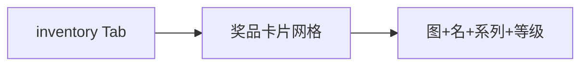

# 我的收藏（盒柜）

## 1. 模块概述

| 项 | 说明 |
|----|------|
| 用户目标 | 查看已获得的盲盒款式收藏 |
| 入口 | `inventory` Tab（需登录 + 功能开关） |
| API | `POST /api/v1/blindbox/inventory` |

## 2. 信息架构

## 3. 界面清单

| 元素 | 说明 |
|------|------|
| Tab 标题区 | 「我的收藏」类文案 |
| 网格 | 2 列卡片，`PrizeMedia` 展示图或 emoji 占位 |
| `EmptyState` | 无库存时引导去系列抽盒 |

## 4. 核心用户流程 **[已实现]**

1. 用户登录并开启 `inventory` 开关
2. 切换到「我的」Tab → 懒加载 `inventoryQuery`
3. 浏览网格，只读无详情页
4. 重复款数据用于交换 Tab 的 `duplicateInventory` 计算，本 Tab 不单独标重复

## 5. 交互状态表

| 状态 | UI | 操作 |
|------|-----|------|
| loading | 骨架或 Loader | — |
| empty | EmptyState | 跳转系列（手动切 Tab） |
| error | React Query 默认 | 下拉刷新无，需切 Tab 重试 |

## 6. 与产品文档差异表

| 能力 | 产品描述 | 状态 | 备注 |
|------|----------|------|------|
| 系列归类筛选 | 按系列折叠 | **[规划中]** | 平铺列表 |
| 重复款角标 | 显示 ×N | **[部分实现]** | 交换模块用，盒柜未标 |
| 3D 展示柜 | 进阶 | **[规划中]** | |
| 兑换积分 | redeem | **[已实现]** | 盒柜条目「兑换」 |
| 合成升级 | blend | **[已实现]** | 盒柜「合成」Modal |
| 按系列分组 | | **[已实现]** | 列表/按系列切换 |
| 重复款角标 | | **[已实现]** | ×N 角标 |

## 7. 关联文档

- [04-exchange.md](./04-exchange.md)
- [02-series-activities-draw.md](./02-series-activities-draw.md)
