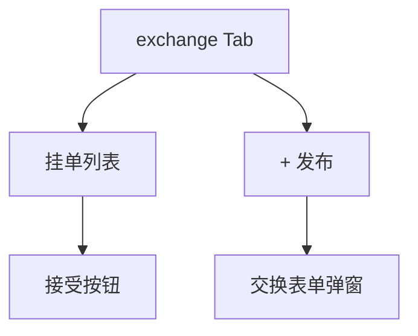

# 交换市场

## 1. 模块概述

| 项 | 说明 |
|----|------|
| 用户目标 | 用重复款挂单交换想要的款式 |
| 入口 | `exchange` Tab；`showExchangeModal` |
| API | `exchange-offers` GET/POST、`.../accept` POST |

## 2. 信息架构

## 3. 界面清单

| 元素 | 说明 |
|------|------|
| 「+ 发布」 | 打开弹窗；需有 `duplicateInventory` |
| 挂单卡片 | 出让款 ↔ 想要款、发布者、接受 |
| 弹窗表单 | 两个 select：`have_prize_id`、`want_prize_id` |

## 4. 核心用户流程

### 4.1 发布交换 **[已实现]**

1. 点击「+ 发布」→ `setShowExchangeModal(true)`
2. 选择「我有的重复款」「想要的款」（选项来自库存与全站奖品）
3. 提交 `publishExchangeMutation` → 成功关闭弹窗并 reset 表单

### 4.2 接受交换 **[已实现]**

1. 浏览他人挂单 → 点击「接受」
2. `acceptExchangeMutation` → 刷新 offers + inventory

## 5. 表单与校验

`exchangeSchema`：`have_prize_id`、`want_prize_id` 均 `min(1)`，未选无法通过 resolver。

## 6. 交互状态表

| 状态 | UI |
|------|-----|
| loading | 列表 Loader |
| empty | 无挂单 EmptyState |
| submitting | 发布按钮 pending |

## 7. 与产品文档差异表

| 能力 | 产品描述 | 状态 | 备注 |
|------|----------|------|------|
| 匹配推荐 | 智能匹配 | **[规划中]** | |
| 交换确认二次弹窗 | 防误触 | **[规划中]** | 直接 accept |
| 取消自己的单 | DELETE offer | **[规划中]** | 后端有，C 端无 |

## 8. 关联文档

- [03-inventory.md](./03-inventory.md)
