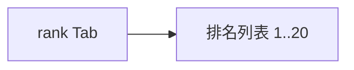

# 收集排行榜

## 1. 模块概述

| 项 | 说明 |
|----|------|
| 用户目标 | 查看全站收集数量排名 |
| 入口 | `rank` Tab |
| API | `POST /api/v1/blindbox/leaderboard?limit=20` |

## 2. 信息架构

## 3. 界面清单

| 元素 | 说明 |
|------|------|
| 排名行 | 名次、昵称、收集数 |
| 当前用户 | 列表内高亮或单独展示（若后端返回） |

## 4. 核心用户流程 **[已实现]**

1. 登录 + `rank` 开关开启
2. 进入 Tab → 请求 leaderboard
3. 只读浏览，无点击进个人主页

## 5. 交互状态表

| 状态 | UI |
|------|-----|
| loading | Loader |
| empty | EmptyState |

## 6. 与产品文档差异表

| 能力 | 产品描述 | 状态 | 备注 |
|------|----------|------|------|
| 分系列榜 | 按 campaign | **[规划中]** | 全站聚合 |
| 周榜/月榜切换 | Tab 筛选 | **[规划中]** | |
| 点击查看他人盒柜 | 社交 | **[规划中]** | |

## 7. 关联文档

- [03-inventory.md](./03-inventory.md)
