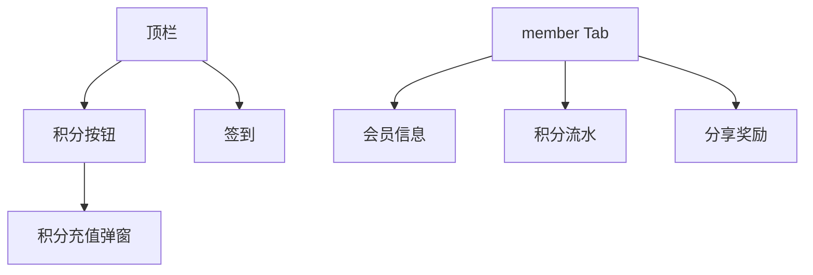

# 会员、签到与积分

## 1. 模块概述

| 项 | 说明 |
|----|------|
| 用户目标 | 查看会员等级与积分、每日签到、积分流水、分享得积分 |
| 入口 | 顶栏积分/签到；`member` Tab |
| API | `me/account`、`blindbox/member`、`blindbox/points-log`、`blindbox/checkin`、`blindbox/share-reward` |

月卡/战令购买见 [08-monthcard-battlepass.md](./08-monthcard-battlepass.md)。

## 2. 信息架构

## 3. 界面清单

| 区域 | 交互 |
|------|------|
| 顶栏积分按钮 | 显示当前积分，点击打开充值 Modal |
| 顶栏签到 | `checkInMutation`，pending 时 disabled |
| member Tab | 等级、累计积分、流水列表、分享按钮 |

## 4. 核心用户流程

### 4.1 每日签到 **[已实现]**

1. 点击「签到」→ `POST blindbox/checkin`
2. 成功 invalidate `member`、`points-log`

### 4.2 分享奖励 **[已实现]**

1. member Tab 内点击分享相关按钮 → `shareMutation`
2. 刷新积分

### 4.3 积分流水 **[已实现]**

1. `points-log` 列表展示变动与余额

### 4.4 积分充值 **[已实现]**

见 [payment-checkout.md](../cross-cutting/payment-checkout.md)：固定 SKU + 自定义金额。

## 5. 交互状态表

| 状态 | UI |
|------|-----|
| loading | `memberQuery` 骨架 |
| checkin pending | 签到按钮 disabled + Loader |

## 6. 与产品文档差异表

| 能力 | 产品描述 | 状态 | 备注 |
|------|----------|------|------|
| 会员等级权益说明页 | 银/金/钻 | **[部分实现]** | 展示等级字段 |
| 签到日历 | 连续签到 | **[部分实现]** | 单次签到 |
| 体力/每日免费抽 | 手游化 | **[规划中]** | |

## 7. 关联文档

- [payment-checkout.md](../cross-cutting/payment-checkout.md)
- [08-monthcard-battlepass.md](./08-monthcard-battlepass.md)
