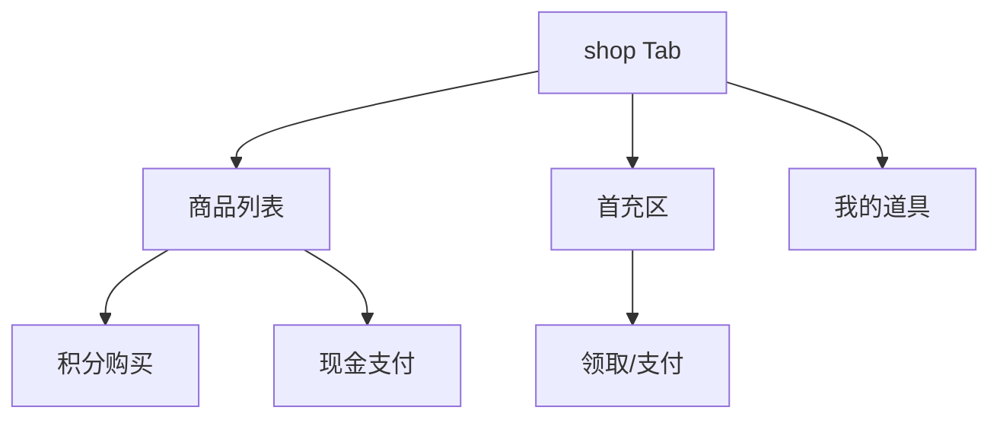

# 商店与首充

## 1. 模块概述

| 项 | 说明 |
|----|------|
| 用户目标 | 用积分或现金购买道具；领取/购买首充礼包 |
| 入口 | `shop` Tab |
| API | `shop/items`、`shop/items/inventory`、`shop/buy`、`first-recharge/*` |

## 2. 信息架构

## 3. 界面清单

| 区块 | 内容 |
|------|------|
| 商品卡片 | 名称、类型、积分价/现金价、购买按钮 |
| 首充礼包 |  pack 列表、已领状态、`firstRechargeMutation` / 现金 `runCashPay` |
| 道具背包 | `user-items` 只读列表 |

## 4. 核心用户流程

### 4.1 积分购买道具 **[已实现]**

1. 点击积分购买 → `buyShopMutation(shopItemId)`
2. 成功刷新 member、user-items

### 4.2 现金购买 **[已实现]**

1. `runCashPay` + `biz_type: shop_item`
2. 支付成功后 invalidate

### 4.3 首充 **[已实现]**

1. 展示 packs + `first-recharge/status`
2. 积分领取 `claim` 或现金支付履约

## 5. 与产品文档差异表

| 能力 | 产品描述 | 状态 | 备注 |
|------|----------|------|------|
| 使用道具（透卡/十连券） | 抽盒前使用 | **[规划中]** | `shop/items/use` 无 UI |
| 限时商店 | 倒计时 | **[规划中]** | |
| 首充双倍动效 | 营销 | **[部分实现]** | |

## 6. 关联文档

- [payment-checkout.md](../cross-cutting/payment-checkout.md)
- [02-series-activities-draw.md](./02-series-activities-draw.md)
- [admin/06-shop-first-recharge.md](../admin/06-shop-first-recharge.md)
