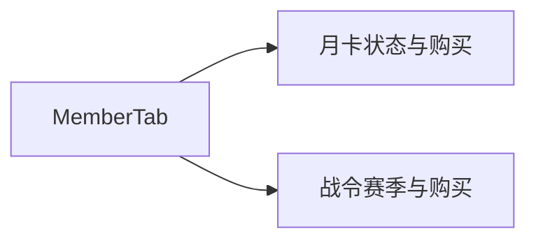

# 月卡与战令

## 1. 模块概述

| 项 | 说明 |
|----|------|
| 用户目标 | 购买月卡/周卡/季卡；购买战令并领取等级奖励 |
| 入口 | `member` Tab 内区块（与 [06-member-points.md](./06-member-points.md) 同 Tab） |
| API | `month-card/status`、`month-card/buy`、`battle-pass/info`、`battle-pass/buy`、`battle-pass/claim/:level` |

定价常量（前端）：月卡现金 2800 分 / 积分 2800；战令现金 6800 分 / 积分 680。

## 2. 信息架构

## 3. 核心用户流程

### 3.1 月卡 **[部分实现]**

1. 展示 `month-card/status`
2. 积分购买：`buyMonthCardMutation(cardType)` → `month-card/buy`
3. 现金：`runCashPay` + `membership`
4. 失败 `alert(mapPurchaseErrorMessage)`

### 3.2 战令 **[部分实现]**

1. `battle-pass/info` 展示赛季、任务、等级
2. 积分/现金购买付费战令
3. 领取等级奖励：若 UI 有 claim 按钮则调 `battle-pass/claim`（以代码为准）

## 4. 与产品文档差异表

| 能力 | 产品描述 | 状态 | 备注 |
|------|----------|------|------|
| 战令任务进度 UI | 每日/每周任务 | **[部分实现]** | 只读展示为主 |
| 等级奖励一键领取 | 批量 claim | **[部分实现]** | |
| 30 元月卡每日领钻 | 详细日历 | **[部分实现]** | |
| 管理端配置战令 | 运营配置 | **[规划中]** | 管理端只读 |

## 5. 关联文档

- [payment-checkout.md](../cross-cutting/payment-checkout.md)
- [admin/08-monthcard-battlepass-view.md](../admin/08-monthcard-battlepass-view.md)
