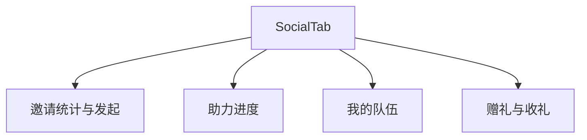

# 社交裂变（邀请/助力/组队/赠礼）

## 1. 模块概述

| 项 | 说明 |
|----|------|
| 用户目标 | 邀请好友、模拟助力、创建队伍、赠送/收取礼物 |
| 入口 | `social` Tab |
| API | `share/invite-stats`、`share/invite`、`share/assist`、`team/*`、`share/gift*` |

> **演示级说明**：助力使用随机 `helper_id`、赠礼固定 `demo_friend`，生产需风控 **[部分实现]**。

## 2. 信息架构

## 3. 界面清单

| 区块 | 按钮/展示 |
|------|-----------|
| 邀请 | 统计数字、发起邀请 `inviteMutation` |
| 助力 | 进度条、模拟助力 `assistMutation` |
| 组队 | 队伍信息、创建队伍 `createTeamMutation` |
| 赠礼 | 选择库存款式赠送、incoming 列表 |

## 4. 核心用户流程 **[部分实现]**

1. **邀请**：点击 → POST invite → 刷新 stats
2. **助力**：点击 → POST assist（`assist_type: free_draw`）→ 刷新 progress
3. **建队**：POST team/create 默认名与目标
4. **赠礼**：选 prize → POST gift → 刷新 incoming

## 5. 交互状态表

| 状态 | UI |
|------|-----|
| loading | 各 query Loader |
| mutation pending | 按钮 disabled |

## 6. 与产品文档差异表

| 能力 | 产品描述 | 状态 | 备注 |
|------|----------|------|------|
| 真实分享卡片/链接 | 微信分享 | **[规划中]** | |
| 好友助力防刷 | 设备/IP | **[规划中]** | |
| 组队开盒进度 | 共享抽奖 | **[部分实现]** | |
| 开盒炫耀分享 | 结果页 | **[部分实现]** | alert/占位 |

## 7. 关联文档

- [system-design.md](../../system-design.md) 社交风控风险
- [02-series-activities-draw.md](./02-series-activities-draw.md)
