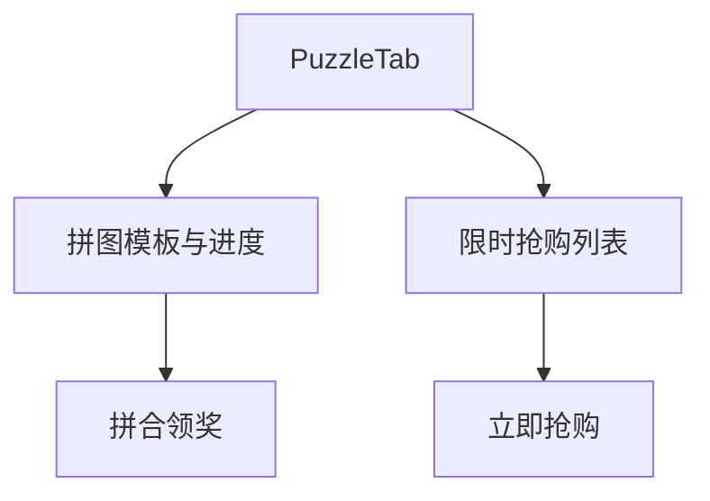

# 拼图与限时抢购

## 1. 模块概述

| 项 | 说明 |
|----|------|
| 用户目标 | 收集拼图碎片并合成领奖；参与限时秒杀 |
| 入口 | `puzzle` Tab（上下分区） |
| API | `puzzle/my`、`puzzle/compose`、`flash/list`、`flash/:id/purchase` |

## 2. 信息架构

## 3. 核心用户流程

### 3.1 拼图合成 **[部分实现]**

1. 展示 `puzzle/my` 模板与碎片进度
2. 满足条件点击合成 → `composePuzzleMutation(templateId)`
3. 刷新 puzzles、member

### 3.2 限时抢购 **[部分实现]**

1. `flash/list` 展示活动
2. 点击购买 → `flashPurchaseMutation` 扣积分/库存（后端规则）
3. 无预约提醒、排队 UI **[规划中]**

## 4. 与产品文档差异表

| 能力 | 产品描述 | 状态 | 备注 |
|------|----------|------|------|
| 社群拼图组队 | puzzle/team | **[部分实现]** | 后端有，C 端简 |
| 碎片交换 | C2C 碎片 | **[规划中]** | |
| 预约提醒 | 秒杀前订阅 | **[规划中]** | `flash/subscribe` 后端有 |
| 抽签排队 | 风控 | **[规划中]** | |

## 5. 关联文档

- [09-social.md](./09-social.md)
