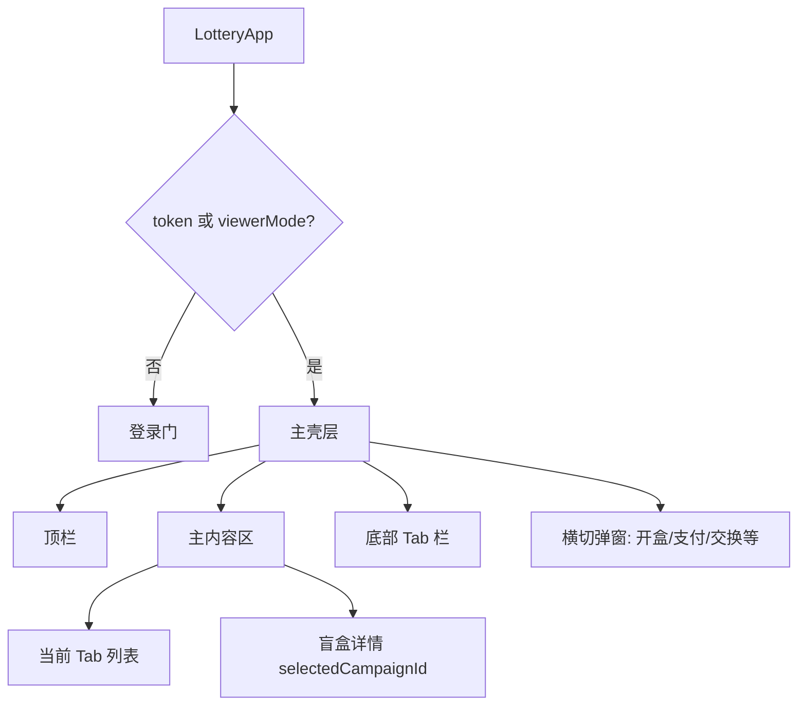

# C 端导航壳层与布局

## 1. 模块概述

| 项 | 说明 |
|----|------|
| 用户目标 | 在单一 H5 页内切换功能 Tab、进入盲盒详情、使用顶栏账户能力 |
| 入口 | `/` → `LotteryApp`（[`lottery-app.tsx`](../../../front-page/src/features/lottery/lottery-app.tsx)） |
| 关联 API | `POST /api/v1/config/public`（功能开关、微信/SMS 配置） |

**说明**：无 URL 级 Tab；视图由 React state 驱动。

## 2. 信息架构

### 视图栈状态变量

| State | 类型 | 作用 |
|-------|------|------|
| `token` | string | 用户会话；空则未登录 |
| `viewerMode` | boolean | 试玩模式，无 token 可浏览系列 |
| `tab` | `TabKey` | 当前底部 Tab |
| `selectedCampaignId` | string \| null | 非空时主区显示盲盒详情，隐藏 Tab 高亮逻辑仍保留 |

## 3. 界面清单

| 区域 | 组件/行为 | 显示条件 |
|------|-----------|----------|
| 顶栏 | 昵称或「游客试玩」、积分、签到按钮、积分充值 | 已登录或试玩且在主壳层 |
| 主内容 | Tab 对应区块 或 盲盒详情全屏 | `selectedCampaignId` 优先 |
| 底部 Tab | 8 项：系列/我的/交换/排行/会员/商店/社交/拼图 | `visibleTabs` 过滤后 |
| 返回 | 详情内返回系列 | 清除 `selectedCampaignId` |

## 4. 核心用户流程

### 4.1 进入主壳层

1. 用户完成登录或点击「先试玩抽盒」→ `viewerMode=true` **[已实现]**
2. 请求 `config/public` → 合并 `c_end_features` **[已实现]**
3. 未登录时 `runtimeFeatureToggles` 强制关闭除 `series` 外全部 Tab **[已实现]**
4. 若当前 `tab` 不可见，自动切到 `visibleTabs[0]`（通常 `series`） **[已实现]**

### 4.2 切换 Tab

1. 用户点击底部 Tab → `setTab(key)` **[已实现]**
2. 若存在 `selectedCampaignId`，需先返回系列（详情页覆盖 Tab 内容） **[已实现]**
3. React Query 按 `activeTab` 懒加载对应接口（`enabled` 条件） **[已实现]**

### 4.3 进入/退出盲盒详情

1. 系列 Tab 点击活动/盲盒卡片 → `setSelectedCampaignId(id)` **[已实现]**
2. 详情展示奖品网格、进度、单抽/十连 **[已实现]**
3. 返回 → `setSelectedCampaignId(null)` **[已实现]**

## 5. 交互状态表

| 状态 | 触发 | UI 表现 | 用户操作 | 数据 |
|------|------|---------|----------|------|
| loading | `publicConfigQuery.isLoading` | 全页或区块等待 | 等待 | `config/public` |
| empty tabs | 后台关闭全部 Tab | 主区提示无可用入口 | 仅可刷新 | `c_end_features` 全 false |
| viewer | `viewerMode && !token` | 顶栏显示试玩标识 | 仅系列+详情抽盒（匿名） | 匿名 token |
| campaign detail | `selectedCampaignId` | 详情覆盖 Tab 列表 | 抽盒/返回 | campaigns + probabilities |

## 6. 功能开关（C 端入口）

| `CEndFeatureToggles` 键 | Tab 标签 | 管理端配置 |
|-------------------------|----------|------------|
| `series` | 系列 | [admin/07-feature-toggles.md](../admin/07-feature-toggles.md) |
| `inventory` | 我的 | 同上 |
| `exchange` | 交换 | 同上 |
| `rank` | 排行 | 同上 |
| `member` | 会员 | 同上 |
| `shop` | 商店 | 同上 |
| `social` | 社交 | 同上 |
| `puzzle` | 拼图 | 同上 |

关闭 `series` 时自动清除 `selectedCampaignId` 与 `lastDraw` **[已实现]**。

## 7. 权限与门槛

| 门槛 | 行为 |
|------|------|
| 无 token 非试玩 | 仅显示登录门 |
| 无 token 试玩 | 仅 `series` Tab + 匿名抽盒 |
| 有 token | 按 `c_end_features` 显示 Tab |
| `frozen` 等 | 后端拦截；前端以 API 错误提示 **[部分实现]** |

## 8. 与产品文档差异表

| 能力 | 产品描述 | 状态 | 备注 |
|------|----------|------|------|
| 多页面路由 | 系列列表/详情独立 URL | **[规划中]** | 当前单页 state |
| 下拉刷新分页 | 系列 20 条分页 | **[规划中]** | 当前一次加载 |
| 排序筛选 | 热度/价格筛选 | **[规划中]** | 无筛选 UI |
| 底部 Tab 8 项 | 与架构图一致 | **[已实现]** | |

## 9. 异常与边界

- `config/public` 失败：依赖 React Query 默认 error；Tab 使用 `defaultCEndFeatureToggles` 默认值。
- 快速切换 Tab：旧请求可能被新 Tab 的 `enabled` 取消，无额外取消逻辑。

## 10. 关联文档

- [01-auth-login.md](../c-end/01-auth-login.md)
- [02-series-activities-draw.md](../c-end/02-series-activities-draw.md)
- [payment-checkout.md](./payment-checkout.md)
- [admin/07-feature-toggles.md](../admin/07-feature-toggles.md)
