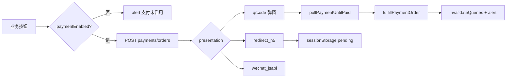

# 支付收银横切交互

## 1. 模块概述

| 项 | 说明 |
|----|------|
| 用户目标 | 用微信/支付宝完成现金支付，获得积分、月卡、战令、商店商品、首充等权益 |
| 入口 | C 端多处按钮统一调用 `runCashPay` / `runPaymentCheckout` |
| 代码 | [`payment-checkout.ts`](../../../front-page/src/client/payment-checkout.ts)、[`payment-api.ts`](../../../front-page/src/client/payment-api.ts) |
| 业务规则 | [payment-module-integration.md](../../payment-module-integration.md) |

## 2. 信息架构

## 3. 触发场景

| 场景 | 业务类型 `biz_type` | 需 token |
|------|---------------------|----------|
| 积分充值 | `points_recharge` | 是 **[已实现]** |
| 月卡购买 | `membership` | 是 **[已实现]** |
| 战令购买 | `battle_pass` | 是 **[已实现]** |
| 商店现金商品 | `shop_item` | 是 **[已实现]** |
| 首充礼包 | `first_recharge_pack` | 是 **[已实现]** |

未登录点击：各业务按钮前置判断 `!token` 时不发起支付 **[已实现]**。

## 4. 核心用户流程

### 4.1 二维码支付（PC/非微信内）

1. 用户点击现金支付 → `setPayingCash(true)` **[已实现]**
2. `runPaymentCheckout` + `onQrcode` → `setQrCheckout(checkout)` 打开居中弹窗 **[已实现]**
3. 展示渠道名、金额、`qr_code_content` 渲染二维码图（第三方 QR API） **[已实现]**
4. `useEffect` 轮询 `pollPaymentUntilPaid`（最多 90 次） **[已实现]**
5. 成功 → `fulfillPaymentOrder` → 关闭弹窗 → `invalidateQueries` → `alert('支付成功，权益已到账')` **[已实现]**
6. 失败 → `alert` 错误信息，`setPayingCash(false)` **[已实现]**

### 4.2 H5 跳转支付

1. `presentation === 'redirect_h5'` → `window.location.href = redirect_url` **[已实现]**
2. `sessionStorage.setItem('pending_payment_order', orderNo)` **[已实现]**
3. 用户返回站点且已登录 → `resumePendingPayment` 短轮询 + 履约 → `alert` 成功 **[已实现]**

### 4.3 微信 JSAPI（微信内）

1. `WeixinJSBridge.invoke('getBrandWCPayRequest', ...)` **[已实现]**
2. 非微信环境 → `reject('请在微信内打开以完成支付')` **[已实现]**

### 4.4 积分充值弹窗

1. 顶栏点击积分 → `setShowPointsRechargeModal(true)` **[已实现]**
2. 固定 SKU（1/6/12/30/68 元）或自定义金额 → 走 `points_recharge` **[已实现]**

## 5. 交互状态表

| 状态 | 触发 | UI | 用户操作 |
|------|------|-----|----------|
| disabled | `!paymentEnabled` | 现金按钮可点但 alert | 无支付 |
| paying | `payingCash` | 抽盒等按钮 `disabled` | 等待 |
| qr open | `qrCheckout` | 遮罩 + 二维码 | 关闭按钮取消轮询（组件卸载 cancel） |
| success | 轮询 paid | 弹窗关闭 + alert | 继续浏览 |

## 6. 弹窗栈叠规则

- 支付二维码弹窗与开盒弹窗（`showBoxModal`）不应同时操作；抽盒时 `payingCash` 会禁用抽盒按钮 **[已实现]**
- 积分充值 Modal 独立于 `qrCheckout` **[已实现]**

## 7. 与产品文档差异表

| 能力 | 产品描述 | 状态 | 备注 |
|------|----------|------|------|
| 首充双倍展示 | 营销文案 | **[部分实现]** | 首充 UI 有，规则见后端 |
| 支付中页 | 专用订单页 | **[部分实现]** | 多为弹窗/跳转 |
| 退款入口 | 用户申请退款 | **[规划中]** | 无 C 端 UI |

## 8. 异常与边界

| 异常 | 处理 |
|------|------|
| 支付未启用 | `alert('支付功能未启用')` |
| 轮询超时 | `alert` 支付确认失败 |
| H5 返回未付 | `resumePendingPayment` 3 次失败后静默 |
| 重复履约 | 后端幂等；前端 fulfill 后 invalidate |

## 9. 关联文档

- [c-end/06-member-points.md](../c-end/06-member-points.md)
- [c-end/07-shop-first-recharge.md](../c-end/07-shop-first-recharge.md)
- [c-end/08-monthcard-battlepass.md](../c-end/08-monthcard-battlepass.md)
- [payment-module-design.md](../../payment-module-design.md)
