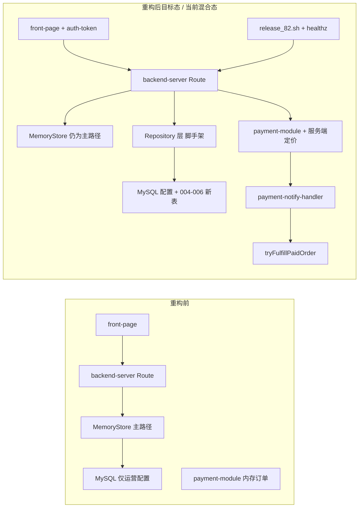

# 生产上线重构说明（2026-05）

> **文档用途**：记录 2026-05 生产上线重构的实际代码改动、验收方式与遗留风险，供研发、测试与运维对照。  
> **更新日期**：2026-05-29  
> **对照计划**：`.cursor/plans/生产上线重构计划_9058f1e1.plan.md`（本文档不修改该 plan 文件）  
> **审计范围**：`git diff`、未跟踪新文件、`backend-server/`、`front-page/`、`deploy/`、`sql/migrations/`、`.github/workflows/ci.yml`

---

## 1. 概述

### 1.1 目的

本次重构面向 **82 生产环境可安全发布**，解决上线阻断项（CORS、密钥硬编码、支付定价信任边界、500 信息泄露等），并为 **MySQL 持久化、Repository 分层、支付审计、管理端安全** 铺设脚手架。核心目标不是一次性完成全量数据落库，而是：

1. 阻断已知安全风险；
2. 明确 `MemoryStore` 与 MySQL 的边界；
3. 让 `release_82.sh` 具备可验证的发布闭环；
4. 引入 CI 与基础单测，防止回归。

### 1.2 范围（Phase 0–6）

| Phase | 主题 | 状态 | 说明 |
|-------|------|------|------|
| **0** | 安全与上线阻断项 | **已完成** | 与 plan 勾选项一致，已合入工作区修改 |
| **1** | 配置与工程基础 | **部分完成** | `STORAGE_MODE`、生产 CORS 校验、`GUEST_INITIAL_POINTS` 等 |
| **2** | Repository 与数据迁移脚手架 | **部分完成** | `repositories/` + migration 004–006，**未接管主业务路径** |
| **3** | 支付加固 | **大部分完成** | 服务端定价、notify 履约、fulfill 只读；MySQL 订单双写未接通 |
| **4** | 管理端认证与审计 | **部分完成** | `admin-auth`、审计日志 API、频控；管理端 UI 未接 |
| **5** | 部署与基础设施 | **大部分完成** | `healthz` 增强、`release_82.sh` 重写；Redis 仍默认关闭 |
| **6** | 前端健壮性与 CI | **部分完成** | `auth-token`、`api.ts`、Vitest、Error Boundary；Tab 拆分未完成 |

> **说明**：官方 plan 文件仅将 Phase 0 标记为完成，Phase 1+ 标注「待后续迭代」。本文 Phase 1–6 按**实际代码聚类**组织，便于验收与排期；与「缺口模块」计划（Phase 0–7 产品能力）是不同维度。

### 1.3 架构变化摘要



**关键结论**：

- 运行时主链路仍是 **`LotteryService` → `MemoryStore`**；`PityTracker` 仍在 Service 实例内存中。
- **`getRepositories()`** 已在 `singleton.ts` 初始化时调用，但 Repository 目前仅用于审计日志、退款路由订单列表等**边缘路径**。
- MySQL 继续承载运营配置（盲盒/奖品/商店/首充/`app_settings`）；migration 004–006 新增表已就绪，**需执行 migrate 后才存在**。
- 支付订单权威状态仍在 **payment-module 内存**；`payment_orders` 表与 Repository 已实现，**尚未在下单/notify 流程中双写**。

---

## 2. 改动内容（按 Phase）

### Phase 0 — 安全与上线阻断项（已完成）

| 改动项 | 文件路径 | 行为变化 |
|--------|----------|----------|
| 生产拒绝 `CORS_ALLOW_ORIGIN=*` | `backend-server/src/server/config.ts` | `NODE_ENV=production` 时 Zod `superRefine` 校验失败，进程启动报错 |
| PM2 移除硬编码密码 | `deploy/pm2/ecosystem.config.cjs` | `ADMIN_PASSWORD`、`MYSQL_PASSWORD`、`CORS_ALLOW_ORIGIN` 改为 `process.env.*` |
| 发布脚本强制注入密钥 | `deploy/release_82.sh` | 缺少 `DEPLOY_PASSWORD` / `ADMIN_PASSWORD` / `MYSQL_PASSWORD` / `CORS_ALLOW_ORIGIN` 则退出；禁止 `CORS=*` |
| `.env.example` 对齐 | `backend-server/.env.example` | 微信占位符、`PAYMENT_ENABLED` 注释、`STORAGE_MODE=memory` 默认值 |
| 支付服务端定价 | `backend-server/src/server/payment-pricing.ts` | `POST /api/v1/payments/orders` 通过 `resolveCheckoutAmountCents()` 从服务端目录取价，不信任客户端 `amount_cents` |
| 用户 fulfill 只读 | `backend-server/app/api/v1/payments/orders/[orderNo]/fulfill/route.ts` | `GET`/`POST` 均调用 `getPaymentFulfillmentStatus()`，**不再触发履约**；履约走 notify / mock 查单 |
| 500 响应泛化 + `error_id` | `backend-server/src/server/api-response.ts` | 非 `AppError` 返回固定文案 + UUID；服务端 `console.error` 含 `[internal_error:{id}]` |
| 奖品图安全 | `backend-server/src/server/prize-image-storage.ts` | 禁止 SVG/XML；上传与读取均做 magic-byte 校验 |
| 前端 token 与 API 健壮性 | `front-page/src/client/auth-token.ts`、`front-page/src/client/api.ts` | 统一 `getUserToken`/`setUserToken`；空响应/非 JSON 解析错误；401 派发 `AUTH_EXPIRED_EVENT` |
| 生产隐藏 `dev_code` | `front-page/src/features/lottery/lottery-app.tsx` | 仅 `NODE_ENV === 'development'` 时展示短信开发验证码 |
| healthz + 发布健康检查 | `backend-server/app/healthz/route.ts`、`deploy/release_82.sh` | 发布后轮询 API `200` 且 `status=ok`；前端 `3000` 可访问；拒绝含「输入昵称」的旧登录 UI |

**支付定价支持的业务类型**（`payment-pricing.ts`）：

| `business_type` | 定价来源 |
|-----------------|----------|
| `membership` | `MEMBERSHIP_CASH_CENTS`（`payment-fulfillment.ts`） |
| `battle_pass` | `BATTLE_PASS_CASH_CENTS` |
| `shop_item` | `MemoryStore` 商店商品 `price_cash` |
| `first_recharge_pack` | 首充礼包 `cash_price` |
| `points_pack` | `business_id` 形如 `recharge_{分}` |
| `inventory_delivery` | `getDeliveryShippingFeeCentsByUserId()` |

单测：`backend-server/src/server/payment-pricing.spec.ts`（2 cases）。

---

### Phase 1 — 配置与工程基础（部分完成）

| 改动项 | 文件路径 | 行为变化 |
|--------|----------|----------|
| 存储模式开关 | `backend-server/src/server/config.ts` | 新增 `STORAGE_MODE=mysql\|memory`；未设时 `MYSQL_ENABLED=true` → `mysql`，否则 `memory` |
| 存储模式约束 | 同上 | `STORAGE_MODE=mysql` 且 `MYSQL_ENABLED=false` 时启动抛错 |
| 游客初始积分（仅配置） | `config.ts`、`.env.example` | `GUEST_INITIAL_POINTS` 默认 100；**尚未接入 `MemoryStore` 游客注册逻辑** |
| 请求日志脚手架 | `backend-server/src/server/request-log.ts` | `buildRequestLogContext` / `logStructured`；**主路由尚未统一接入** |
| CORS 允许 `X-Request-Id` | `backend-server/src/server/api-response.ts` | 预检头新增 `X-Request-Id` |
| 请求 ID 工具 | 同上 | `requestIdFromRequest()` 供审计等场景使用 |

---

### Phase 2 — Repository 与数据迁移脚手架（部分完成）

#### 2.1 Repository 层

| 文件 | 说明 |
|------|------|
| `backend-server/src/server/repositories/index.ts` | 按 `storageMode` 选择 `createMysqlRepositories()` 或 `createMemoryRepositories(store)` |
| `backend-server/src/server/repositories/types.ts` | 定义 `UserRepo`、`SessionRepo`、`DrawRepo`、`LedgerRepo`、`PityRepo`、`PaymentOrderRepo`、`AdminAuditRepo` |
| `backend-server/src/server/repositories/mysql/index.ts` | MySQL 实现（users、sessions、draw_records、user_members、user_pity_state、payment_orders、admin_audit_logs） |
| `backend-server/src/server/repositories/memory/index.ts` | memory 模式：`draw`/`ledger`/`pity`/`paymentOrders`/`adminAudit` 进程内 Map；`users`/`sessions` 为 noop |
| `backend-server/src/server/singleton.ts` | 启动时 `getRepositories(store)`，**不改变 LotteryService 数据源** |

#### 2.2 SQL 迁移（004–006）

| 迁移文件 | 内容 |
|----------|------|
| `sql/migrations/004_pity_and_draw_request_id.sql` | 表 `user_pity_state`；`draw_records.request_id` 唯一索引 |
| `sql/migrations/005_payment_orders.sql` | 表 `payment_orders`、`payment_notify_logs`（notify 幂等） |
| `sql/migrations/006_admin_sessions_audit.sql` | 表 `admin_sessions`、`admin_audit_logs` |

#### 2.3 Schema 版本

| 文件 | 行为 |
|------|------|
| `backend-server/src/server/schema-version.ts` | 读 `_schema_migrations` 最新 name；无 MySQL 时返回 `000_legacy_schema` |
| `backend-server/app/healthz/route.ts` | 响应新增 `schema_version` |

**未完成的集成**：`LotteryService` 仍用 `PityTracker` 实例字段；抽盒、`draw_records` 写入、积分流水**未调用** `DrawRepo`/`PityRepo`/`LedgerRepo`。

---

### Phase 3 — 支付加固（大部分完成）

| 改动项 | 文件路径 | 行为变化 |
|--------|----------|----------|
| 下单取价 | `app/api/v1/payments/orders/route.ts` | 创建 checkout 前 `resolveCheckoutAmountCents()` |
| 支付后自动履约 | `app/api/v1/payments/orders/route.ts` | mock/已支付订单创建后 `tryFulfillPaidOrder()` |
| Notify 日志与履约 | `backend-server/src/server/payment-notify-handler.ts`、`payment-http.ts` | 验证通过后写 `payment_notify_logs`（MySQL 可用时）；新 notify 触发 `fulfillOrderAfterNotify` |
| 履约状态查询 | `backend-server/src/server/payment-fulfillment.ts` | 新增 `getPaymentFulfillmentStatus()`；移除用户侧主动 fulfill |
| 网关类型扩展 | `backend-server/src/server/payment-gateway.ts` | notify 结果含 `alreadyProcessed`、`notify` 字段 |
| 盒柜发货定价 | `memory-store.ts`、`lottery-service.ts` | `getDeliveryShippingFeeCents` / `getDeliveryRequest` 供 `inventory_delivery` 定价 |
| 退款与订单列表（新文件） | `app/api/v1/payments/orders/[orderNo]/refund/route.ts` | `POST` 调 `payment.requestRefund`；`GET` 从 `getRepositories().paymentOrders.listByUser` 列订单 |

**支付履约映射**（`payment-fulfillment.ts` → `runBusinessFulfillment`）：

- `first_recharge_pack`、`membership`、`shop_item`、`battle_pass`、`points_pack`、`inventory_delivery`

**缺口**：checkout 流程**未** `paymentOrders.upsert()`；notify 日志依赖 MySQL 但订单仍以 payment-module 内存为准。

---

### Phase 4 — 管理端认证与审计（部分完成）

| 改动项 | 文件路径 | 行为变化 |
|--------|----------|----------|
| 管理端登录校验 | `backend-server/src/server/admin-auth.ts` | 优先查 MySQL `admin_users` + SHA256 盐哈希；回退 `ADMIN_USER`/`ADMIN_PASSWORD`；IP 维度 5 次/15 分钟锁定（Redis 可用时） |
| 审计写入 | `backend-server/src/server/audit-log.ts` | `writeAdminAudit()` → `AdminAuditRepo.insert()` |
| 登录审计 | `app/api/v1/[...path]/route.ts` | `POST admin/login` 成功后写 `admin.login` 审计 |
| 审计日志查询 | 同上 | `GET admin/audit-logs?limit=` |
| 抽奖记录 CSV 导出 | 同上 | `GET admin/draw-records/export` 返回 CSV 附件 |
| 合规配置更新 | 同上 | `POST admin/compliance` → `service.updateCompliance()` |
| 手机验证码频控 | 同上 | `POST auth/phone/code` IP 限流 10 次/小时 |
| Redis 辅助 | `backend-server/src/server/redis-helpers.ts` | OTP 存取、频控、`claimIdempotent`；**Redis 未启用时静默放行/跳过** |
| SMS Provider（未接线） | `backend-server/src/server/sms-provider.ts` | 生产禁止 mock；**`MemoryStore.sendPhoneCode` 仍用内存验证码，未调用此模块** |

**缺口**：`admin_sessions` 表已 migration，会话仍由 `MemoryStore` 管理；管理端 UI **无**审计日志 Tab。

---

### Phase 5 — 部署与基础设施（大部分完成）

| 改动项 | 文件路径 | 行为变化 |
|--------|----------|----------|
| healthz 增强 | `backend-server/app/healthz/route.ts` | 新增 `storage_mode`、`schema_version`；MySQL/Redis 异常时 `503 degraded` |
| nginx healthz | `deploy/nginx/gaokao-api.conf` | `location = /healthz` 反代到 `18100` |
| 发布脚本 | `deploy/release_82.sh` | 6 步：rsync（含 payment-module 拷贝）、migrate、构建、PM2 重启、healthz/前端探测、拒绝 legacy UI |
| 部署文档 | `deploy/README.md` | 必填 env、HTTPS certbot 指引、healthz 字段说明 |
| PM2 生产默认值 | `deploy/pm2/ecosystem.config.cjs` | `MYSQL_ENABLED=true`、`PAYMENT_ENABLED=true`、`REDIS_ENABLED=false` |

**路径注意**：`ecosystem.config.cjs` 与 nginx 模板默认 cwd 为 `/home/ubuntu/campaign-lottery-next`；`deploy/README.md` 默认 `REMOTE_PROJECT_DIR` 写 `campaign-lottery-platform`。**两者不一致时需显式设置 `REMOTE_PROJECT_DIR`**。

---

### Phase 6 — 前端健壮性与 CI（部分完成）

| 改动项 | 文件路径 | 行为变化 |
|--------|----------|----------|
| Token 模块 | `front-page/src/client/auth-token.ts` | `getUserToken` / `setUserToken` / `clearUserToken`；键名 `campaign-lottery-user-token` |
| Token 单测 | `front-page/src/client/auth-token.spec.ts` | Vitest mock localStorage |
| Auth Hook | `front-page/src/features/lottery/hooks/use-auth.ts` | 薄封装，**lottery-app 尚未全面替换内联逻辑** |
| API 客户端 | `front-page/src/client/api.ts` | `ApiRequestError`、`parseApiEnvelope`、401 事件 |
| 支付页 | `front-page/app/pay/[orderNo]/page.tsx` | 使用 `getUserToken()` |
| Error Boundary | `front-page/app/error.tsx`、`global-error.tsx` | 用户可见错误页 + 重试 |
| 安全响应头 | `front-page/next.config.mjs` | `X-Frame-Options`、`CSP`、`Referrer-Policy` |
| Vitest | `front-page/vitest.config.ts`、`package.json` | `npm test` → `vitest run` |
| CI 工作流（新文件） | `.github/workflows/ci.yml` | 三 job：`backend-server`、`payment-module`、`front-page` 分别 typecheck/lint/test |
| Tab 拆分（骨架） | `front-page/src/features/lottery/tabs/inventory-tab.tsx`、`front-page/src/features/admin/tabs/fulfillment-tab-utils.ts` | **未替换** `lottery-app.tsx` / `admin-app.tsx` 单体 |

---

## 3. 测试建议

### 3.1 手动测试清单

#### 环境与配置

- [ ] `backend-server` 在 `NODE_ENV=production`、`CORS_ALLOW_ORIGIN=*` 下**无法启动**
- [ ] `CORS_ALLOW_ORIGIN=http://localhost:3000` 本地前后端联调正常
- [ ] `GET /healthz` 返回 `storage_mode`、`schema_version`、`dependencies.mysql/redis`
- [ ] MySQL 关闭时 `status=ok`（dependencies 非 error）；MySQL 配错密码时 `503 degraded`

#### 认证与用户

- [ ] 手机验证码：开发环境可见 `dev_code`；生产构建**不展示**开发验证码
- [ ] Token 过期：401 触发前端登出/提示（`AUTH_EXPIRED_EVENT`）
- [ ] 验证码频控：同一 IP 连续请求 `auth/phone/code` 超过 10 次/小时返回 429

#### 支付流程（`PAYMENT_ENABLED=true` + mock config）

- [ ] 创建订单：`POST /api/v1/payments/orders`，金额由服务端决定（篡改 body 无效）
- [ ] Mock 支付后自动履约（会员/商店/首充/战令/积分/盒柜发货各测一条）
- [ ] `GET /api/v1/payments/orders/{orderNo}/fulfill` **仅返回状态**，不重复发货
- [ ] `/pay/[orderNo]` 轮询 fulfill 状态正确
- [ ] 微信/支付宝 notify（mock 或沙箱）：重复 notify 不重复履约（依赖 `payment_notify_logs` 幂等，需 MySQL）

#### 管理端

- [ ] `POST /api/v1/admin/login`：错误密码 5 次后锁定（需 `REDIS_ENABLED=true` 才跨进程生效）
- [ ] 登录成功后 `GET /api/v1/admin/audit-logs` 可见 `admin.login`
- [ ] `GET /api/v1/admin/draw-records/export` 下载 CSV
- [ ] `POST /api/v1/admin/compliance` 更新后 C 端 `config/public` 可读

#### 安全

- [ ] 上传 `.svg` 奖品图被拒绝
- [ ] 伪造扩展名图片（magic-byte 不匹配）被拒绝
- [ ] 触发 500 的接口：响应无堆栈，含 `error_id`

#### 部署

- [ ] `release_82.sh` 在无必填 env 时失败
- [ ] 发布后 `curl http://127.0.0.1:18100/healthz` → `"status":"ok"`
- [ ] 前端无「输入昵称」legacy 登录 UI

### 3.2 自动化测试命令

| 子项目 | 命令 | 当前结果（2026-05-29 审计） |
|--------|------|----------------------------|
| backend-server | `cd backend-server && npm run typecheck && npm test` | typecheck 通过；Jest **5/5 通过**（含 `payment-pricing.spec.ts`、`probability.spec.ts`） |
| backend-server lint | `cd backend-server && npm run lint` | **9 errors**（主要在 `payment-gateway.ts` 等） |
| front-page | `cd front-page && npm run typecheck && npm test` | Vitest **1/1 通过**（`auth-token.spec.ts`） |
| front-page lint | `cd front-page && npm run lint` | 0 errors，28 warnings |
| payment-module | `cd payment-module && npm test` | **1 failed**：`payment-service.spec.ts`「is idempotent for same client_request_id」— `paid -> pending` 非法状态转移 |
| CI | push 至 `main`/`master`/`develop` 或 PR | `.github/workflows/ci.yml` 会跑上述三套；**payment-module 失败将导致 CI 红** |

### 3.3 `release_82.sh` 所需环境变量

| 变量 | 必填 | 说明 |
|------|------|------|
| `DEPLOY_PASSWORD` | 是 | SSH `sshpass` 密码 |
| `ADMIN_PASSWORD` | 是 | 写入 PM2 `ADMIN_PASSWORD` |
| `MYSQL_PASSWORD` | 是 | 写入 PM2 `MYSQL_PASSWORD` |
| `CORS_ALLOW_ORIGIN` | 是 | 生产前端源，**禁止 `*`** |
| `DEPLOY_HOST` | 否 | 默认 `82.156.54.232` |
| `DEPLOY_USER` | 否 | 默认 `ubuntu` |
| `REMOTE_PROJECT_DIR` | 否 | 默认 `/home/ubuntu/campaign-lottery-next`（与 README 默认值可能不同） |
| `NGINX_SITE_PATH` | 否 | 默认 `/etc/nginx/sites-available/gaokao-api` |

本机还需安装：`sshpass`、`rsync`、`python3`（模板路径替换）。

### 3.4 healthz 期望

**正常（200）示例字段**：

```json
{
  "service": "campaign-lottery-backend-server",
  "status": "ok",
  "storage_mode": "mysql",
  "schema_version": "006_admin_sessions_audit",
  "dependencies": {
    "mysql": { "status": "ok" },
    "redis": { "status": "disabled" }
  },
  "timestamp": "..."
}
```

| 场景 | HTTP | `status` |
|------|------|----------|
| MySQL/Redis 均正常或 disabled | 200 | `ok` |
| MySQL enabled 但连接失败 | 503 | `degraded` |
| 未跑 migrate | 200 | `ok`（`schema_version` 可能为 `000_legacy_schema`） |

`release_82.sh` 要求：`HTTP 200` 且 body 含 `"status":"ok"`。

---

## 4. 改动后风险与遗留项

### 4.1 架构与数据

| 风险 | 严重度 | 说明 |
|------|--------|------|
| **MemoryStore 仍为主路径** | 高 | 用户、会话、抽盒、保底、库存、社交等仍在进程内存；Repository 未接入 `LotteryService` |
| **PityTracker 进程内** | 高 | 重启丢失保底进度；migration 004 / `PityRepo` 未使用 |
| **支付订单未落业务 MySQL** | 高 | `payment_orders` 表与 Repo 已实现，checkout/notify **未双写**；对账、多实例仍依赖 payment-module 内存 |
| **`GUEST_INITIAL_POINTS` 未接线** | 中 | 配置可读，游客注册仍用硬编码种子逻辑 |
| **`sms-provider.ts` 未接线** | 中 | 生产若仍走 `MemoryStore.sendPhoneCode` 内存码，存在安全风险 |
| **Redis 默认关闭** | 中 | 频控、OTP、幂等、admin 锁定在单进程内无效或静默降级 |

### 4.2 部分实现与测试

| 项 | 状态 |
|----|------|
| payment-module 单测失败 | `paid -> pending` 幂等用例与当前状态机不一致 |
| backend lint 9 errors | CI 若加 `lint` 门禁会失败（workflow 已含 `npm run lint`） |
| 退款路由 | 文件存在但未跟踪/未充分鉴权测试（`POST` 用裸 `Error('forbidden')` 而非 `AppError`） |
| `request-log.ts` | 未接入主路由 |
| 前端 Tab 拆分 | `lottery-app.tsx` ~2553 行、`admin-app.tsx` ~2073 行仍为单体 |
| 管理端审计 UI | 仅有 API，无前端 Tab |

### 4.3 部署破坏性变更

| 变更 | 影响 | 缓解 |
|------|------|------|
| PM2 密码改为 env | 旧 ecosystem 硬编码密码失效 | 发布时必须 export `ADMIN_PASSWORD`、`MYSQL_PASSWORD` |
| 生产 CORS 禁止 `*` | 旧 `CORS_ALLOW_ORIGIN=*` 无法启动 | 部署前设置真实前端域名 |
| `release_82.sh` 健康检查 | 发布失败会 exit 1 | 查 PM2 日志、`/healthz`、MySQL 密码 |
| migrate 004–006 | 新表依赖 migrate | 发布脚本已含 `npm run migrate` |
| nginx 默认路径 | `campaign-lottery-next` vs `campaign-lottery-platform` | 统一 `REMOTE_PROJECT_DIR` |

### 4.4 多实例与生产化缺口

- **无 Redis 会话/锁**：PM2 多实例或水平扩展会导致 MemoryStore 状态不一致。
- **零停机**：`pm2 delete` 全量重启，短暂不可用。
- **HTTPS**：nginx 模板仅 `listen 80`；需 certbot 或手工证书。
- **监控**：无 SLS/ARMS/Sentry 接入（README 仅提及可选 `SENTRY_DSN`）。
- **图片存储**：奖品图仍写本地 `.runtime/prize-images`，无 OSS。

### 4.5 建议后续优先级（与重构计划衔接）

1. **P0**：payment-module 单测修复；checkout/notify 双写 `payment_orders`；backend lint 清零。
2. **P0**：抽盒路径接入 `DrawRepo` + `request_id` 幂等；保底接入 `PityRepo`。
3. **P1**：`sendPhoneCode` 改调 `sms-provider` + Redis OTP；生产启用 `REDIS_ENABLED`。
4. **P1**：`GUEST_INITIAL_POINTS` 接入游客注册；管理端审计 Tab。
5. **P2**：`LotteryService` 按 `STORAGE_MODE` 切换数据源；前端 Tab 拆分与 URL 深链。

---

## 5. 相关文档

| 文档 | 路径 |
|------|------|
| 技术架构 | [technical-architecture.md](./technical-architecture.md) |
| 配置说明 | [configuration.md](./configuration.md) |
| 数据存储审计 | [data-storage-audit-recommendations.md](./data-storage-audit-recommendations.md) |
| 支付模块设计 | [payment-module-design.md](./payment-module-design.md) |
| 部署说明 | [../deploy/README.md](../deploy/README.md) |
| 缺口迭代清单 | [../缺口模块后续迭代清单.md](../缺口模块后续迭代清单.md) |

---

*本文档随 2026-05 生产重构迭代更新；Phase 0 完成后请以 `git diff` 与 `/healthz` 实测为准验收 Phase 1–6 脚手架项。*
