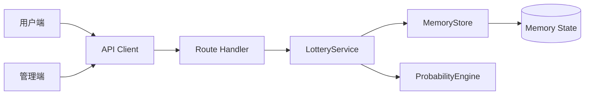
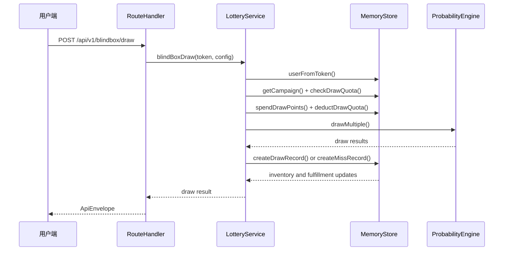

# 系统设计文档

## 背景

本项目对齐参考项目的“BOX·MAGIC 盲盒抽奖平台”能力，但不改变当前架构。当前仍由两个 Next.js 子项目组成：

- `front-page`：用户端和管理端 UI。
- `backend-server`：业务 API 服务，使用 Route Handler、Zod、TypeScript 和内存仓储。

## 总体架构

## 核心流程

### 抽盒流程

### 商店和首充

用户从 `shop/items` 获取商品列表，购买后扣减积分并写入 `user_items`。首充礼包通过 `first-recharge/packs` 展示，领取后发放积分或道具，并记录用户已领取礼包。

### 社交裂变

邀请、助力、队伍和礼物都以用户 token 为边界。当前实现用于功能演示，生产化时助力动作需要防刷记录、设备指纹、IP 限制和风控策略。

### 拼图与抢购

拼图模板驱动用户进度，拼合后发放奖励。限时抢购基于活动库存和用户积分，生产化时需要数据库行锁或 Redis 原子扣减避免超卖。

## 对齐结果

已对齐参考项目中的核心模块：基础抽盒、保底、库存、交换、积分会员、发奖、统计、商店、首充、月卡、战令、社交、拼图、抢购和活动运营。

## 风险与后续

- 当前 `MemoryStore` 不适合多实例生产部署，服务重启会丢数据。
- 抽盒、抢购、兑换、合成、交换等资产操作需要事务化持久化。
- 管理员认证仍是演示级环境变量密码和内存 token。
- 前后端类型仍是手写维护，后续建议用 OpenAPI 或共享包生成契约。
- 数据库落地时应按 `docs/database-design.md` 建表，并补充 migration。
