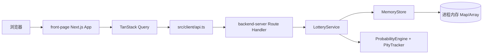
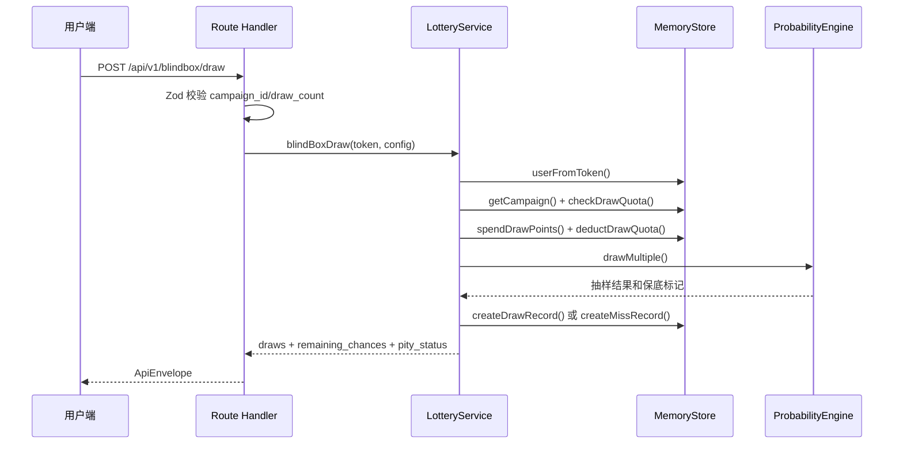

# campaign-lottery-platform 技术文档

## 1. 项目定位

本项目是一个“盲盒/活动抽奖平台”原型，实现了用户端抽盒、系列收集、积分会员、交换市场，以及管理端活动、奖品、发奖和抽奖记录查看能力。

当前仓库由两个独立 Next.js 子项目组成：

- `front-page`：用户端与管理端前端 UI，运行在 `3000` 端口。
- `backend-server`：基于 Next.js Route Handler 的业务 API 服务，运行在 `18100` 端口。

当前实现以前后端双 Next.js 进程为主，82 环境已采用 PM2 + nginx 运行。管理配置类数据已落 MySQL，前台和 MIS 入口由 nginx 暴露；完整模板见 `deploy/`。其余用户态、会话态和运营态数据仍有部分在进程内存中，生产化前仍需继续收敛。

## 2. 规范适用范围

本项目适用 `.cursor/skills/yuanjing-fullstack` 中以下规范：

- `tech-choices.md`：技术选型、依赖边界、npm 包管理约束。
- `architecture.md`：多实例无状态、幂等、健康检查、服务边界约束。
- `infra.md`：阿里云 ACK/FC、RDS、Tair、SLS/ARMS、云效流水线约束。
- `typescript.md`：严格 TypeScript、公开函数返回值、ESLint/Prettier 约束。
- `nextjs.md`：App Router、Tailwind、TanStack Query、RHF + Zod 约束。
- `testing.md`：Jest 单测、集成测试、E2E 分层约束。
- `security.md`：密钥、脱敏、认证鉴权、客户端安全约束。
- `git-and-docs.md`：中文 Markdown 文档、Mermaid 图源、提交前验证约束。

## 3. 技术栈现状

前端 `front-page`：

- Next.js `16.2.6`，App Router。
- React `19.2.6`。
- TypeScript `6.0.3`，`strict: true`。
- Tailwind CSS `4.3.0`，启用 `@tailwindcss/forms` 和 `@tailwindcss/typography`。
- TanStack Query `5.100.14`。
- React Hook Form `7.76.1` + Zod `4.4.3`。
- `lucide-react` 用于图标。

后端 `backend-server`：

- Next.js `16.2.6` Route Handler。
- TypeScript `6.0.3`，`strict: true`。
- Zod `4.4.3` 用于 Route Handler 入参校验。
- Jest `30.4.2` + ts-jest `29.4.11`。
- Node.js 内置 `crypto` 用于随机 ID 和抽样随机数。

通用：

- 包管理器为 npm，两个子项目各自维护 `package-lock.json`。
- 两个子项目都配置了 `eslint-config-next` 和 `@typescript-eslint/no-floating-promises: warn`。

## 4. 目录结构

```text
campaign-lottery-platform/
  front-page/
    app/
      page.tsx
      admin/page.tsx
      layout.tsx
      globals.css
    src/
      app/providers.tsx
      client/api.ts
      features/admin/admin-app.tsx
      features/lottery/lottery-app.tsx
      types/api.ts
    package.json
  backend-server/
    app/
      api/v1/[...path]/route.ts
      healthz/route.ts
    src/server/
      api-response.ts
      errors.ts
      lottery-service.ts
      memory-store.ts
      probability.ts
      probability.spec.ts
      singleton.ts
      types.ts
    jest.config.ts
    package.json
  docs/
    technical-architecture.md
```

## 5. 运行与脚本

前端：

- `npm run dev`：启动 `next dev -p 3000`。
- `npm run build`：构建前端。
- `npm run start`：启动 `next start -p 3000`。
- `npm run lint`：执行 ESLint。
- `npm run typecheck`：执行 `tsc --noEmit`。

后端：

- `npm run dev`：启动 `next dev -p 18100`。
- `npm run build`：构建后端服务。
- `npm run start`：启动 `next start -p 18100`。
- `npm run lint`：执行 ESLint。
- `npm run typecheck`：执行 `tsc --noEmit`。
- `npm test`：执行 Jest 单元测试。

环境变量：

- `front-page/.env.example`
  - `NEXT_PUBLIC_API_BASE_URL=http://localhost:18100`
  - `NEXT_PUBLIC_ADMIN_USER_HINT=admin`
- `backend-server/.env.example`
  - `ADMIN_USER=admin`
  - `ADMIN_PASSWORD=change-me`
  - `CORS_ALLOW_ORIGIN=http://localhost:3000`

## 6. 架构视图



当前前后端通过 HTTP API 解耦。前端只保存当前页面会话中的用户 token/admin token，服务端用 `Authorization: Bearer <token>` 解析用户或管理员身份。

后端核心是三层：

- `app/api/v1/[...path]/route.ts`：统一 Route Handler，负责 HTTP 方法、路径分发、Zod 入参校验、统一响应。
- `LotteryService`：业务服务层，编排抽奖、保底、库存、积分、交换、后台管理等业务流程。
- `MemoryStore`：内存数据仓储，负责用户、会话、活动、奖品、库存、记录、会员和发奖任务。

## 7. 前端模块

`front-page/app/layout.tsx`：

- 设置中文站点元信息。
- 包裹 `Providers`，为全局客户端组件提供 TanStack Query。

`front-page/src/app/providers.tsx`：

- 创建 `QueryClient`。
- 默认 `staleTime` 为 20 秒，失败重试 1 次。

`front-page/src/client/api.ts`：

- 读取 `NEXT_PUBLIC_API_BASE_URL`，默认 `http://localhost:18100`。
- 封装统一 `ApiEnvelope<T>`。
- 自动加入 JSON Content-Type 和 Bearer Token。
- 当 HTTP 非 2xx 或业务 `code !== "ok"` 时抛出错误。

`front-page/src/features/lottery/lottery-app.tsx`：

- 游客登录。
- 活动列表和系列进度。
- 单抽/十连抽。
- 用户库存。
- 交换市场展示。
- 会员积分、签到。

`front-page/src/features/admin/admin-app.tsx`：

- 管理员登录。
- 平台总览。
- 活动列表。
- 按活动查看奖品。
- 发奖任务确认。
- 抽奖记录查看。

## 8. 后端模块

`backend-server/app/api/v1/[...path]/route.ts`：

- 通过 catch-all 路由承载 `/api/v1/**`。
- 支持 `GET`、`POST`、`PUT`、`PATCH`、`DELETE`、`OPTIONS`。
- 所有输入通过 Zod schema 校验。
- 所有输出统一为 `{ code, message, data }`。

`backend-server/app/healthz/route.ts`：

- 返回服务名、状态和当前时间。
- 附带 CORS 头。
- 当前健康检查只做快速本地响应，符合探针快速返回约束。

`backend-server/src/server/probability.ts`：

- `AliasTable`：基于权重构建 O(1) 加权随机抽样表。
- `PityTracker`：保存用户在活动维度的连续未中次数、保底倍率和 UP 池兜底状态。
- `calculateEffectiveWeight()`：软保底后提升目标奖品有效权重，硬保底后返回极大权重。
- `ProbabilityEngine`：执行单次或多次抽样，并更新保底状态。

`backend-server/src/server/lottery-service.ts`：

- 校验活动状态和时间窗口。
- 校验每日抽奖次数。
- 扣减积分和抽奖次数。
- 调用概率引擎抽奖。
- 处理 UP 池 50% 触发和下次兜底。
- 创建中奖/未中奖记录。
- 返回剩余次数和保底状态。

`backend-server/src/server/memory-store.ts`：

- 使用 `Map` 和数组保存全部业务状态。
- 初始化三组示例活动和奖品。
- 维护用户、会话、会员、积分日志、库存、交换挂单、发奖任务。
- 管理端 token 有 12 小时有效期，用户 token 有 7 天有效期。

`backend-server/src/server/singleton.ts`：

- 使用 `globalThis.__campaignLotteryServices` 在开发热更新和单进程内复用 `MemoryStore` 与 `LotteryService`。

## 9. API 概览

公开/用户 API：

- `POST /api/v1/auth/guest-login`：游客登录。
- `GET /api/v1/blindbox/campaigns`：活动列表，登录后带收集进度。
- `GET /api/v1/blindbox/campaigns/:id/probabilities`：活动概率信息。
- `POST /api/v1/blindbox/draw`：抽盒。
- `GET /api/v1/blindbox/pity-status?campaign_id=...`：保底状态。
- `GET /api/v1/blindbox/inventory`：用户库存。
- `GET /api/v1/blindbox/series-progress?campaign_id=...`：系列收集进度。
- `GET /api/v1/blindbox/exchange-offers`：交换市场挂单。
- `POST /api/v1/blindbox/exchange-offers`：创建交换挂单。
- `POST /api/v1/blindbox/exchange-offers/:id/accept`：接受交换挂单。
- `DELETE /api/v1/blindbox/exchange-offers/:id`：取消交换挂单。
- `POST /api/v1/blindbox/redeem`：积分兑换奖品。
- `POST /api/v1/blindbox/checkin`：每日签到。
- `POST /api/v1/blindbox/share-reward`：分享奖励。
- `GET /api/v1/blindbox/member`：会员信息。
- `GET /api/v1/blindbox/points-log`：积分日志。
- `GET /api/v1/blindbox/leaderboard`：收集排行榜。

管理 API：

- `POST /api/v1/admin/login`：管理员登录。
- `GET /api/v1/admin/overview`：管理总览。
- `GET /api/v1/admin/campaigns`：活动列表。
- `POST /api/v1/admin/campaigns`：创建活动。
- `GET /api/v1/admin/campaigns/:id`：活动详情。
- `PUT /api/v1/admin/campaigns/:id`：更新活动。
- `DELETE /api/v1/admin/campaigns/:id`：删除活动。
- `GET /api/v1/admin/campaigns/:id/prizes`：活动奖品。
- `POST /api/v1/admin/campaigns/:id/prizes`：创建奖品。
- `PUT /api/v1/admin/prizes/:id`：更新奖品。
- `DELETE /api/v1/admin/prizes/:id`：删除奖品。
- `GET /api/v1/admin/campaigns/:id/pity-config`：保底配置。
- `PUT /api/v1/admin/campaigns/:id/pity-config`：更新保底配置。
- `GET /api/v1/admin/fulfillment-tasks`：发奖任务。
- `PATCH /api/v1/admin/fulfillment-tasks/:id`：更新发奖任务。
- `POST /api/v1/admin/delivery/approve`：批量发奖审核。
- `GET /api/v1/admin/draw-records`：抽奖记录。
- `GET /api/v1/admin/statistics`：抽奖统计。

## 10. 数据模型

核心实体定义在 `backend-server/src/server/types.ts`，前端在 `front-page/src/types/api.ts` 维护一份对应的 API 类型。

主要实体：

- `User` / `Session`：游客用户和会话 token。
- `Campaign`：活动，包含状态、时间窗口、每日抽奖上限、未中权重和可选保底配置。
- `Prize`：奖品，包含等级、库存、概率权重和状态。
- `DrawRecord`：抽奖记录，记录中奖或未中结果。
- `UserInventory`：用户奖品库存。
- `SeriesProgress`：系列收集进度。
- `ExchangeOffer`：交换挂单。
- `UserMember` / `UserPointsLog`：会员等级、积分余额和积分流水。
- `FulfillmentTask`：中奖后的发奖任务。

当前没有数据库 schema 或 ORM。生产化建议优先使用 Prisma + RDS MySQL，并将保底状态、库存扣减、抽奖记录写入同一事务或具备一致性边界的持久化流程。

## 11. 关键业务流程

抽奖流程：



保底规则：

- 活动可配置 `pity_config.enabled` 开关。
- 当连续未中次数达到 `soft_pity_n` 后，目标奖品权重按 `pity_factor` 递增。
- 当连续未中次数达到 `hard_pity_n` 后，直接返回目标奖品。
- UP 池开启后，命中指定等级时 50% 转为 UP 奖品；未中 UP 则设置下一次 UP 兜底。

积分规则：

- 新用户注册赠送 1000 积分。
- 单抽消耗 100 积分。
- 多抽按每次 95 积分计算。
- 每日签到奖励 20 积分，连续第 7 天奖励 70 积分。
- 分享奖励每天最多 3 次，每次 10 积分。
- 兑换奖品按等级消耗积分：`limited=2000`、`secret=1200`、`rare=500`、其他 `200`。

## 12. 测试现状

当前后端已有 `backend-server/src/server/probability.spec.ts`，覆盖：

- Alias Table 可构建并返回合法索引。
- 软保底后目标奖品权重按预期提升。
- 达到硬保底后返回目标奖品。

本次验证结果：

- `front-page`：`npm run typecheck` 通过。
- `front-page`：`npm run lint` 通过。
- `backend-server`：`npm run typecheck` 通过。
- `backend-server`：`npm run lint` 通过。
- `backend-server`：`npm test` 通过，1 个测试套件，3 个用例。

测试缺口：

- 前端没有组件测试和 E2E 测试。
- 后端只覆盖概率引擎，未覆盖 Route Handler、抽奖扣库存、积分扣减、每日限额、交换市场、发奖任务。
- 当前没有真实 API/持久化集成测试。

## 13. 规范符合度与风险

符合项：

- 使用 Next.js App Router。
- 使用 TypeScript strict 模式。
- 使用 npm 和 `package-lock.json`。
- 前端使用 TanStack Query 管理 API 数据。
- 表单使用 React Hook Form + Zod。
- 后端健康检查快速返回。
- 后端业务异常统一为结构化 `ApiEnvelope`。
- 已有 Jest 单测，且现有 lint/typecheck/test 通过。

需要整改项：

- `MemoryStore` 和 `PityTracker` 持有进程内可变业务状态，不符合多实例无状态约束。
- 当前库存扣减、抽奖记录、积分扣减不是数据库事务；多实例或并发场景会出现库存超卖、积分重复扣减或记录不一致。
- `singleton.ts` 通过 `globalThis` 复用服务，只适合本地单进程开发，不适合作为生产状态管理。
- 仓库当前不是 Git 仓库，且未发现 `.gitignore`；但存在 `.env.local` 文件，后续初始化 Git 前必须确保 `.env*` 被忽略。
- 未发现 Dockerfile、云效流水线、ACK/FC 部署配置、SLS/ARMS 日志接入配置。
- `front-page/app/globals.css` 包含自定义全局样式和硬编码颜色，和“除 Tailwind 指令外不生成全局 CSS”的前端规范存在差距。
- 前端 API 类型和后端 API 类型是两份手写定义，存在接口漂移风险。
- 管理端认证是内存 token + 环境变量密码，缺少审计、权限分级、密码哈希和暴力破解防护。
- CORS 在未设置 `CORS_ALLOW_ORIGIN` 时回退到 `*`，生产环境应强制配置白名单。

## 14. 生产化改造建议

优先级 P0：

- 引入 Prisma + RDS MySQL，持久化用户、会话、活动、奖品、抽奖记录、库存、积分、发奖任务。
- 将库存扣减、积分扣减、抽奖记录写入、库存入账、发奖任务创建纳入事务。
- 将保底状态、每日限额、签到状态、分享次数迁移到数据库或 Tair，并使用原子操作保证多实例一致性。
- 新增 `.gitignore`，确保 `.env*`、`.next/`、`node_modules/`、`coverage/` 不进入版本库。

优先级 P1：

- 拆分 `app/api/v1/[...path]/route.ts` 的路径分发，减少单文件路由膨胀。
- 引入服务端日志，优先使用 `@yuanjing/pino-logger` 和 `@yuanjing/alicloud-sls`。
- 补充 API 单元测试和关键业务集成测试。
- 增加前端组件测试或核心用户路径 E2E 测试。
- 为管理端增加最小权限、操作审计和失败登录限制。

优先级 P2：

- 用共享类型包、OpenAPI 或生成器统一前后端 API 契约。
- 将前端 UI 原子组件沉淀为 shadcn/ui 风格组件。
- 增加 Dockerfile、健康探针、云效流水线和 ACK/FC 部署文档。
- 增加 CSP、安全响应头和前端错误监控。

## 15. 完成检查项

- [x] 文档使用中文 Markdown，并放在 `docs/` 目录。
- [x] 架构图使用 Mermaid，图源即文档。
- [x] 覆盖技术栈、目录结构、运行脚本、环境变量、架构、模块、API、数据模型、业务流程、测试和风险。
- [x] 对照元境全栈规范标注当前符合项和整改项。
- [x] 记录本次 lint/typecheck/test 验证结果。

## 16. 功能对齐补充

本次在不改变现有 Next.js 前后端架构的前提下，将参考项目中原先占位或缺失的模块补齐到当前实现：

- 用户端新增商店、首充礼包、道具库存、月卡、战令、邀请助力、组队开盒、礼物、拼图、限时抢购和运营活动展示。
- 管理端新增快速创建活动、快速创建礼品、保存保底/UP 池配置、查看战令任务、商品列表和首充礼包。
- 后端新增 `/shop`、`/first-recharge`、`/month-card`、`/battle-pass`、`/share`、`/team`、`/puzzle`、`/flash`、`/activities`、`/blindbox/blend`、`/blindbox/hint` 等接口。
- 文档新增 `docs/modules.md`、`docs/api-design.md`、`docs/database-design.md` 和 `docs/system-design.md`。

功能对齐后的数据仍位于 `MemoryStore`。`docs/database-design.md` 给出了生产化数据库设计和 ER 图，后续如果进入生产化阶段，应先完成持久化和事务边界改造。
