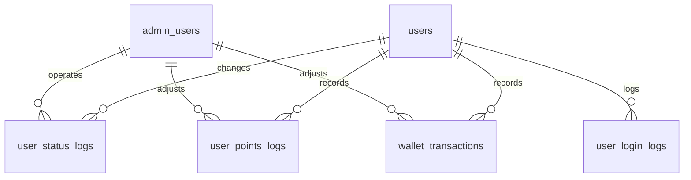

# 后台用户管理设计文档

## 1. 背景与依据

本设计聚焦管理端对用户、状态、资产、登录记录和审计的管理能力。普通用户侧注册、登录、资料维护和用户端账户展示见 [`user-management-user-design.md`](user-management-user-design.md)。

现有依据：

- [`api-design.md`](api-design.md)：管理端接口统一位于 `/api/v1/admin/**`，响应统一为 `{ code, message, data }`，使用 `Authorization: Bearer <token>`。
- [`database-design.md`](database-design.md)：已有 `admin_users` 逻辑表，以及 `users`、`user_sessions`、`user_members`、`user_points_logs` 等用户相关表。
- [`modules.md`](modules.md)：管理端入口是 `front-page/app/admin/page.tsx`，核心实现位于 `front-page/src/features/admin/admin-app.tsx`。
- 当前管理端已有 `POST /api/v1/admin/login`、`GET /api/v1/admin/overview`、活动管理、奖品管理、发奖管理和抽奖记录能力，缺少完整用户管理。

## 2. 后台设计目标

后台用户管理模块面向运营、客服、风控和管理员：

- 支持按手机号、昵称、状态、注册来源、注册时间查询用户。
- 支持查看用户详情，包括基础资料、微信绑定、会员积分、现金余额、抽奖统计、登录记录和资产流水。
- 支持冻结、解冻、禁用、注销标记等状态操作。
- 支持人工调整积分或余额，并强制记录操作人、原因和流水。
- 支持登录日志、状态日志、资产流水和后台操作审计查询。
- 为后续 MySQL/Redis 生产化、权限角色和风控策略预留结构。

## 3. 后台功能范围

包含：

- 管理员登录与会话。
- 后台用户列表、筛选、分页、导出预留。
- 用户详情页：基础资料、账号状态、绑定身份、会员资产、抽奖与活动概览。
- 用户状态管理：冻结、解冻、禁用、注销标记。
- 资产管理：积分调整、现金余额调整预留、流水查询。
- 风控与审计：登录日志、状态变更日志、后台操作记录。

不包含：

- 用户端注册、登录、资料编辑和手机号验证流程，见 [`user-management-user-design.md`](user-management-user-design.md)。
- 活动、奖品、概率配置和发奖管理本身；这里只引用这些模块与用户的关系。

## 4. 管理端角色与权限

推荐角色：

- `super_admin`：拥有全部权限，包括后台账号管理、用户状态变更和资产调整。
- `operator`：可查询用户、处理冻结/解冻、查看流水，可按配置执行积分调整。
- `viewer`：只读权限，可查看用户列表、详情、日志和流水。

权限建议：

- 用户查询：`user:read`
- 用户状态变更：`user:status:update`
- 积分调整：`user:points:adjust`
- 钱包调整：`user:wallet:adjust`
- 登录日志查看：`user:login-log:read`
- 审计日志查看：`audit:read`
- 后台账号管理：`admin:user:manage`

第一期可以先在服务层用角色枚举控制；生产化后建议增加角色权限表。

## 5. 用户列表

列表筛选条件：

- 手机号：支持完整手机号和脱敏展示后的精确查询。
- 昵称：支持模糊搜索。
- 用户 ID：精确查询。
- 状态：`pending_phone`、`active`、`frozen`、`disabled`、`cancelled`。
- 注册来源：`wechat`、`mobile`、`guest`、`admin_import`。
- 注册时间：开始时间、结束时间。
- 最近登录时间：开始时间、结束时间。

列表展示字段：

- 用户 ID。
- 昵称和头像。
- 脱敏手机号。
- 用户状态。
- 注册来源。
- 会员等级。
- 积分余额。
- 现金余额。
- 累计抽奖次数。
- 累计消费。
- 最近登录时间。
- 创建时间。

分页与排序：

- 默认按 `created_at desc`。
- 支持按注册时间、最近登录时间、积分余额、累计消费排序。
- 分页参数建议使用 `page`、`page_size`，后续大数据量可扩展游标分页。

## 6. 用户详情

用户详情需要聚合多个表和业务模块：

- 基础资料：`users`、`user_profiles`。
- 绑定身份：`user_identities`，展示微信 `openid` 后 6 位、`unionid`、绑定时间、微信昵称和头像。
- 会话信息：`user_sessions`，展示活跃设备和过期时间，支持强制下线。
- 会员积分：`user_members`、`user_points_logs`。
- 现金钱包：`user_wallets`、`wallet_transactions`。
- 抽奖概览：`draw_records`、`user_inventories`、`user_campaign_quotas`。
- 活动参与：`activity_participations`。
- 社交行为：邀请、助力、赠礼等用户关联记录。
- 登录日志：`user_login_logs`。
- 状态日志：`user_status_logs`。

详情页建议分区：

- 基本信息。
- 账号与绑定。
- 状态与风控。
- 账户资产。
- 抽奖与库存。
- 活动与社交。
- 登录日志。
- 操作审计。

## 7. 用户状态管理

后台可执行的状态变更：

- `pending_phone -> active`：一般由用户手机号验证触发，不建议后台手动操作。
- `active -> frozen`：冻结资产行为，用户仍可登录和查看信息。
- `frozen -> active`：解冻。
- `active/frozen -> disabled`：禁用账号，禁止登录或登录后只展示禁用原因。
- `active/frozen/disabled -> cancelled`：注销标记，需满足注销前置条件并脱敏。

状态变更要求：

- 必须填写原因。
- 必须记录操作人。
- 必须写 `user_status_logs`。
- 对 `disabled` 和 `cancelled` 用户，应撤销未过期 `user_sessions`。
- 对 `frozen` 用户，不强制下线，但所有资产行为必须被服务层拦截。

禁止行为：

- 不允许后台静默覆盖用户手机号。
- 不允许不写流水直接修改积分或现金余额。
- 不允许删除用户历史抽奖、订单、发奖、资产流水记录。

## 8. 资产管理

积分管理：

- 管理员可以查看用户积分余额和积分流水。
- 人工积分调整必须走 `POST /api/v1/admin/users/:id/points-adjust`。
- 调整时必须填写原因和备注。
- 变更必须同时更新 `user_members.points` 和写入 `user_points_logs`。
- 必须使用 `request_id` 或后台操作 ID 保证幂等。

现金余额管理：

- 如果启用现金钱包，后台调整必须写入 `wallet_transactions`。
- 现金调整建议限制在 `super_admin` 或双人审核后执行。
- 退款、充值、消费应优先通过支付订单和业务订单驱动，不建议后台直接改余额。

资产操作审计字段：

- `operator_id`：后台操作人。
- `reason`：调整原因。
- `remark`：人工备注。
- `biz_type`：如 `admin_adjust`。
- `biz_id`：后台操作单号。
- `request_id`：幂等键。

## 9. 风控与审计

登录日志：

- 记录登录方式、登录账号、IP、设备、UA、成功状态和失败原因。
- 支持按用户、IP、设备、时间查询。
- 可用于识别撞库、异常设备和批量注册。

状态日志：

- 记录用户状态的每次变化。
- 支持运营和客服追溯冻结、解冻、禁用、注销原因。

后台操作审计：

- 第一阶段可复用 `user_status_logs`、`user_points_logs.operator_id`、`wallet_transactions.operator_id`。
- 生产化建议新增通用 `admin_operation_logs`，统一记录后台所有敏感操作。

推荐审计字段：

- 操作人 ID。
- 操作类型。
- 目标资源类型和 ID。
- 操作前数据快照。
- 操作后数据快照。
- 操作原因。
- IP 和 UA。
- 创建时间。

## 10. 后台 API 设计

管理员认证：

- `POST /api/v1/admin/login`：管理员登录。
- `POST /api/v1/admin/logout`：管理员退出。
- `GET /api/v1/admin/me`：当前管理员信息和权限。

用户管理：

- `GET /api/v1/admin/users`：用户列表，支持手机号、昵称、状态、注册来源、注册时间筛选。
- `GET /api/v1/admin/users/:id`：用户详情。
- `PATCH /api/v1/admin/users/:id/status`：冻结、解冻、禁用、注销标记。
- `POST /api/v1/admin/users/:id/kick-sessions`：强制用户下线。

资产管理：

- `GET /api/v1/admin/users/:id/points-log`：积分流水。
- `POST /api/v1/admin/users/:id/points-adjust`：人工积分调整。
- `GET /api/v1/admin/users/:id/wallet-transactions`：现金钱包流水。
- `POST /api/v1/admin/users/:id/wallet-adjust`：人工现金余额调整，建议二期实现。

日志与审计：

- `GET /api/v1/admin/users/:id/login-logs`：用户登录记录。
- `GET /api/v1/admin/users/:id/status-logs`：用户状态变更记录。
- `GET /api/v1/admin/audit-logs`：后台操作审计，建议二期实现。

响应兼容：

- 保持 `{ code, message, data }`。
- 列表接口返回 `items`、`page`、`page_size`、`total`。
- 敏感信息默认脱敏，例如手机号、openid、IP 可按权限展示。

## 11. 后台数据库设计

后台数据库设计依赖用户端核心表，并额外关注后台账号、用户状态日志、登录日志和资产调整审计。

### 11.1 ER 关系

### 11.2 `admin_users`

当前管理端使用环境变量账号密码，生产化建议使用表驱动。

| 字段 | 类型 | 约束 | 说明 |
|---|---|---|---|
| `id` | `varchar(32)` | PK | 后台用户 ID |
| `username` | `varchar(64)` | UNIQUE, not null | 登录名 |
| `password_hash` | `varchar(255)` | not null | 密码哈希 |
| `display_name` | `varchar(64)` | not null | 展示名 |
| `role` | `varchar(32)` | not null | `super_admin`、`operator`、`viewer` |
| `status` | `varchar(32)` | not null | `active`、`disabled` |
| `last_login_at` | `datetime` | nullable | 最近登录时间 |
| `created_at` | `datetime` | not null | 创建时间 |
| `updated_at` | `datetime` | not null | 更新时间 |

索引：

- `PRIMARY KEY(id)`
- `UNIQUE KEY uk_admin_username(username)`
- `KEY idx_admin_status(status)`

### 11.3 `user_status_logs`

记录冻结、解冻、禁用、注销等状态变化。

| 字段 | 类型 | 约束 | 说明 |
|---|---|---|---|
| `id` | `bigint unsigned` | PK, auto increment | 日志 ID |
| `user_id` | `varchar(32)` | FK, not null | 用户 ID |
| `from_status` | `varchar(32)` | not null | 原状态 |
| `to_status` | `varchar(32)` | not null | 新状态 |
| `reason` | `varchar(255)` | not null | 变更原因 |
| `operator_id` | `varchar(32)` | nullable | 后台操作人或系统 |
| `created_at` | `datetime` | not null | 创建时间 |

索引：

- `PRIMARY KEY(id)`
- `KEY idx_status_logs_user_id(user_id, created_at)`
- `KEY idx_status_logs_operator(operator_id, created_at)`

### 11.4 `user_login_logs`

登录日志表，用于风控和后台排查。

| 字段 | 类型 | 约束 | 说明 |
|---|---|---|---|
| `id` | `bigint unsigned` | PK, auto increment | 日志 ID |
| `user_id` | `varchar(32)` | nullable, index | 登录成功时关联用户 |
| `login_type` | `varchar(32)` | not null | `wechat`、`mobile_code`、`guest`、`admin` |
| `login_account` | `varchar(128)` | nullable | 脱敏手机号、openid 后 6 位等 |
| `success` | `tinyint(1)` | not null | 是否成功 |
| `fail_reason` | `varchar(128)` | nullable | 失败原因 |
| `ip` | `varchar(64)` | nullable | IP |
| `device_id` | `varchar(128)` | nullable | 设备标识 |
| `user_agent` | `varchar(512)` | nullable | UA |
| `created_at` | `datetime` | not null | 创建时间 |

索引：

- `PRIMARY KEY(id)`
- `KEY idx_login_logs_user_id(user_id, created_at)`
- `KEY idx_login_logs_ip(ip, created_at)`
- `KEY idx_login_logs_device(device_id, created_at)`

### 11.5 `user_points_logs` 的后台审计字段

后台积分调整复用积分流水表，需要补齐审计字段。

| 字段 | 类型 | 约束 | 说明 |
|---|---|---|---|
| `id` | `bigint unsigned` | PK, auto increment | 流水 ID |
| `user_id` | `varchar(32)` | FK, not null | 用户 ID |
| `points` | `int` | not null | 正数为增加，负数为扣减 |
| `balance` | `int` | not null | 变动后积分余额 |
| `reason` | `varchar(64)` | not null | 后台调整时为 `admin_adjust` |
| `biz_type` | `varchar(64)` | nullable | 后台调整时为 `admin_operation` |
| `biz_id` | `varchar(64)` | nullable | 后台操作单号 |
| `request_id` | `varchar(64)` | nullable | 幂等键 |
| `operator_id` | `varchar(32)` | nullable | 后台操作人 |
| `remark` | `varchar(255)` | not null default '' | 调整原因备注 |
| `created_at` | `datetime` | not null | 创建时间 |

索引：

- `PRIMARY KEY(id)`
- `KEY idx_points_logs_user_id(user_id, created_at)`
- `UNIQUE KEY uk_points_request(request_id)`
- `KEY idx_points_logs_biz(biz_type, biz_id)`
- `KEY idx_points_logs_operator(operator_id, created_at)`

### 11.6 `wallet_transactions` 的后台审计字段

现金余额调整复用钱包流水表，需要限制权限并记录审计。

| 字段 | 类型 | 约束 | 说明 |
|---|---|---|---|
| `id` | `bigint unsigned` | PK, auto increment | 钱包流水 ID |
| `user_id` | `varchar(32)` | FK, not null | 用户 ID |
| `amount` | `int` | not null | 正数入账，负数出账，单位分 |
| `balance_after` | `int` | not null | 变动后可用余额 |
| `frozen_after` | `int` | not null | 变动后冻结余额 |
| `type` | `varchar(32)` | not null | 后台调整时为 `admin_adjust` |
| `biz_type` | `varchar(64)` | nullable | 后台调整时为 `admin_operation` |
| `biz_id` | `varchar(64)` | nullable | 后台操作单号 |
| `status` | `varchar(32)` | not null | `pending`、`success`、`failed`、`cancelled` |
| `request_id` | `varchar(64)` | nullable | 幂等键 |
| `operator_id` | `varchar(32)` | nullable | 后台操作人 |
| `remark` | `varchar(255)` | not null default '' | 调整原因备注 |
| `created_at` | `datetime` | not null | 创建时间 |

索引：

- `PRIMARY KEY(id)`
- `KEY idx_wallet_tx_user_id(user_id, created_at)`
- `KEY idx_wallet_tx_biz(biz_type, biz_id)`
- `UNIQUE KEY uk_wallet_tx_request(request_id)`
- `KEY idx_wallet_tx_operator(operator_id, created_at)`

### 11.7 `admin_operation_logs`

二期建议新增通用后台操作审计表，覆盖用户、活动、奖品、发奖、资产等敏感操作。

| 字段 | 类型 | 约束 | 说明 |
|---|---|---|---|
| `id` | `bigint unsigned` | PK, auto increment | 审计 ID |
| `operator_id` | `varchar(32)` | not null | 后台操作人 |
| `action` | `varchar(64)` | not null | 操作类型 |
| `resource_type` | `varchar(64)` | not null | 资源类型 |
| `resource_id` | `varchar(64)` | not null | 资源 ID |
| `before_json` | `json` | nullable | 操作前快照 |
| `after_json` | `json` | nullable | 操作后快照 |
| `reason` | `varchar(255)` | nullable | 操作原因 |
| `ip` | `varchar(64)` | nullable | 操作 IP |
| `user_agent` | `varchar(512)` | nullable | UA |
| `created_at` | `datetime` | not null | 创建时间 |

索引：

- `PRIMARY KEY(id)`
- `KEY idx_admin_ops_operator(operator_id, created_at)`
- `KEY idx_admin_ops_resource(resource_type, resource_id)`
- `KEY idx_admin_ops_action(action, created_at)`

## 12. 事务边界

状态变更事务：

- 锁定 `users` 当前行。
- 校验状态流转是否合法。
- 更新 `users.status`。
- 写入 `user_status_logs`。
- 如变更为 `disabled` 或 `cancelled`，撤销未过期 `user_sessions`。
- 如启用 `admin_operation_logs`，写入后台操作审计。

积分调整事务：

- 校验管理员权限。
- 锁定 `user_members` 当前行。
- 校验调整后积分不为负。
- 更新 `user_members.points`、`total_spent`、`level`。
- 写入 `user_points_logs`，用 `request_id` 保证幂等。
- 写入后台操作审计。

现金余额调整事务：

- 校验管理员权限，建议仅 `super_admin` 可执行。
- 锁定 `user_wallets` 当前行。
- 校验调整后余额不为负。
- 更新 `cash_balance` 或 `frozen_balance`。
- 写入 `wallet_transactions`，用 `request_id` 保证幂等。
- 写入后台操作审计。

注销事务：

- 校验无未完成发奖、退款、提现等流程。
- 脱敏 `users.mobile`、`nickname`、`avatar_url` 和可选资料。
- 保留 `mobile_hash`、订单、奖品、积分、钱包流水。
- 更新 `status=cancelled`、`cancelled_at`。
- 写状态日志并撤销所有 session。
- 写后台操作审计。

## 13. 后台页面设计

用户列表页：

- 筛选区：手机号、昵称、用户 ID、状态、注册来源、注册时间。
- 列表区：头像昵称、手机号、状态、会员等级、积分余额、累计抽奖、最近登录、注册时间。
- 操作区：查看详情、冻结/解冻、禁用、强制下线。

用户详情页：

- 顶部摘要：头像、昵称、手机号、状态、用户 ID。
- 基础信息：注册来源、创建时间、最近登录。
- 绑定身份：微信绑定信息、手机号验证时间。
- 账户资产：积分、现金余额、累计消费、积分流水。
- 行为记录：抽奖、库存、活动参与、社交记录。
- 安全日志：登录日志、状态变更日志。
- 管理操作：状态变更、积分调整、强制下线。

资产调整弹窗：

- 展示当前余额。
- 输入调整数量，正数增加、负数扣减。
- 填写原因和备注。
- 二次确认。
- 提交后展示流水号。

## 14. 后台落地顺序

第一期：

- 新增 `GET /api/v1/admin/users` 和 `GET /api/v1/admin/users/:id`。
- 新增 `PATCH /api/v1/admin/users/:id/status`。
- 新增 `GET /api/v1/admin/users/:id/points-log`。
- 新增 `POST /api/v1/admin/users/:id/points-adjust`。
- 前端管理端增加用户列表和用户详情。

第二期：

- 增加 `user_login_logs` 和 `user_status_logs` 查询。
- 增加强制下线。
- 增加后台角色权限控制。
- 增加 `admin_operation_logs`。

第三期：

- 接入现金钱包和钱包调整审核。
- 增加双人审批或高危操作二次验证。
- 增加导出、批量冻结、风控标签等运营能力。
