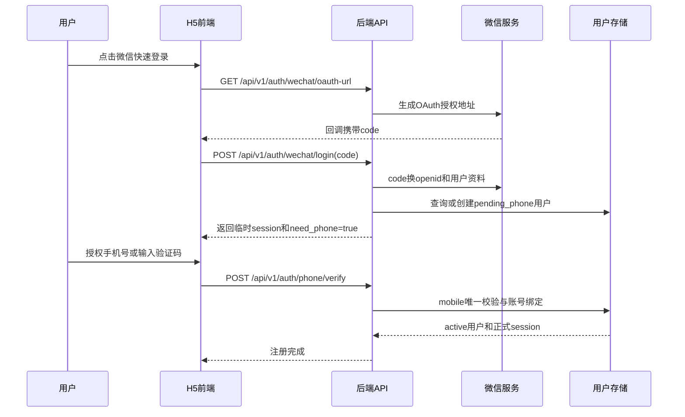
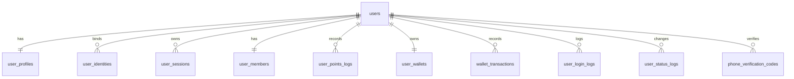

# 用户管理模块设计文档

## 1. 背景与依据

本设计基于当前仓库已有文档和代码：

- API 约定来自 [`docs/api-design.md`](api-design.md)：所有业务接口位于 `/api/v1`，统一响应 `{ code, message, data }`，用户端和管理端都使用 `Authorization: Bearer <token>`。
- 数据库设计来自 [`docs/database-design.md`](database-design.md)：已有 `users`、`user_sessions`、`user_members`、`user_points_logs` 等生产化逻辑表。
- 模块边界来自 [`docs/modules.md`](modules.md)：后端入口为 `backend-server/app/api/v1/[...path]/route.ts`，服务层为 `backend-server/src/server/lottery-service.ts`，当前仍使用 `MemoryStore`。
- 登录升级记录来自 [`changelog/2026-05-25-登录系统升级.md`](../changelog/2026-05-25-登录系统升级.md)：当前已存在微信 OAuth、微信手机号解密绑定、手机号登录和游客登录。

当前代码中的关键现状：

- 已有接口：`POST /api/v1/auth/guest-login`、`POST /api/v1/auth/wechat/login`、`POST /api/v1/auth/wechat/phone`、`POST /api/v1/auth/phone-login`、`GET /api/v1/me`。
- 当前 `User` 仅包含 `id`、`nickname`、可选 `phone`、`created_at`；数据库设计中规划了 `mobile`、`status`。
- 账户余额当前主要对应积分：`UserMember.points` 和 `UserPointsLog.balance`。现金余额、充值、退款、钱包流水尚未成体系。
- 当前手机号登录只做手机号格式校验并自动创建用户，尚未接入短信验证码、运营商一键登录或微信手机号授权的强校验闭环。

## 2. 设计目标

用户管理模块以“手机号作为平台账号”为核心身份规则：

- 用户先通过微信快速登录降低进入门槛，再完成手机验证。
- 手机号验证成功后，平台账号以手机号为唯一登录账号，微信 `openid` 作为第三方身份绑定关系。
- 用户资料支持昵称、头像、基本信息、手机号、账户状态、会员积分、账户余额等字段管理。
- 用户状态支持正常、待验证、冻结、注销等业务状态，并对抽奖、支付、兑换、社交行为做统一拦截。
- 后台支持用户查询、详情、状态调整、余额/积分流水查询与人工调整审计。
- 兼容当前内存实现，同时为后续 MySQL/Redis 生产化落库预留事务边界。

## 3. 模块范围

包含：

- 注册：微信快速登录、手机验证、账号创建、微信身份绑定。
- 登录：微信登录、手机号验证码登录、会话续期、退出登录。
- 用户信息：昵称、头像、性别、生日、地区、手机号、账号状态、注册来源、最近登录信息。
- 账户资产：积分余额、现金余额、会员等级、累计消费、抽奖次数、积分/余额流水。
- 后台管理：用户列表、用户详情、状态管理、余额/积分调整、登录记录和操作审计。
- 风控与合规：验证码频控、IP/设备限制、未验证账号权限限制、未成年人/实名能力预留。

不在第一期强制实现但需要预留：

- 身份证实名验证。
- 未成年人消费限制和夜间禁抽。
- 多微信账号合并、换绑手机号申诉。
- 第三方支付充值、退款、提现。

## 4. 身份与账号模型

主账号规则：

- `mobile` 是平台登录账号，必须全局唯一。
- `user_id` 是系统内部主键，不对用户展示。
- 微信 `openid` 是第三方身份，不作为主账号；同一 `openid` 只能绑定一个 `user_id`。
- 如后续接入多个微信应用，应增加 `unionid` 或 `app_id + openid` 维度避免冲突。

推荐用户状态：

- `pending_phone`：微信快速登录后，尚未验证手机号，只允许完成绑定流程和查看有限页面。
- `active`：手机号已验证，账号正常可用。
- `frozen`：后台冻结，禁止抽奖、支付、兑换、提现、社交赠送等资产行为。
- `disabled`：长期封禁或风控禁用，禁止登录或登录后只能看到受限提示。
- `cancelled`：用户注销，保留必要审计和订单/奖品记录，个人资料脱敏。

推荐身份类型：

- `wechat`：微信 OAuth 或小程序身份。
- `mobile`：手机号验证码身份。
- `guest`：开发或低风险体验态，可逐步降级为仅本地调试。
- `admin`：管理端账号，继续与普通用户账号隔离。

## 5. 注册流程设计

核心流程：微信快速登录后验证手机号，手机号作为账号。

注册规则：

- 新微信用户登录后，如果没有绑定手机号，创建 `pending_phone` 用户，并返回临时 token。
- 临时 token 只能调用 `GET /me`、`POST /auth/phone/verify`、`POST /auth/logout` 等最小接口。
- 手机号验证成功后，如果手机号不存在，当前用户转为 `active`，手机号成为账号。
- 如果手机号已存在且未绑定当前微信，需进入账号合并/绑定确认流程，不能静默覆盖。
- 微信昵称和头像可作为首次资料默认值，用户后续可修改昵称和头像。
- 新注册用户赠送积分应写入 `user_members` 和 `user_points_logs`，与现有“新用户 1000 积分”规则一致。

手机号验证方式优先级：

- 微信内环境：优先使用微信手机号授权，复用当前 `wechatBindPhone(openid, encryptedData, iv)` 能力。
- 普通 H5：使用短信验证码，新增发送和校验接口。
- 真正“一键登录”：需要接入闪验、阿里云号码认证等运营商 SDK；不能依赖浏览器直接获取本机号码。

## 6. 登录流程设计

微信登录：

- 用户点击微信登录后走 OAuth `code` 流程。
- 若 `openid` 已绑定 `active` 用户，直接签发 7 天用户 session。
- 若 `openid` 对应 `pending_phone` 用户，返回 `need_phone=true`，前端引导手机验证。
- 若 `openid` 首次出现，创建 `pending_phone` 用户，保存微信昵称、头像和 `openid` 绑定关系。

手机号登录：

- 新增 `POST /api/v1/auth/phone/code` 发送验证码。
- 新增 `POST /api/v1/auth/phone/verify` 校验验证码并登录。
- 验证通过后，如果手机号已存在，签发 session。
- 如果手机号不存在，不建议直接创建完整账号；应要求用户先走微信快速登录，或创建 `pending_profile` 用户并提示补充基础资料。结合本需求，推荐第一期强制“微信快速登录 + 手机验证”作为注册入口。

游客登录：

- 当前 `POST /api/v1/auth/guest-login` 可保留为开发、演示或低风险体验入口。
- 游客用户不应拥有真实余额、充值、提现、兑奖等资产能力。
- 游客升级正式账号时，需要绑定手机号，并迁移有限的体验数据。

退出与会话：

- 新增 `POST /api/v1/auth/logout` 删除当前 token。
- 后续生产化建议将 `user_sessions` 存入 Redis 或数据库，支持过期、踢下线、设备列表和风控撤销。

## 7. 用户信息管理

用户资料字段建议：

- 基础身份：`id`、`mobile`、`nickname`、`avatar_url`、`status`、`register_source`。
- 基本信息：`gender`、`birthday`、`province`、`city`、`bio`。
- 微信绑定：`openid`、`unionid`、`wechat_nickname`、`wechat_avatar`、`wechat_bound_at`。
- 账户信息：`member_level`、`points_balance`、`cash_balance`、`total_draws`、`total_spent`。
- 审计信息：`created_at`、`updated_at`、`last_login_at`、`last_login_ip`、`last_device_id`。

用户端能力：

- 查看个人信息：`GET /api/v1/me`。
- 更新昵称、头像、基础信息：`PATCH /api/v1/me/profile`。
- 查看会员积分：继续兼容 `GET /api/v1/blindbox/member`。
- 查看积分流水：继续兼容 `GET /api/v1/blindbox/points-log`。
- 绑定或换绑手机号：`POST /api/v1/me/mobile/bind`、`POST /api/v1/me/mobile/change`。

字段校验：

- 昵称长度建议 2 到 20 个字符，过滤敏感词和明显广告内容。
- 头像仅允许平台上传后的 URL 或可信三方头像 URL。
- 手机号使用大陆手机号规则时继续沿用当前正则 `^1[3-9]\d{9}$`，生产化应支持区号扩展。
- 手机号、余额、状态等敏感字段不能由普通用户直接更新。

## 8. 账户余额与积分设计

当前系统已经有积分体系：

- `UserMember.points` 表示积分余额。
- `UserPointsLog.points` 表示本次变动值。
- `UserPointsLog.balance` 表示变动后余额。
- 抽盒扣积分、签到、分享、活动奖励、兑换都应写流水。

建议区分两类资产：

- 积分余额：用于抽盒、兑换、签到、分享奖励、活动奖励、道具购买等，沿用 `user_members.points`。
- 现金余额：如果要支持充值、退款、支付账户余额，应新增钱包表和钱包流水，不要复用积分字段。

积分流水规则：

- 所有积分增减必须通过统一资产服务写入，禁止业务代码直接改余额。
- 每笔流水包含 `reason`、`remark`、业务单号、操作人、变动前后余额。
- 抽奖扣积分、发放奖励、后台调整需要幂等键，避免重复扣减或重复发放。

现金钱包预留：

- `user_wallets`：`user_id`、`cash_balance`、`frozen_balance`、`currency`、`updated_at`。
- `wallet_transactions`：`id`、`user_id`、`amount`、`balance_after`、`type`、`biz_type`、`biz_id`、`status`、`created_at`。
- 如接入微信支付，应另设 `payment_orders`、`refund_orders`，钱包只记录支付成功后的平台内余额变化。

## 9. 数据库设计

数据库设计沿用 [`docs/database-design.md`](database-design.md) 的约定：字段使用 `snake_case`，时间字段统一为 `created_at`、`updated_at`，核心业务表增加软删除或状态字段。用户管理模块建议优先落 MySQL；`user_sessions` 和验证码频控可同时接入 Redis 做过期加速，但 MySQL 仍保留审计记录。

### 9.1 ER 关系

### 9.2 核心用户表

#### `users`

用户主表，保存账号级核心字段。手机号是平台账号，微信身份放在 `user_identities`。

| 字段 | 类型 | 约束 | 说明 |
|---|---|---|---|
| `id` | `varchar(32)` | PK | 用户 ID，建议沿用 `usr_xxx` 格式或 UUID |
| `mobile` | `varchar(20)` | UNIQUE, nullable | 平台账号手机号；`pending_phone` 阶段可为空 |
| `mobile_hash` | `varchar(64)` | index | 手机号哈希，用于注销后审计和风控匹配 |
| `nickname` | `varchar(40)` | not null | 昵称 |
| `avatar_url` | `varchar(512)` | nullable | 头像 |
| `status` | `varchar(32)` | not null | `pending_phone`、`active`、`frozen`、`disabled`、`cancelled` |
| `register_source` | `varchar(32)` | not null | `wechat`、`mobile`、`guest`、`admin_import` |
| `mobile_verified_at` | `datetime` | nullable | 手机号验证时间 |
| `last_login_at` | `datetime` | nullable | 最近登录时间 |
| `last_login_ip` | `varchar(64)` | nullable | 最近登录 IP |
| `last_device_id` | `varchar(128)` | nullable | 最近设备标识 |
| `cancelled_at` | `datetime` | nullable | 注销时间 |
| `created_at` | `datetime` | not null | 创建时间 |
| `updated_at` | `datetime` | not null | 更新时间 |

索引：

- `PRIMARY KEY(id)`
- `UNIQUE KEY uk_users_mobile(mobile)`
- `KEY idx_users_status(status)`
- `KEY idx_users_mobile_hash(mobile_hash)`
- `KEY idx_users_created_at(created_at)`

约束：

- `active` 用户必须有 `mobile` 和 `mobile_verified_at`。
- `pending_phone` 用户允许 `mobile` 为空，但不允许进行资产类操作。
- `cancelled` 用户需要脱敏 `mobile`、`nickname`、`avatar_url`，保留 `mobile_hash` 用于审计。

#### `user_profiles`

用户可选资料表，避免 `users` 过宽。

| 字段 | 类型 | 约束 | 说明 |
|---|---|---|---|
| `user_id` | `varchar(32)` | PK, FK | 关联 `users.id` |
| `gender` | `varchar(16)` | nullable | `unknown`、`male`、`female`、`other` |
| `birthday` | `date` | nullable | 生日，后续可用于未成年人限制 |
| `province` | `varchar(64)` | nullable | 省份 |
| `city` | `varchar(64)` | nullable | 城市 |
| `bio` | `varchar(200)` | nullable | 个人简介 |
| `created_at` | `datetime` | not null | 创建时间 |
| `updated_at` | `datetime` | not null | 更新时间 |

索引：

- `PRIMARY KEY(user_id)`

### 9.3 第三方身份与会话

#### `user_identities`

记录微信、手机号、游客等身份绑定。微信 `openid` 不直接写入 `users`，便于后续支持多端和 `unionid`。

| 字段 | 类型 | 约束 | 说明 |
|---|---|---|---|
| `id` | `bigint unsigned` | PK, auto increment | 绑定记录 ID |
| `user_id` | `varchar(32)` | FK, not null | 关联用户 |
| `provider` | `varchar(32)` | not null | `wechat`、`mobile`、`guest` |
| `provider_app_id` | `varchar(64)` | nullable | 微信 AppId 或渠道标识 |
| `provider_user_id` | `varchar(128)` | not null | 微信 `openid`、手机号或游客 ID |
| `unionid` | `varchar(128)` | nullable | 微信开放平台 unionid |
| `nickname` | `varchar(80)` | nullable | 三方昵称快照 |
| `avatar_url` | `varchar(512)` | nullable | 三方头像快照 |
| `metadata_json` | `json` | nullable | 三方扩展信息 |
| `bound_at` | `datetime` | not null | 绑定时间 |
| `unbound_at` | `datetime` | nullable | 解绑时间 |
| `created_at` | `datetime` | not null | 创建时间 |
| `updated_at` | `datetime` | not null | 更新时间 |

索引：

- `PRIMARY KEY(id)`
- `UNIQUE KEY uk_identity_provider_user(provider, provider_app_id, provider_user_id)`
- `KEY idx_identity_user_id(user_id)`
- `KEY idx_identity_unionid(unionid)`

#### `user_sessions`

用户会话表，兼容当前 7 天 token 机制。生产化可把热数据放 Redis，MySQL 保留会话记录和撤销状态。

| 字段 | 类型 | 约束 | 说明 |
|---|---|---|---|
| `token` | `varchar(128)` | PK | Bearer token |
| `user_id` | `varchar(32)` | FK, not null | 用户 ID |
| `session_type` | `varchar(32)` | not null | `normal`、`limited`、`admin` |
| `device_id` | `varchar(128)` | nullable | 设备标识 |
| `ip` | `varchar(64)` | nullable | 登录 IP |
| `user_agent` | `varchar(512)` | nullable | UA |
| `revoked_at` | `datetime` | nullable | 退出或强制失效时间 |
| `expires_at` | `datetime` | not null | 过期时间 |
| `created_at` | `datetime` | not null | 创建时间 |

索引：

- `PRIMARY KEY(token)`
- `KEY idx_user_sessions_user_id(user_id)`
- `KEY idx_user_sessions_expires_at(expires_at)`

### 9.4 手机验证与登录日志

#### `phone_verification_codes`

验证码审计表，验证码明文不能入库，只保存哈希。

| 字段 | 类型 | 约束 | 说明 |
|---|---|---|---|
| `id` | `bigint unsigned` | PK, auto increment | 记录 ID |
| `mobile` | `varchar(20)` | not null | 手机号 |
| `mobile_hash` | `varchar(64)` | index | 手机号哈希 |
| `scene` | `varchar(32)` | not null | `register`、`login`、`bind`、`change_mobile` |
| `code_hash` | `varchar(128)` | not null | 验证码哈希 |
| `send_channel` | `varchar(32)` | not null | `sms`、`wechat_phone`、`carrier` |
| `send_ip` | `varchar(64)` | nullable | 发送 IP |
| `device_id` | `varchar(128)` | nullable | 设备标识 |
| `attempt_count` | `int` | not null default 0 | 校验失败次数 |
| `verified_at` | `datetime` | nullable | 验证成功时间 |
| `expires_at` | `datetime` | not null | 过期时间 |
| `created_at` | `datetime` | not null | 创建时间 |

索引：

- `PRIMARY KEY(id)`
- `KEY idx_phone_codes_mobile_scene(mobile, scene, created_at)`
- `KEY idx_phone_codes_mobile_hash(mobile_hash)`
- `KEY idx_phone_codes_ip(send_ip, created_at)`
- `KEY idx_phone_codes_expires_at(expires_at)`

#### `user_login_logs`

登录日志表，用于风控和后台排查。

| 字段 | 类型 | 约束 | 说明 |
|---|---|---|---|
| `id` | `bigint unsigned` | PK, auto increment | 日志 ID |
| `user_id` | `varchar(32)` | nullable, index | 登录成功时关联用户 |
| `login_type` | `varchar(32)` | not null | `wechat`、`mobile_code`、`guest`、`admin` |
| `login_account` | `varchar(128)` | nullable | 脱敏手机号、openid 后 6 位等 |
| `success` | `tinyint(1)` | not null | 是否成功 |
| `fail_reason` | `varchar(128)` | nullable | 失败原因 |
| `ip` | `varchar(64)` | nullable | IP |
| `device_id` | `varchar(128)` | nullable | 设备标识 |
| `user_agent` | `varchar(512)` | nullable | UA |
| `created_at` | `datetime` | not null | 创建时间 |

索引：

- `PRIMARY KEY(id)`
- `KEY idx_login_logs_user_id(user_id, created_at)`
- `KEY idx_login_logs_ip(ip, created_at)`
- `KEY idx_login_logs_device(device_id, created_at)`

### 9.5 会员积分与余额

#### `user_members`

沿用现有会员积分模型，作为积分余额主表。

| 字段 | 类型 | 约束 | 说明 |
|---|---|---|---|
| `user_id` | `varchar(32)` | PK, FK | 用户 ID |
| `level` | `varchar(32)` | not null | `normal`、`silver`、`gold`、`diamond` |
| `points` | `int` | not null default 0 | 积分余额 |
| `total_draws` | `int` | not null default 0 | 累计抽奖次数 |
| `total_spent` | `int` | not null default 0 | 累计积分消耗 |
| `created_at` | `datetime` | not null | 创建时间 |
| `updated_at` | `datetime` | not null | 更新时间 |

索引：

- `PRIMARY KEY(user_id)`
- `KEY idx_user_members_level(level)`

#### `user_points_logs`

积分流水表。现有 `points` 和 `balance` 语义保留，补充业务单号和操作来源。

| 字段 | 类型 | 约束 | 说明 |
|---|---|---|---|
| `id` | `bigint unsigned` | PK, auto increment | 流水 ID |
| `user_id` | `varchar(32)` | FK, not null | 用户 ID |
| `points` | `int` | not null | 正数为增加，负数为扣减 |
| `balance` | `int` | not null | 变动后积分余额 |
| `reason` | `varchar(64)` | not null | `register_bonus`、`draw`、`checkin`、`share_reward`、`admin_adjust` |
| `biz_type` | `varchar(64)` | nullable | 关联业务类型 |
| `biz_id` | `varchar(64)` | nullable | 关联业务单号 |
| `request_id` | `varchar(64)` | nullable | 幂等键 |
| `operator_id` | `varchar(32)` | nullable | 后台操作人 |
| `remark` | `varchar(255)` | not null default '' | 备注 |
| `created_at` | `datetime` | not null | 创建时间 |

索引：

- `PRIMARY KEY(id)`
- `KEY idx_points_logs_user_id(user_id, created_at)`
- `UNIQUE KEY uk_points_request(request_id)`
- `KEY idx_points_logs_biz(biz_type, biz_id)`

#### `user_wallets`

现金余额钱包表。若第一期“账户余额”仅指积分，可以先建表预留或暂不启用。

| 字段 | 类型 | 约束 | 说明 |
|---|---|---|---|
| `user_id` | `varchar(32)` | PK, FK | 用户 ID |
| `cash_balance` | `int` | not null default 0 | 可用现金余额，单位分 |
| `frozen_balance` | `int` | not null default 0 | 冻结余额，单位分 |
| `currency` | `varchar(16)` | not null default `CNY` | 币种 |
| `created_at` | `datetime` | not null | 创建时间 |
| `updated_at` | `datetime` | not null | 更新时间 |

索引：

- `PRIMARY KEY(user_id)`

#### `wallet_transactions`

现金余额流水表。

| 字段 | 类型 | 约束 | 说明 |
|---|---|---|---|
| `id` | `bigint unsigned` | PK, auto increment | 钱包流水 ID |
| `user_id` | `varchar(32)` | FK, not null | 用户 ID |
| `amount` | `int` | not null | 正数入账，负数出账，单位分 |
| `balance_after` | `int` | not null | 变动后可用余额 |
| `frozen_after` | `int` | not null | 变动后冻结余额 |
| `type` | `varchar(32)` | not null | `recharge`、`consume`、`refund`、`freeze`、`unfreeze`、`admin_adjust` |
| `biz_type` | `varchar(64)` | nullable | 业务类型 |
| `biz_id` | `varchar(64)` | nullable | 业务单号 |
| `status` | `varchar(32)` | not null | `pending`、`success`、`failed`、`cancelled` |
| `request_id` | `varchar(64)` | nullable | 幂等键 |
| `operator_id` | `varchar(32)` | nullable | 后台操作人 |
| `remark` | `varchar(255)` | not null default '' | 备注 |
| `created_at` | `datetime` | not null | 创建时间 |

索引：

- `PRIMARY KEY(id)`
- `KEY idx_wallet_tx_user_id(user_id, created_at)`
- `KEY idx_wallet_tx_biz(biz_type, biz_id)`
- `UNIQUE KEY uk_wallet_tx_request(request_id)`

### 9.6 用户状态与审计

#### `user_status_logs`

记录冻结、解冻、禁用、注销等状态变化。

| 字段 | 类型 | 约束 | 说明 |
|---|---|---|---|
| `id` | `bigint unsigned` | PK, auto increment | 日志 ID |
| `user_id` | `varchar(32)` | FK, not null | 用户 ID |
| `from_status` | `varchar(32)` | not null | 原状态 |
| `to_status` | `varchar(32)` | not null | 新状态 |
| `reason` | `varchar(255)` | not null | 变更原因 |
| `operator_id` | `varchar(32)` | nullable | 后台操作人或系统 |
| `created_at` | `datetime` | not null | 创建时间 |

索引：

- `PRIMARY KEY(id)`
- `KEY idx_status_logs_user_id(user_id, created_at)`
- `KEY idx_status_logs_operator(operator_id, created_at)`

### 9.7 后台账号表

当前管理端使用环境变量账号密码，生产化建议使用表驱动。

#### `admin_users`

| 字段 | 类型 | 约束 | 说明 |
|---|---|---|---|
| `id` | `varchar(32)` | PK | 后台用户 ID |
| `username` | `varchar(64)` | UNIQUE, not null | 登录名 |
| `password_hash` | `varchar(255)` | not null | 密码哈希 |
| `display_name` | `varchar(64)` | not null | 展示名 |
| `role` | `varchar(32)` | not null | `super_admin`、`operator`、`viewer` |
| `status` | `varchar(32)` | not null | `active`、`disabled` |
| `last_login_at` | `datetime` | nullable | 最近登录时间 |
| `created_at` | `datetime` | not null | 创建时间 |
| `updated_at` | `datetime` | not null | 更新时间 |

索引：

- `PRIMARY KEY(id)`
- `UNIQUE KEY uk_admin_username(username)`
- `KEY idx_admin_status(status)`

### 9.8 状态枚举与字段规范

用户状态：

- `pending_phone`：微信登录后待验证手机号。
- `active`：正常。
- `frozen`：冻结资产行为。
- `disabled`：禁用登录和业务行为。
- `cancelled`：已注销并脱敏。

注册来源：

- `wechat`：微信快速登录。
- `mobile`：手机号验证码登录或绑定。
- `guest`：游客体验。
- `admin_import`：后台导入。

积分流水原因：

- `register_bonus`：注册赠送。
- `draw_cost`：抽盒消耗。
- `checkin_reward`：签到奖励。
- `share_reward`：分享奖励。
- `activity_reward`：活动奖励。
- `redeem_cost`：兑换消耗。
- `admin_adjust`：后台调整。

### 9.9 事务边界

用户注册激活事务：

- 校验手机号未被其他 `active` 用户占用。
- 更新 `users.mobile`、`mobile_verified_at`、`status=active`。
- 写入或更新 `user_identities`。
- 初始化 `user_members`、`user_wallets`。
- 发放注册积分并写 `user_points_logs`。
- 写 `user_login_logs`。

积分变动事务：

- 锁定 `user_members` 当前行。
- 校验余额不为负。
- 更新 `points`、`total_spent`、`level`。
- 写入 `user_points_logs`，用 `request_id` 保证幂等。

状态变更事务：

- 锁定 `users` 当前行。
- 更新 `status`。
- 写入 `user_status_logs`。
- 如变更为 `disabled` 或 `cancelled`，撤销未过期 `user_sessions`。

注销事务：

- 校验无未完成发奖、退款、提现等流程。
- 脱敏 `users.mobile`、`nickname`、`avatar_url` 和可选资料。
- 保留 `mobile_hash`、订单、奖品、积分、钱包流水。
- 更新 `status=cancelled`、`cancelled_at`。
- 写状态日志并撤销所有 session。

## 10. API 设计建议

认证接口沿用当前 `/auth` 前缀：

- `GET /api/v1/auth/wechat/oauth-url`：获取微信 OAuth 地址。
- `POST /api/v1/auth/wechat/login`：微信 code 登录，返回用户、token、是否需要手机号验证。
- `POST /api/v1/auth/wechat/phone`：微信手机号解密绑定，现有接口可保留并增强为完成注册。
- `POST /api/v1/auth/phone/code`：发送短信验证码。
- `POST /api/v1/auth/phone/verify`：校验验证码，完成绑定或手机号登录。
- `POST /api/v1/auth/logout`：退出登录。

用户接口：

- `GET /api/v1/me`：当前用户基础资料和状态。
- `PATCH /api/v1/me/profile`：修改昵称、头像、基础信息。
- `GET /api/v1/me/account`：返回积分余额、现金余额、会员等级、累计消费。
- `GET /api/v1/me/account/transactions`：账户流水，整合积分和现金流水视图。
- `POST /api/v1/me/mobile/change`：手机号换绑发起。
- `POST /api/v1/me/mobile/change/confirm`：手机号换绑确认。

管理端接口：

- `GET /api/v1/admin/users`：用户列表，支持手机号、昵称、状态、注册时间筛选。
- `GET /api/v1/admin/users/:id`：用户详情。
- `PATCH /api/v1/admin/users/:id/status`：冻结、解冻、禁用、注销标记。
- `GET /api/v1/admin/users/:id/points-log`：积分流水。
- `POST /api/v1/admin/users/:id/points-adjust`：人工积分调整，必须写审计。
- `GET /api/v1/admin/users/:id/login-logs`：登录记录。

响应兼容：

- 保持 `{ code, message, data }`。
- 登录成功返回 `user`、`session` 或 `token`、`expires_at`。
- 需要手机号验证时返回明确状态：`need_phone=true`、`status=pending_phone`、`bind_token` 或受限 session。

## 11. 权限与状态拦截

用户状态应在服务层统一校验：

- `pending_phone`：只允许绑定手机号、查看基础页面，不允许抽盒、兑换、购买、赠礼、领取奖品。
- `active`：正常使用。
- `frozen`：允许登录和查看资料，但禁止资产变动类操作。
- `disabled`：禁止登录或登录后只返回禁用原因。
- `cancelled`：禁止登录，历史业务记录保留但个人信息脱敏。

需要统一拦截的资产行为：

- 抽盒扣积分。
- 积分兑换。
- 商店购买。
- 月卡、战令、首充。
- 礼物赠送和领取。
- 活动奖励领取。
- 后台人工调整除外，但必须记录操作审计。

## 12. 前端交互设计

注册登录入口：

- 首屏优先展示“微信快速登录”。
- 微信登录成功但未绑定手机号时，弹出手机号验证步骤。
- 微信环境中优先走微信手机号授权；普通浏览器走短信验证码。
- 手机号验证后进入正式登录态，并刷新用户信息、会员积分和活动进度。

用户中心：

- 展示头像、昵称、手机号脱敏、账号状态、会员等级、积分余额、现金余额。
- 提供编辑昵称、头像、基础信息入口。
- 展示积分流水、抽奖记录、库存、兑换记录、活动参与记录。
- 账号冻结或待验证时，在用户中心和关键业务按钮上显示原因与下一步动作。

后台用户管理：

- 用户列表支持按手机号、昵称、状态、注册来源、注册时间查询。
- 用户详情展示基础资料、微信绑定、积分余额、现金余额、抽奖统计、流水和登录日志。
- 状态变更需要填写原因。
- 人工调整积分需要二次确认并生成审计日志。

## 13. 安全、风控与合规

验证码安全：

- 同一手机号每分钟最多发送 1 次，每日最多 5 到 10 次。
- 同一 IP、设备指纹、微信 `openid` 维度做联合频控。
- 验证码只存哈希，不存明文。
- 验证码有效期建议 5 分钟，连续错误 5 次锁定短时间窗口。

微信安全：

- OAuth `state` 必须校验，防止 CSRF。
- 微信 `session_key` 不应长期明文保存；如必须保存，应加密并设置过期。
- `openid` 绑定手机号时必须校验当前临时 session 与 `openid` 所属用户一致。

资产安全：

- 积分和现金余额更新必须在事务内完成。
- 余额不得为负。
- 所有资产变动都要有流水和业务来源。
- 抽奖生产化事务需与现有数据库设计保持一致：扣积分、扣额度、抽样、库存、记录、发奖任务创建一起提交。

合规预留：

- 实名认证能力预留到 `user_realname_verifications`。
- 未成年人限制预留年龄、实名状态、消费限额和夜间禁抽校验。
- 注销流程需支持个人信息脱敏，同时保留法律要求的订单、奖品、资金流水记录。

## 14. 与当前实现的差异和落地顺序

第一期建议：

- 扩展 `User` 类型，增加 `mobile`、`avatar_url`、`status`、`updated_at`。
- 将当前 `phone` 字段统一为数据库文档中的 `mobile`，前后端类型同步。
- 改造 `wechatLogin`：未绑定手机号时返回 `need_phone=true`，用户为 `pending_phone`。
- 增强 `wechatBindPhone`：手机号验证成功后完成账号激活、手机号唯一校验和必要的账号合并提示。
- 新增短信验证码接口，替代当前直接 `phone-login` 的生产路径。
- 增加 `GET /me/account` 或扩展 `GET /me` 返回会员积分和状态。

第二期建议：

- 后台增加用户列表、详情、冻结/解冻、积分调整和审计。
- 增加登录日志、状态日志、验证码频控。
- 抽奖、兑换、商店、赠礼、活动领取统一接入用户状态校验。
- 把用户、session、积分、验证码从 `MemoryStore` 迁移到 MySQL/Redis。

第三期建议：

- 接入真实微信配置和 HTTPS 回调域名。
- 接入运营商一键登录或第三方号码认证。
- 接入微信支付、充值订单、现金钱包和退款。
- 接入实名、未成年人限制和更完整的风控策略。

## 15. 待确认事项

- 手机号登录是否允许“无微信直接注册”。本设计默认第一期不允许，注册必须先微信快速登录再验证手机号。
- “账户余额”是否指现金余额，还是当前积分余额。当前代码已有积分余额；现金余额建议作为钱包二期能力单独设计。
- 游客登录是否保留给正式用户。建议生产环境弱化为演示入口或关闭。
- 用户注销后手机号是否允许立即重新注册。建议先不立即复用，至少保留冷却期和审计哈希。
