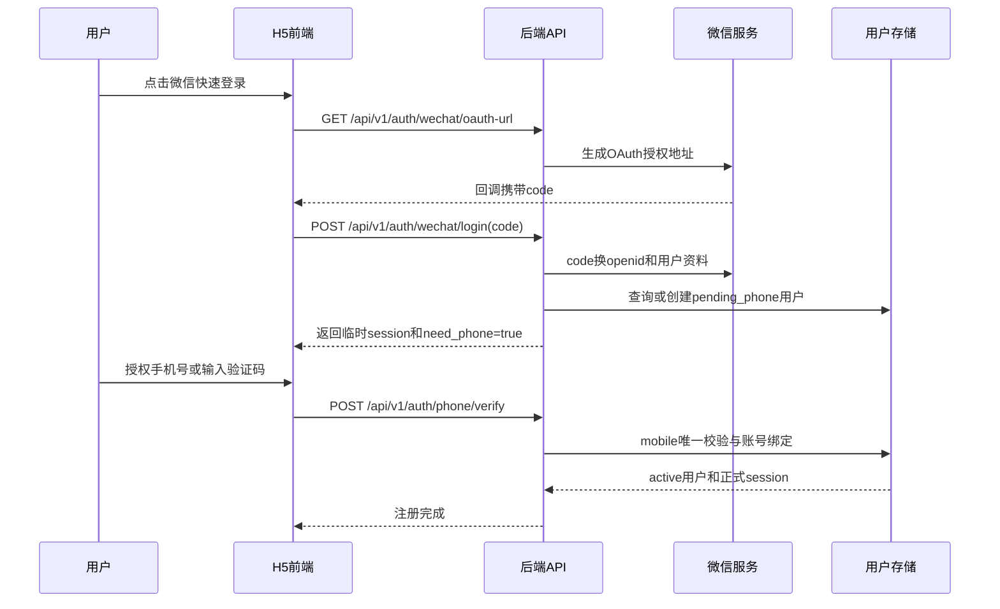
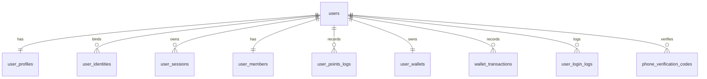

# 用户端用户功能设计文档

## 1. 背景与依据

本设计聚焦普通用户在前台 H5/小程序侧的注册、登录、资料、账户资产和状态感知能力。

现有依据：

- [`api-design.md`](api-design.md)：接口统一位于 `/api/v1`，响应统一为 `{ code, message, data }`，用户端使用 `Authorization: Bearer <token>`。
- [`database-design.md`](database-design.md)：已有 `users`、`user_sessions`、`user_members`、`user_points_logs` 等生产化逻辑表。
- [`modules.md`](modules.md)：用户端入口是 `front-page/app/page.tsx`，核心实现位于 `front-page/src/features/lottery/lottery-app.tsx`。
- [`../changelog/2026-05-25-登录系统升级.md`](../changelog/2026-05-25-登录系统升级.md)：当前已存在微信 OAuth、微信手机号解密绑定、手机号登录和游客登录。

当前代码中的用户侧现状：

- 已有 `POST /api/v1/auth/guest-login`、`POST /api/v1/auth/wechat/login`、`POST /api/v1/auth/wechat/phone`、`POST /api/v1/auth/phone-login`、`GET /api/v1/me`。
- 当前 `User` 仅包含 `id`、`nickname`、可选 `phone`、`created_at`，需要扩展为手机号账号、头像、状态等完整用户模型。
- 当前“账户余额”主要是积分余额：`UserMember.points` 和 `UserPointsLog.balance`。
- 当前手机号登录只校验手机号格式，尚未具备短信验证码、运营商一键登录或微信手机号授权的完整验证闭环。

## 2. 用户端设计目标

用户端以“手机号作为平台账号”为核心身份规则：

- 用户通过微信快速登录降低进入门槛，再完成手机验证。
- 手机号验证成功后，平台账号以手机号为唯一账号，微信 `openid` 作为第三方身份绑定。
- 用户可以查看和维护昵称、头像、基本资料、手机号、账号状态、积分余额、现金余额等信息。
- 用户状态对抽奖、购买、兑换、赠礼、活动领奖等资产行为产生统一限制。
- 第一阶段兼容当前 `MemoryStore` 实现，后续平滑迁移到 MySQL/Redis。

## 3. 用户端能力范围

包含：

- 注册：微信快速登录、手机验证、账号创建、微信身份绑定。
- 登录：微信登录、手机号验证码登录、会话续期、退出登录。
- 用户资料：昵称、头像、性别、生日、地区、手机号、注册来源、最近登录信息。
- 账户资产：积分余额、现金余额、会员等级、累计消费、抽奖次数、积分/余额流水。
- 状态感知：待验证、正常、冻结、禁用、注销状态下的前端提示和业务按钮限制。
- 安全与合规：验证码频控、设备/IP 限制、实名和未成年人限制预留。

不包含：

- 后台用户列表、状态调整、人工积分调整和审计，见 [`user-management-admin-design.md`](user-management-admin-design.md)。
- 管理员账号、后台权限和后台操作日志。

## 4. 身份与账号模型

主账号规则：

- `mobile` 是平台登录账号，必须全局唯一。
- `user_id` 是系统内部主键，不对用户展示。
- 微信 `openid` 是第三方身份，不作为主账号。
- 同一 `openid` 只能绑定一个 `user_id`。
- 如后续接入多个微信应用，应使用 `provider_app_id + openid` 或 `unionid` 避免冲突。

用户状态：

- `pending_phone`：微信快速登录后尚未验证手机号，只允许完成绑定流程和查看有限页面。
- `active`：手机号已验证，账号正常可用。
- `frozen`：允许登录和查看资料，但禁止抽奖、支付、兑换、提现、社交赠送等资产行为。
- `disabled`：长期封禁或风控禁用，禁止登录或登录后只展示受限提示。
- `cancelled`：用户已注销，禁止登录，历史业务记录保留但个人信息脱敏。

身份类型：

- `wechat`：微信 OAuth 或小程序身份。
- `mobile`：手机号验证码身份。
- `guest`：开发、演示或低风险体验态。

## 5. 用户注册流程

核心流程：微信快速登录后验证手机号，手机号作为账号。

注册规则：

- 新微信用户登录后，如果没有绑定手机号，创建 `pending_phone` 用户，并返回临时 token。
- 临时 token 只能调用 `GET /me`、`POST /auth/phone/verify`、`POST /auth/logout` 等最小接口。
- 手机号验证成功后，如果手机号不存在，当前用户转为 `active`，手机号成为账号。
- 如果手机号已存在且未绑定当前微信，进入账号合并或绑定确认流程，不能静默覆盖。
- 微信昵称和头像可作为首次资料默认值，用户后续可修改。
- 新注册用户赠送积分应写入 `user_members` 和 `user_points_logs`，与现有“新用户 1000 积分”规则一致。

手机号验证方式优先级：

- 微信内环境：优先使用微信手机号授权，复用当前 `wechatBindPhone(openid, encryptedData, iv)` 能力。
- 普通 H5：使用短信验证码，新增发送和校验接口。
- 真正“一键登录”：需要接入闪验、阿里云号码认证等运营商 SDK，不能依赖浏览器直接获取本机号码。

## 6. 用户登录流程

微信登录：

- 用户点击微信登录后走 OAuth `code` 流程。
- 若 `openid` 已绑定 `active` 用户，直接签发 7 天用户 session。
- 若 `openid` 对应 `pending_phone` 用户，返回 `need_phone=true`，前端引导手机验证。
- 若 `openid` 首次出现，创建 `pending_phone` 用户，保存微信昵称、头像和 `openid` 绑定关系。

手机号登录：

- 新增 `POST /api/v1/auth/phone/code` 发送验证码。
- 新增 `POST /api/v1/auth/phone/verify` 校验验证码并登录。
- 验证通过后，如果手机号已存在，签发 session。
- 如果手机号不存在，第一期建议要求用户先走微信快速登录，再验证手机号完成注册。

游客登录：

- 当前 `POST /api/v1/auth/guest-login` 可保留为开发、演示或低风险体验入口。
- 游客用户不应拥有真实余额、充值、提现、兑奖等资产能力。
- 游客升级正式账号时，需要绑定手机号，并迁移有限的体验数据。

退出与会话：

- 新增 `POST /api/v1/auth/logout` 删除当前 token。
- 后续生产化建议将热会话存入 Redis，同时在数据库保留会话审计和撤销状态。

## 7. 用户资料管理

用户资料字段：

- 基础身份：`id`、`mobile`、`nickname`、`avatar_url`、`status`、`register_source`。
- 基本信息：`gender`、`birthday`、`province`、`city`、`bio`。
- 微信绑定：`openid`、`unionid`、`wechat_nickname`、`wechat_avatar`、`wechat_bound_at`。
- 账户信息：`member_level`、`points_balance`、`cash_balance`、`total_draws`、`total_spent`。
- 审计信息：`created_at`、`updated_at`、`last_login_at`、`last_login_ip`、`last_device_id`。

用户端能力：

- 查看个人信息：`GET /api/v1/me`。
- 更新昵称、头像、基础信息：`PATCH /api/v1/me/profile`。
- 查看会员积分：继续兼容 `GET /api/v1/blindbox/member`。
- 查看积分流水：继续兼容 `GET /api/v1/blindbox/points-log`。
- 绑定或换绑手机号：`POST /api/v1/me/mobile/bind`、`POST /api/v1/me/mobile/change`。

字段校验：

- 昵称长度建议 2 到 20 个字符，过滤敏感词和明显广告内容。
- 头像仅允许平台上传后的 URL 或可信三方头像 URL。
- 手机号使用大陆手机号规则时继续沿用当前正则 `^1[3-9]\d{9}$`，生产化应支持区号扩展。
- 手机号、余额、状态等敏感字段不能由普通用户直接更新。

## 8. 账户余额与积分

当前系统已有积分体系：

- `UserMember.points` 表示积分余额。
- `UserPointsLog.points` 表示本次变动值。
- `UserPointsLog.balance` 表示变动后余额。
- 抽盒扣积分、签到、分享、活动奖励、兑换都应写流水。

建议区分两类资产：

- 积分余额：用于抽盒、兑换、签到、分享奖励、活动奖励、道具购买等，沿用 `user_members.points`。
- 现金余额：如果要支持充值、退款、支付账户余额，应新增钱包表和钱包流水，不要复用积分字段。

积分流水规则：

- 所有积分增减必须通过统一资产服务写入，禁止业务代码直接改余额。
- 每笔流水包含 `reason`、`remark`、业务单号、操作人、变动前后余额。
- 抽奖扣积分、发放奖励、后台调整需要幂等键，避免重复扣减或重复发放。

现金钱包预留：

- `user_wallets`：用户现金余额。
- `wallet_transactions`：现金余额流水。
- 如接入微信支付，应另设 `payment_orders`、`refund_orders`，钱包只记录支付成功后的平台内余额变化。

## 9. 用户状态与前端限制

前端和服务层都需要识别用户状态，但最终限制必须以后端校验为准。

状态行为：

- `pending_phone`：只允许绑定手机号、查看基础页面，不允许抽盒、兑换、购买、赠礼、领取奖品。
- `active`：正常使用。
- `frozen`：允许登录和查看资料，但禁止资产变动类操作。
- `disabled`：禁止登录或登录后只返回禁用原因。
- `cancelled`：禁止登录，历史业务记录保留但个人信息脱敏。

需要拦截的用户端资产行为：

- 抽盒扣积分。
- 积分兑换。
- 商店购买。
- 月卡、战令、首充。
- 礼物赠送和领取。
- 活动奖励领取。

## 10. 用户端 API 设计

认证接口：

- `GET /api/v1/auth/wechat/oauth-url`：获取微信 OAuth 地址。
- `POST /api/v1/auth/wechat/login`：微信 code 登录，返回用户、token、是否需要手机号验证。
- `POST /api/v1/auth/wechat/phone`：微信手机号解密绑定，现有接口可保留并增强为完成注册。
- `POST /api/v1/auth/phone/code`：发送短信验证码。
- `POST /api/v1/auth/phone/verify`：校验验证码，完成绑定或手机号登录。
- `POST /api/v1/auth/logout`：退出登录。

用户接口：

- `GET /api/v1/me`：当前用户基础资料和状态。
- `PATCH /api/v1/me/profile`：修改昵称、头像、基础信息。
- `GET /api/v1/me/account`：返回积分余额、现金余额、会员等级、累计消费。
- `GET /api/v1/me/account/transactions`：账户流水，整合积分和现金流水视图。
- `POST /api/v1/me/mobile/change`：手机号换绑发起。
- `POST /api/v1/me/mobile/change/confirm`：手机号换绑确认。

响应兼容：

- 保持 `{ code, message, data }`。
- 登录成功返回 `user`、`session` 或 `token`、`expires_at`。
- 需要手机号验证时返回 `need_phone=true`、`status=pending_phone`、`bind_token` 或受限 session。

## 11. 用户端数据库设计

数据库设计沿用 [`database-design.md`](database-design.md) 的约定：字段使用 `snake_case`，时间字段统一为 `created_at`、`updated_at`。

### 11.1 ER 关系

### 11.2 `users`

用户主表，保存账号级核心字段。手机号是平台账号，微信身份放在 `user_identities`。

| 字段 | 类型 | 约束 | 说明 |
|---|---|---|---|
| `id` | `varchar(32)` | PK | 用户 ID，建议沿用 `usr_xxx` 格式或 UUID |
| `mobile` | `varchar(20)` | UNIQUE, nullable | 平台账号手机号；`pending_phone` 阶段可为空 |
| `mobile_hash` | `varchar(64)` | index | 手机号哈希，用于注销后审计和风控匹配 |
| `nickname` | `varchar(40)` | not null | 昵称 |
| `avatar_url` | `varchar(512)` | nullable | 头像 |
| `status` | `varchar(32)` | not null | `pending_phone`、`active`、`frozen`、`disabled`、`cancelled` |
| `register_source` | `varchar(32)` | not null | `wechat`、`mobile`、`guest`、`admin_import` |
| `mobile_verified_at` | `datetime` | nullable | 手机号验证时间 |
| `last_login_at` | `datetime` | nullable | 最近登录时间 |
| `last_login_ip` | `varchar(64)` | nullable | 最近登录 IP |
| `last_device_id` | `varchar(128)` | nullable | 最近设备标识 |
| `cancelled_at` | `datetime` | nullable | 注销时间 |
| `created_at` | `datetime` | not null | 创建时间 |
| `updated_at` | `datetime` | not null | 更新时间 |

索引：

- `PRIMARY KEY(id)`
- `UNIQUE KEY uk_users_mobile(mobile)`
- `KEY idx_users_status(status)`
- `KEY idx_users_mobile_hash(mobile_hash)`
- `KEY idx_users_created_at(created_at)`

### 11.3 `user_profiles`

用户可选资料表，避免 `users` 过宽。

| 字段 | 类型 | 约束 | 说明 |
|---|---|---|---|
| `user_id` | `varchar(32)` | PK, FK | 关联 `users.id` |
| `gender` | `varchar(16)` | nullable | `unknown`、`male`、`female`、`other` |
| `birthday` | `date` | nullable | 生日，后续可用于未成年人限制 |
| `province` | `varchar(64)` | nullable | 省份 |
| `city` | `varchar(64)` | nullable | 城市 |
| `bio` | `varchar(200)` | nullable | 个人简介 |
| `created_at` | `datetime` | not null | 创建时间 |
| `updated_at` | `datetime` | not null | 更新时间 |

索引：

- `PRIMARY KEY(user_id)`

### 11.4 `user_identities`

记录微信、手机号、游客等身份绑定。

| 字段 | 类型 | 约束 | 说明 |
|---|---|---|---|
| `id` | `bigint unsigned` | PK, auto increment | 绑定记录 ID |
| `user_id` | `varchar(32)` | FK, not null | 关联用户 |
| `provider` | `varchar(32)` | not null | `wechat`、`mobile`、`guest` |
| `provider_app_id` | `varchar(64)` | nullable | 微信 AppId 或渠道标识 |
| `provider_user_id` | `varchar(128)` | not null | 微信 `openid`、手机号或游客 ID |
| `unionid` | `varchar(128)` | nullable | 微信开放平台 unionid |
| `nickname` | `varchar(80)` | nullable | 三方昵称快照 |
| `avatar_url` | `varchar(512)` | nullable | 三方头像快照 |
| `metadata_json` | `json` | nullable | 三方扩展信息 |
| `bound_at` | `datetime` | not null | 绑定时间 |
| `unbound_at` | `datetime` | nullable | 解绑时间 |
| `created_at` | `datetime` | not null | 创建时间 |
| `updated_at` | `datetime` | not null | 更新时间 |

索引：

- `PRIMARY KEY(id)`
- `UNIQUE KEY uk_identity_provider_user(provider, provider_app_id, provider_user_id)`
- `KEY idx_identity_user_id(user_id)`
- `KEY idx_identity_unionid(unionid)`

### 11.5 `user_sessions`

用户会话表，兼容当前 7 天 token 机制。

| 字段 | 类型 | 约束 | 说明 |
|---|---|---|---|
| `token` | `varchar(128)` | PK | Bearer token |
| `user_id` | `varchar(32)` | FK, not null | 用户 ID |
| `session_type` | `varchar(32)` | not null | `normal`、`limited` |
| `device_id` | `varchar(128)` | nullable | 设备标识 |
| `ip` | `varchar(64)` | nullable | 登录 IP |
| `user_agent` | `varchar(512)` | nullable | UA |
| `revoked_at` | `datetime` | nullable | 退出或强制失效时间 |
| `expires_at` | `datetime` | not null | 过期时间 |
| `created_at` | `datetime` | not null | 创建时间 |

索引：

- `PRIMARY KEY(token)`
- `KEY idx_user_sessions_user_id(user_id)`
- `KEY idx_user_sessions_expires_at(expires_at)`

### 11.6 `phone_verification_codes`

验证码审计表，验证码明文不能入库，只保存哈希。

| 字段 | 类型 | 约束 | 说明 |
|---|---|---|---|
| `id` | `bigint unsigned` | PK, auto increment | 记录 ID |
| `mobile` | `varchar(20)` | not null | 手机号 |
| `mobile_hash` | `varchar(64)` | index | 手机号哈希 |
| `scene` | `varchar(32)` | not null | `register`、`login`、`bind`、`change_mobile` |
| `code_hash` | `varchar(128)` | not null | 验证码哈希 |
| `send_channel` | `varchar(32)` | not null | `sms`、`wechat_phone`、`carrier` |
| `send_ip` | `varchar(64)` | nullable | 发送 IP |
| `device_id` | `varchar(128)` | nullable | 设备标识 |
| `attempt_count` | `int` | not null default 0 | 校验失败次数 |
| `verified_at` | `datetime` | nullable | 验证成功时间 |
| `expires_at` | `datetime` | not null | 过期时间 |
| `created_at` | `datetime` | not null | 创建时间 |

索引：

- `PRIMARY KEY(id)`
- `KEY idx_phone_codes_mobile_scene(mobile, scene, created_at)`
- `KEY idx_phone_codes_mobile_hash(mobile_hash)`
- `KEY idx_phone_codes_ip(send_ip, created_at)`
- `KEY idx_phone_codes_expires_at(expires_at)`

### 11.7 `user_members` 与 `user_points_logs`

`user_members` 是积分余额主表：

| 字段 | 类型 | 约束 | 说明 |
|---|---|---|---|
| `user_id` | `varchar(32)` | PK, FK | 用户 ID |
| `level` | `varchar(32)` | not null | `normal`、`silver`、`gold`、`diamond` |
| `points` | `int` | not null default 0 | 积分余额 |
| `total_draws` | `int` | not null default 0 | 累计抽奖次数 |
| `total_spent` | `int` | not null default 0 | 累计积分消耗 |
| `created_at` | `datetime` | not null | 创建时间 |
| `updated_at` | `datetime` | not null | 更新时间 |

`user_points_logs` 是积分流水表：

| 字段 | 类型 | 约束 | 说明 |
|---|---|---|---|
| `id` | `bigint unsigned` | PK, auto increment | 流水 ID |
| `user_id` | `varchar(32)` | FK, not null | 用户 ID |
| `points` | `int` | not null | 正数为增加，负数为扣减 |
| `balance` | `int` | not null | 变动后积分余额 |
| `reason` | `varchar(64)` | not null | 变动原因 |
| `biz_type` | `varchar(64)` | nullable | 关联业务类型 |
| `biz_id` | `varchar(64)` | nullable | 关联业务单号 |
| `request_id` | `varchar(64)` | nullable | 幂等键 |
| `operator_id` | `varchar(32)` | nullable | 后台操作人 |
| `remark` | `varchar(255)` | not null default '' | 备注 |
| `created_at` | `datetime` | not null | 创建时间 |

索引：

- `PRIMARY KEY(user_id)` on `user_members`
- `PRIMARY KEY(id)` on `user_points_logs`
- `KEY idx_points_logs_user_id(user_id, created_at)`
- `UNIQUE KEY uk_points_request(request_id)`
- `KEY idx_points_logs_biz(biz_type, biz_id)`

### 11.8 `user_wallets` 与 `wallet_transactions`

现金余额钱包表：

| 字段 | 类型 | 约束 | 说明 |
|---|---|---|---|
| `user_id` | `varchar(32)` | PK, FK | 用户 ID |
| `cash_balance` | `int` | not null default 0 | 可用现金余额，单位分 |
| `frozen_balance` | `int` | not null default 0 | 冻结余额，单位分 |
| `currency` | `varchar(16)` | not null default `CNY` | 币种 |
| `created_at` | `datetime` | not null | 创建时间 |
| `updated_at` | `datetime` | not null | 更新时间 |

现金余额流水表：

| 字段 | 类型 | 约束 | 说明 |
|---|---|---|---|
| `id` | `bigint unsigned` | PK, auto increment | 钱包流水 ID |
| `user_id` | `varchar(32)` | FK, not null | 用户 ID |
| `amount` | `int` | not null | 正数入账，负数出账，单位分 |
| `balance_after` | `int` | not null | 变动后可用余额 |
| `frozen_after` | `int` | not null | 变动后冻结余额 |
| `type` | `varchar(32)` | not null | `recharge`、`consume`、`refund`、`freeze`、`unfreeze`、`admin_adjust` |
| `biz_type` | `varchar(64)` | nullable | 业务类型 |
| `biz_id` | `varchar(64)` | nullable | 业务单号 |
| `status` | `varchar(32)` | not null | `pending`、`success`、`failed`、`cancelled` |
| `request_id` | `varchar(64)` | nullable | 幂等键 |
| `operator_id` | `varchar(32)` | nullable | 后台操作人 |
| `remark` | `varchar(255)` | not null default '' | 备注 |
| `created_at` | `datetime` | not null | 创建时间 |

索引：

- `PRIMARY KEY(user_id)` on `user_wallets`
- `PRIMARY KEY(id)` on `wallet_transactions`
- `KEY idx_wallet_tx_user_id(user_id, created_at)`
- `KEY idx_wallet_tx_biz(biz_type, biz_id)`
- `UNIQUE KEY uk_wallet_tx_request(request_id)`

## 12. 安全、风控与合规

验证码安全：

- 同一手机号每分钟最多发送 1 次，每日最多 5 到 10 次。
- 同一 IP、设备指纹、微信 `openid` 维度做联合频控。
- 验证码只存哈希，不存明文。
- 验证码有效期建议 5 分钟，连续错误 5 次锁定短时间窗口。

微信安全：

- OAuth `state` 必须校验，防止 CSRF。
- 微信 `session_key` 不应长期明文保存；如必须保存，应加密并设置过期。
- `openid` 绑定手机号时必须校验当前临时 session 与 `openid` 所属用户一致。

资产安全：

- 积分和现金余额更新必须在事务内完成。
- 余额不得为负。
- 所有资产变动都要有流水和业务来源。
- 抽奖生产化事务需与现有数据库设计保持一致：扣积分、扣额度、抽样、库存、记录、发奖任务创建一起提交。

合规预留：

- 实名认证能力预留到 `user_realname_verifications`。
- 未成年人限制预留年龄、实名状态、消费限额和夜间禁抽校验。
- 注销流程需支持个人信息脱敏，同时保留法律要求的订单、奖品、资金流水记录。

## 13. 用户端落地顺序

第一期：

- 扩展 `User` 类型，增加 `mobile`、`avatar_url`、`status`、`updated_at`。
- 将当前 `phone` 字段统一为数据库文档中的 `mobile`，前后端类型同步。
- 改造 `wechatLogin`：未绑定手机号时返回 `need_phone=true`，用户为 `pending_phone`。
- 增强 `wechatBindPhone`：手机号验证成功后完成账号激活、手机号唯一校验和必要的账号合并提示。
- 新增短信验证码接口，替代当前直接 `phone-login` 的生产路径。
- 增加 `GET /me/account` 或扩展 `GET /me` 返回会员积分和状态。

第二期：

- 增加登录日志、验证码频控和设备/IP 风控。
- 抽奖、兑换、商店、赠礼、活动领取统一接入用户状态校验。
- 把用户、session、积分、验证码从 `MemoryStore` 迁移到 MySQL/Redis。

第三期：

- 接入真实微信配置和 HTTPS 回调域名。
- 接入运营商一键登录或第三方号码认证。
- 接入微信支付、充值订单、现金钱包和退款。
- 接入实名、未成年人限制和更完整的风控策略。
