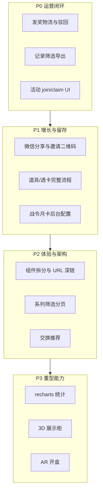

# 缺口模块后续迭代清单

> **文档用途**：记录「缺口模块完整实现」计划中**尚未完全落地**或仅做 MVP/占位的能力，供产品排期、研发拆票与验收对照。（计划文件位于 Cursor 工作区：`缺口模块完整实现_e2080a55.plan.md`）  
> **更新日期**：2026-05-28  
> **对照依据**：
> - 计划原文（Phase 0–7）
> - [docs/interaction-design/APPENDIX-product-gap-matrix.md](docs/interaction-design/APPENDIX-product-gap-matrix.md)
> - 当前代码：`front-page/src/features/lottery/lottery-app.tsx`、`front-page/src/features/admin/admin-app.tsx`、`backend-server/`

## 状态图例

| 标记 | 含义 |
|------|------|
| **未开始** | 产品/计划有描述，代码中基本无对应 UI 或 API |
| **部分实现** | 主路径可用，但体验、风控、运营或工程化不足 |
| **仅后端** | 接口或 `MemoryStore` 已有，C 端/管理端未接通或未做完 |
| **仅骨架** | 目录/占位/501 接口，不可用于生产 |

---

## 一、工程与架构（Phase 0 / Phase 6）

计划要求将 `lottery-app.tsx`（约 2100 行）、`admin-app.tsx`（约 2000 行）按 Tab 拆分为可维护模块；当前**仅抽出部分共享层**，主文件仍为单体。

| 项 | 计划要求 | 当前状态 | 建议迭代 |
|----|----------|----------|----------|
| C 端 Tab 组件化 | `LoginGate`、`SeriesTab`、`CampaignDetail`、`DrawModal` 等各 Tab 独立文件 | **部分实现**：`inventory-tab-panel`、`probability-sheet`、UI/hooks/constants；主逻辑仍在 `lottery-app.tsx` | 按 IXD 逐 Tab 迁移 + `LotteryContext` |
| 管理端 Tab 组件化 | `admin/tabs/*` 十个 Tab | **未开始**：能力散落在 `admin-app.tsx` | 与 C 端同步拆分 |
| 共享 hooks | `useAuth`、`useDraw`、`usePayment`、`useFeatureToggles` | **部分实现**：`use-asset-gate`；其余内联在 App 内 | 抽离并单测 |
| App Router 深链 | `/series`、`/exchange`、`/inventory` 等 + `tab`/`campaignId` 与 URL 同步 | **部分实现**：`/inventory`、`/pay/[orderNo]`；无 query 同步、无全 Tab 路由 | `useSearchParams` + 各 Tab 页面 |
| 依赖 | `recharts`、`xlsx`、`three`、`@react-three/fiber` | **未开始**：`package.json` 未引入 | Phase 6 前统一安装与按需加载 |

---

## 二、C 端 — 系列与抽盒（Phase 2.1）

| 项 | 状态 | 说明 |
|----|------|------|
| 系列排序 / 筛选 / 分页 | **未开始** | 无热度、价格、状态筛选；`campaignListPage` 等 state 未接入列表 |
| 下拉刷新 | **未开始** | 无手势/按钮触发 `refetch` |
| 概率公示独立页 | **部分实现** | 有 `ProbabilitySheet` Modal；非独立路由页；备案号等依赖 `config/public.compliance`（后端已加，需运营配置） |
| 分级开盒光效 | **部分实现** | 结果区有 `drawGlowClass`；无完整白/蓝/紫/金分级动画与可跳过动画 |
| AR 开盒 | **未开始** | 无 WebXR / 摄像头叠加 |
| 开盒结果「查看库存」跳转 | **未开始** | `DrawResultView` 未接 `setTab('inventory')` |
| 运营活动 `join` / `claim` | **仅后端+Mutation** | 存在 `joinActivityMutation`，系列 Tab **无「参与/领奖」按钮**（仍以跳转盲盒为主） |
| UP 池展示区 | **未开始** | 计划 `GET blindbox/up-pool/:id`；详情未接展示区块 |
| 大小保底 / 保底继承 | **部分实现** | 引擎部分字段有；C 端无「歪」说明与继承进度 UI |

**关联 IXD**：[02-series-activities-draw.md](docs/interaction-design/c-end/02-series-activities-draw.md)

---

## 三、C 端 — 盒柜（Phase 2.2）

| 项 | 状态 | 说明 |
|----|------|------|
| 按系列折叠 / ×N 角标 / 合成·兑换 | **已实现** | `InventoryTabPanel` |
| 3D 展示柜 | **未开始** | 无 Three.js / CSS 3D 预览切换 |
| 兑换入口在详情页 | **部分实现** | 主要在盒柜；详情页无独立 redeem |

**关联 IXD**：[03-inventory.md](docs/interaction-design/c-end/03-inventory.md)

---

## 四、C 端 — 交换（Phase 2.3）

| 项 | 状态 | 说明 |
|----|------|------|
| 发布 / 接受 / 取消 / 确认框 | **已实现** | |
| 智能匹配推荐 | **未开始** | 未按 `want_prize_id` 高亮可成交挂单 |
| 交换手续费、积分扣减 UI | **未开始** | 产品文档有，前后端未体现 |

**关联 IXD**：[04-exchange.md](docs/interaction-design/c-end/04-exchange.md)

---

## 五、C 端 — 排行（Phase 2.4）

| 项 | 状态 | 说明 |
|----|------|------|
| 全站榜 + 按盲盒筛选 | **部分实现** | `leaderboard?campaign_id=` |
| 周榜 / 月榜 | **未开始** | 无 `period` 参数与后端聚合 |
| 点击用户公开盒柜 | **部分实现** | `GET users/:id/public-inventory` + Modal；无手机号搜索用户 |

**关联 IXD**：[05-leaderboard.md](docs/interaction-design/c-end/05-leaderboard.md)

---

## 六、C 端 — 会员 / 商店 / 支付（Phase 2.5–2.6）

| 项 | 状态 | 说明 |
|----|------|------|
| 五档会员权益表 | **部分实现** | 静态 `MEMBER_LEVEL_BENEFITS` + 高亮 |
| 签到日历 UI | **部分实现** | 签到成功 alert 展示连续天数；无 7/30 天日历组件 |
| 道具「去使用」跳转商店/详情 | **部分实现** | 详情可点「使用道具」；商店道具区无「去使用」链 |
| 首充双倍等营销动效 | **部分实现** | 购买流程有；无专门动效/文案配置化 |
| 支付中专用页 | **部分实现** | `/pay/[orderNo]` 有；H5 回跳与 token 持久化仍简陋（`sessionStorage` 未统一存用户 token） |
| 退款 / 订单历史 | **未开始** | 无 C 端退款申请；支付模块退款需单独对接 |
| 月卡/战令定价 | **部分实现** | 价格多为前端常量 + 种子数据；非后台可配 |

**关联 IXD**：[06-member-points.md](docs/interaction-design/c-end/06-member-points.md)、[07-shop-first-recharge.md](docs/interaction-design/c-end/07-shop-first-recharge.md)、[payment-checkout.md](docs/interaction-design/cross-cutting/payment-checkout.md)

---

## 七、C 端 — 社交 / 拼图 / 秒杀（Phase 4）

| 项 | 状态 | 说明 |
|----|------|------|
| 邀请链接复制 | **部分实现** | `share/invite` + 复制；无二维码组件 |
| 微信 JSSDK 分享 | **未开始** | 未接 `auth/wechat/jssdk-config` 与 `updateAppMessageShareData` |
| 助力防刷 | **部分实现** | `deviceId` + 后端日限额；无 IP 指纹、无验证码 |
| 赠礼 | **部分实现** | 需手填 `user_id`；无手机号查用户 |
| 组队进度条 / 成员列表 | **部分实现** | 有文案展示；无完整进度条与成员 UI |
| 开盒炫耀 `share/card` | **未开始** | `DrawResultView` 未调分享卡 API |
| 拼图组队 create/join | **未开始** | 后端有 `puzzle/team/*`，C 端无 UI |
| 秒杀预约列表 `flash/my` | **未开始** | 有 subscribe；无「我的预约」页 |
| 抢购倒计时 / 抽签模式 | **未开始** | 无 `mode=lottery|fcfs` 与倒计时 UI |
| 碎片 C2C 交换 | **未开始** | |

**关联 IXD**：[09-social.md](docs/interaction-design/c-end/09-social.md)、[10-puzzle-flash.md](docs/interaction-design/c-end/10-puzzle-flash.md)

---

## 八、C 端 — 合规与登录（Phase 5）

| 项 | 状态 | 说明 |
|----|------|------|
| 概率公示更新时间 / 备案号 | **部分实现** | `config/public.compliance` 已返回；需在管理端配置入口编辑 |
| 实名 / 未成年向导 | **未开始** | 无实名表单；无 `requires_realname` 活动级拦截 UI |
| 账号状态统一 gate | **部分实现** | `useAssetGate` 覆盖抽盒；支付/交换/部分按钮未全部接入 |
| 运营商一键登录 | **仅骨架** | `POST auth/carrier-login` → 501 |
| 透卡完整流程 | **部分实现** | `shop/items/use` 仅在详情一键使用；无摇盒前透卡专属流程 |

**关联 IXD**：[01-auth-login.md](docs/interaction-design/c-end/01-auth-login.md)

---

## 九、管理端 — 运营能力（Phase 3）

| 项 | 状态 | 说明 |
|----|------|------|
| 用户调积分 | **部分实现** | 仍用 `window.prompt`；计划 `AdminModal` + zod 未做 |
| 用户高级筛选 / 导出 CSV | **未开始** | 仅关键词搜索 |
| 抽奖记录筛选 | **部分实现** | 用户/盲盒/结果；无时间范围 UI、无导出 |
| 异常抽奖标记 | **未开始** | |
| 发奖物流单号 / 驳回原因 | **部分实现** | 仍为「审核通过」；无物流公司/单号 Modal、`payload_json` 表单 |
| 批量审核发奖 | **未开始** | 后端有 `admin/delivery/approve`；前端未接 |
| 奖品低库存预警 | **未开始** | 列表无阈值高亮 |
| 奖品 CSV 批量导入 | **未开始** | 无 `xlsx` 解析 |
| 操作审计日志 | **未开始** | 无 `admin_audit_logs` |
| 商店 `sort_order` 拖拽 / 限时折扣 | **未开始** | |
| 统计图表（recharts） | **部分实现** | 总览仅文字 `admin/statistics`；无折线/柱状图 |
| 概率偏离 / 收入排名分析 | **未开始** | |
| UP 活动独立运营工具 | **未开始** | 概率 Tab 有部分 UP 字段，无活动列表/统计 |
| 战令 / 月卡后台配置 | **未开始** | 月卡 Tab 只读 `battle-pass/info` |
| 合规文案后台编辑 | **未开始** | `compliance` 写死在 `MemoryStore` 默认值 |

**关联 IXD**：[admin/02](docs/interaction-design/admin/02-overview-records.md) — [admin/08](docs/interaction-design/admin/08-monthcard-battlepass-view.md)

---

## 十、后端与数据层（支撑上述 UI）

| 项 | 状态 | 说明 |
|----|------|------|
| `MemoryStore` 生产化 | **架构债** | 多实例丢数据；抢购/助力需 Redis 锁与限流 |
| MySQL 全量落库 | **部分实现** | 管理配置可同步 MySQL；用户/抽奖/社交等多为内存 |
| `leaderboard` 周/月榜 | **未开始** | 仅全站/按 campaign 计数 |
| `campaigns` 分页 API | **未开始** | |
| 履约 `payload_json` 物流结构约定 | **未开始** | 需与发奖 Modal 一并设计 |
| 支付退款与对账 UI | **未开始** | 见 `payment-module` 设计文档 |
| OpenAPI / 共享类型生成 | **未开始** | 前后端手写类型 |

**关联**：[docs/system-design.md](docs/system-design.md)、[docs/data-storage-audit-recommendations.md](docs/data-storage-audit-recommendations.md)

---

## 十一、测试与文档（Phase 7）

| 项 | 状态 | 说明 |
|----|------|------|
| IXD 全文同步为 [已实现] | **部分完成** | 仅更新部分附录与 `03-inventory`；其余差异表仍为 [部分实现]/[规划中] |
| Playwright 冒烟 | **未开始** | 登录、抽盒、blend、exchange cancel、admin 发奖 |
| `modules.md` 索引 | **已实现** | 已链到 `docs/interaction-design/` |

---

## 十二、建议迭代优先级（参考）

| 优先级 | 范围 | 目标 |
|--------|------|------|
| **P0** | 管理端发奖物流、记录导出、活动参与领奖 UI | 运营可闭环发货与活动 |
| **P1** | 微信分享、实名/合规配置后台、战令/月卡 CRUD、道具使用引导 | 增长与合规可配置 |
| **P2** | 单体拆分、Tab 路由、系列筛选、交换推荐、签到日历 | 可维护性与核心体验 |
| **P3** | recharts、xlsx 导入、Three.js/AR、概率偏离分析 | 差异化与重型能力 |

---

## 十三、已实现能力速查（避免重复开发）

以下在首轮缺口实现中**已可验收**，迭代时勿重复造轮子：

- C 端：游客/试玩/微信/手机登录；单抽/十连；开盒结果保底条；盒柜合成/兑换/分组；交换发布·接受·取消·确认；排行按盲盒+公开盒柜；概率 Modal；摇盒 hint；战令 claim；秒杀预约；邀请链接+助力 deviceId；赠礼 receiver_id；`useAssetGate`；支付页 `/pay/[orderNo]`
- 管理端：盲盒/奖品/概率/商店/首充 CRUD；C 端 Tab 开关；用户踢会话；抽奖记录基础筛选；总览 statistics 文案
- 后端：`blend`/`redeem`/`shop/items/use`、合规 `compliance`、`public-inventory`、邀请 `invite_from`、助力日限

详细交互见 [docs/interaction-design/README.md](docs/interaction-design/README.md)。

---

## 十四、相关文档索引

| 文档 | 路径 |
|------|------|
| 缺口实现计划（Cursor 计划，勿在仓库内改 plan 原文） | `缺口模块完整实现_e2080a55.plan.md` |
| 交互设计总索引 | [docs/interaction-design/README.md](docs/interaction-design/README.md) |
| 产品 vs 实现对照表 | [docs/interaction-design/APPENDIX-product-gap-matrix.md](docs/interaction-design/APPENDIX-product-gap-matrix.md) |
| 产品功能设计（愿景） | [产品功能设计文档.md](产品功能设计文档.md) |

---

*本文档随迭代更新；完成某项后请同步修改对应 IXD 差异表与本清单状态列。*
