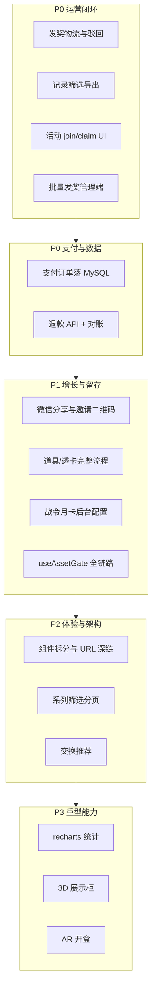

# 缺口模块后续迭代清单

> **文档用途**：记录「缺口模块完整实现」计划中**尚未完全落地**或仅做 MVP/占位的能力，供产品排期、研发拆票与验收对照。（计划文件位于 Cursor 工作区：`缺口模块完整实现_e2080a55.plan.md`）  
> **更新日期**：2026-05-29（全仓代码审计）  
> **对照依据**：
> - 计划原文（Phase 0–7）
> - [docs/interaction-design/APPENDIX-product-gap-matrix.md](docs/interaction-design/APPENDIX-product-gap-matrix.md)
> - 当前代码：`front-page/src/features/lottery/`、`front-page/src/features/admin/admin-app.tsx`、`backend-server/`、`payment-module/`、`deploy/`、`sql/`

## 状态图例

| 标记 | 含义 |
|------|------|
| **未开始** | 产品/计划有描述，代码中基本无对应 UI 或 API |
| **部分实现** | 主路径可用，但体验、风控、运营或工程化不足 |
| **仅后端** | 接口或 `MemoryStore` 已有，C 端/管理端未接通或未做完 |
| **仅骨架** | 目录/占位/501 接口，不可用于生产 |

---

## 审计摘要（2026-05-29）

| 维度 | 结论 |
|------|------|
| **架构** | 生产入口为 `backend-server` + `front-page`（Next.js）；Go `backend/` 为历史参考 |
| **C 端** | `lottery-app.tsx` **约 2553 行**单体；已抽出 `inventory-tab-panel`、`probability-sheet`、`use-asset-gate` 等 11 个周边文件 |
| **管理端** | `admin-app.tsx` **约 2073 行**单体；**无** `admin/tabs/*` 拆分 |
| **持久化** | MySQL 承载运营配置（盲盒/奖品/商店/首充/`app_settings`/游客待领奖）；用户/抽盒/社交/拼图等仍在 **MemoryStore** |
| **支付** | `@campaign-lottery/payment-module` 已接入独立 `/api/v1/payments/*`；C 端 JSAPI/二维码/mock 可走通；**无**退款 HTTP、订单未落业务 MySQL |
| **部署** | `deploy/release_82.sh` + PM2 + nginx 可一键发布 82；缺 HTTPS 文档、多实例 Redis、监控与支付订单持久化 |

---

## 一、工程与架构（Phase 0 / Phase 6）

计划要求将 `lottery-app.tsx`、`admin-app.tsx` 按 Tab 拆分为可维护模块；当前**仅抽出部分共享层**，主文件仍为单体。

| 项 | 计划要求 | 当前状态 | 建议迭代 |
|----|----------|----------|----------|
| C 端 Tab 组件化 | `LoginGate`、`SeriesTab`、`CampaignDetail`、`DrawModal` 等各 Tab 独立文件 | **部分实现**：`components/inventory-tab-panel`、`probability-sheet`、`hooks/use-asset-gate`、`constants`/`utils`/`rarity`、UI 原子组件；主逻辑仍在 `lottery-app.tsx`（~2553 行） | 按 IXD 逐 Tab 迁移 + `LotteryContext` |
| 管理端 Tab 组件化 | `admin/tabs/*` 十个 Tab | **未开始**：能力散落在 `admin-app.tsx`（~2073 行） | 与 C 端同步拆分 |
| 共享 hooks | `useAuth`、`useDraw`、`usePayment`、`useFeatureToggles` | **部分实现**：`use-asset-gate`；支付逻辑在 `@/client/payment-checkout.ts`；其余内联在 App 内 | 抽离并单测 |
| App Router 深链 | `/series`、`/exchange`、`/inventory` 等 + `tab`/`campaignId` 与 URL 同步 | **部分实现**：`/inventory`、`/pay/[orderNo]` 存在，但 `/inventory` 未设 `tab=inventory`；`tab` 仍为 `useState`，无 `useSearchParams` | 各 Tab 页面 + query 同步 |
| 依赖 | `recharts`、`xlsx`、`three`、`@react-three/fiber` | **未开始**：`front-page/package.json` 未引入 | Phase 6 前统一安装与按需加载 |

**死代码提示**：`lottery-app.tsx` 声明了 `seriesSort`、`campaignListPage` 但无 UI/逻辑引用，拆 Tab 时一并接入或删除。

---

## 二、C 端 — 系列与抽盒（Phase 2.1）

| 项 | 状态 | 说明 |
|----|------|------|
| 系列排序 / 筛选 / 分页 | **未开始** | state 已声明未接线；`GET campaigns` 后端全量无分页 |
| 下拉刷新 | **未开始** | 无手势/按钮触发 `refetch` |
| 概率公示独立页 | **部分实现** | `ProbabilitySheet` Modal；非独立路由；备案号等依赖 `config/public.compliance` |
| 分级开盒光效 | **部分实现** | `drawGlowClass` 按稀有度 shadow；无完整白/蓝/紫/金动画与可跳过动画 |
| AR 开盒 | **未开始** | 无 WebXR / Three.js |
| 开盒结果「查看库存」跳转 | **未开始** | `DrawResultView` 无 `setTab('inventory')` |
| 运营活动 `join` / `claim` | **仅后端+Mutation** | `joinActivityMutation` 已定义但**无任何按钮绑定** |
| UP 池展示区 | **未开始** | 后端 `GET blindbox/up-pool/:id` 实为概率别名；详情无 UP 数据块 |
| 大小保底 / 保底继承 | **部分实现** | 连续未中/硬保底有文案；无「歪」与 `pity_inherit` 进度 UI |

**关联 IXD**：[02-series-activities-draw.md](docs/interaction-design/c-end/02-series-activities-draw.md)

---

## 三、C 端 — 盒柜（Phase 2.2）

| 项 | 状态 | 说明 |
|----|------|------|
| 按系列折叠 / ×N 角标 / 合成·兑换 | **已实现** | `InventoryTabPanel` |
| 盒柜发货 + 运费支付 | **部分实现** | `delivery/request` + `inventory_delivery` 支付履约已通；体验与物流跟踪 UI 简陋 |
| 3D 展示柜 | **未开始** | 无 Three.js / CSS 3D 预览切换 |
| 兑换入口在详情页 | **部分实现** | 主要在盒柜；详情页无独立 redeem |

**关联 IXD**：[03-inventory.md](docs/interaction-design/c-end/03-inventory.md)

---

## 四、C 端 — 交换（Phase 2.3）

| 项 | 状态 | 说明 |
|----|------|------|
| 发布 / 接受 / 取消 / 确认框 | **已实现** | |
| 智能匹配推荐 | **未开始** | 未按 `want_prize_id` 高亮可成交挂单 |
| 交换手续费、积分扣减 UI | **未开始** | 会员文案有「手续费 8 折」静态说明，流程无扣费 |

**关联 IXD**：[04-exchange.md](docs/interaction-design/c-end/04-exchange.md)

---

## 五、C 端 — 排行（Phase 2.4）

| 项 | 状态 | 说明 |
|----|------|------|
| 全站榜 + 按盲盒筛选 | **部分实现** | `leaderboard?campaign_id=` |
| 周榜 / 月榜 | **未开始** | 无 `period` 参数与后端聚合 |
| 点击用户公开盒柜 | **部分实现** | `GET users/:id/public-inventory` + Modal；无手机号搜索用户 |

**关联 IXD**：[05-leaderboard.md](docs/interaction-design/c-end/05-leaderboard.md)

---

## 六、C 端 — 会员 / 商店 / 支付（Phase 2.5–2.6）

| 项 | 状态 | 说明 |
|----|------|------|
| 五档会员权益表 | **部分实现** | 静态 `MEMBER_LEVEL_BENEFITS` + 高亮 |
| 签到日历 UI | **部分实现** | 签到成功 alert 展示连续天数；无 7/30 天日历组件 |
| 道具「去使用」跳转商店/详情 | **部分实现** | 详情可点「使用道具」；商店道具区无「去使用」链 |
| 首充双倍等营销动效 | **部分实现** | 购买流程有；无专门动效/文案配置化 |
| 现金支付收银台 | **部分实现** | `runPaymentCheckout`：微信 JSAPI（`WeixinJSBridge`）、二维码 Modal、mock；`/pay/[orderNo]` 轮询 + fulfill |
| 微信 JSSDK **分享**（非支付） | **未开始** | 未调 `auth/wechat/jssdk-config` 的 `updateAppMessageShareData` |
| 支付 token 持久化 | **部分实现** | 订单号用 `sessionStorage`；用户 token 仍主要 `localStorage` |
| 退款 / 订单历史 | **未开始** | 无 C 端退款申请与订单列表页 |
| 月卡/战令定价 | **部分实现** | 价格多为前端常量 + 种子数据；非后台可配 |

**关联 IXD**：[06-member-points.md](docs/interaction-design/c-end/06-member-points.md)、[07-shop-first-recharge.md](docs/interaction-design/c-end/07-shop-first-recharge.md)、[payment-checkout.md](docs/interaction-design/cross-cutting/payment-checkout.md)

---

## 七、C 端 — 社交 / 拼图 / 秒杀（Phase 4）

| 项 | 状态 | 说明 |
|----|------|------|
| 邀请链接复制 | **部分实现** | `share/invite` + 复制；无二维码组件 |
| 微信 JSSDK 分享 | **未开始** | 见第六节 |
| 助力防刷 | **部分实现** | `deviceId` + 后端日限额；无 IP 指纹、无验证码 |
| 赠礼 | **部分实现** | 需手填 `user_id`；无手机号查用户 |
| 组队进度条 / 成员列表 | **部分实现** | 有文案展示；无完整进度条与成员 UI |
| 开盒炫耀 `share/card` | **未开始** | 后端有 `POST share/card`；`DrawResultView` 仍用 `share-reward` |
| 拼图组队 create/join | **仅后端** | `puzzle/team/*` API 已有；C 端无 UI |
| 秒杀预约列表 `flash/my` | **仅后端** | `GET flash/my` 已有；C 端无「我的预约」页 |
| 抢购倒计时 / 抽签模式 | **未开始** | 无 `mode=lottery|fcfs` 与倒计时 UI |
| 碎片 C2C 交换 | **未开始** | |

**关联 IXD**：[09-social.md](docs/interaction-design/c-end/09-social.md)、[10-puzzle-flash.md](docs/interaction-design/c-end/10-puzzle-flash.md)

---

## 八、C 端 — 合规与登录（Phase 5）

| 项 | 状态 | 说明 |
|----|------|------|
| 概率公示更新时间 / 备案号 | **部分实现** | `config/public.compliance` 已返回；管理端无编辑入口 |
| 实名 / 未成年向导 | **未开始** | 无实名表单；无 `requires_realname` 活动级拦截 UI |
| 活动级强制手机登录 | **部分实现** | 后端 `campaigns.requires_phone_login` + migration `003`；C 端 gate 依赖 `useAssetGate`（`pending_phone`） |
| 账号状态统一 gate | **部分实现** | `useAssetGate` **仅覆盖抽盒**；支付/交换/发货/商店/赠礼未统一接入 |
| 运营商一键登录 | **仅骨架** | `POST auth/carrier-login` → 501 |
| 透卡完整流程 | **部分实现** | `shop/items/use` 仅在详情一键使用；无摇盒前透卡专属流程 |

**关联 IXD**：[01-auth-login.md](docs/interaction-design/c-end/01-auth-login.md)

---

## 九、管理端 — 运营能力（Phase 3）

| 项 | 状态 | 说明 |
|----|------|------|
| 用户调积分 | **部分实现** | 仍用 `window.prompt`；计划 `AdminModal` + zod 未做 |
| 用户高级筛选 / 导出 CSV | **未开始** | 仅关键词搜索 |
| 抽奖记录筛选 | **部分实现** | 用户/盲盒/结果；后端已有 `from`/`to`，**前端无时间范围 UI**；列表前端 cap **50 条**；无导出 |
| 异常抽奖标记 | **未开始** | |
| 发奖物流单号 / 驳回原因 | **部分实现** | 仍为「审核通过」+ 固定 note；无物流公司/单号 Modal、`payload_json` 表单 |
| 批量审核发奖 | **仅后端** | `POST admin/delivery/approve` 已实现；管理端仍逐条 PATCH |
| 奖品低库存预警 | **未开始** | 列表无阈值高亮 |
| 奖品 CSV 批量导入 | **未开始** | 无 `xlsx` 解析 |
| 操作审计日志 | **未开始** | 无 `admin_audit_logs` 表与 UI |
| 商店 `sort_order` | **部分实现** | 商店/首充编辑 Modal 有**数字** `sort_order`；**无**拖拽；奖品编辑 Modal **无** sort_order；无限时折扣 |
| 统计图表（recharts） | **部分实现** | 总览仅文字 `admin/statistics`；无折线/柱状图 |
| 概率偏离 / 收入排名分析 | **未开始** | |
| UP 活动独立运营工具 | **未开始** | 概率 Tab 有部分 UP 字段，无活动列表/统计 |
| 战令 / 月卡后台配置 | **未开始** | `monthcard` Tab 只读 `battle-pass/info` |
| 合规文案后台编辑 | **未开始** | `compliance` 写死在 `MemoryStore` 默认值 |

**清单未列、已实现（勿重复开发）**：C 端 Tab 开关、`requires_phone_login`、盲盒发布校验、踢会话、奖品/商店图片上传、用户状态 PATCH。

**关联 IXD**：[admin/02](docs/interaction-design/admin/02-overview-records.md) — [admin/08](docs/interaction-design/admin/08-monthcard-battlepass-view.md)

---

## 十、支付子系统（新增章节，2026-05-29 审计）

| 项 | 状态 | 说明 |
|----|------|------|
| payment-module 包 | **部分实现** | 微信/支付宝/mock、查单、模块内退款能力 |
| 后端路由 | **已实现 MVP** | `payments/orders`、`notify`、`fulfill`、`config/public`、`platform` |
| 业务履约映射 | **已实现** | `first_recharge_pack`、`membership`、`shop_item`、`battle_pass`、`points_pack`、`inventory_delivery` |
| C 端收银台 | **部分实现** | `payment-checkout.ts` + `/pay/[orderNo]` |
| 退款 HTTP API | **未开始** | 模块有 `requestRefund`，主项目未暴露路由 |
| 订单持久化 | **架构债** | 设计文档要求 MySQL `payment_orders`；当前订单在 **payment-module 内存** |
| payment-module README | **文档滞后** | 仍写「未接入主项目」；与 `backend-server` 实际不符，需同步 |

**关联**：[payment-module/README.md](payment-module/README.md)、[docs/payment-module-design.md](docs/payment-module-design.md)

---

## 十一、后端与数据层（支撑上述 UI）

| 项 | 状态 | 说明 |
|----|------|------|
| `MemoryStore` 生产化 | **架构债** | 多实例丢数据；`PityTracker` 甚至在 Service 实例字段，重启丢失 |
| MySQL 全量落库 | **部分实现** | 运营配置 + `pending_anonymous_wins`；`schema.mysql.sql` 中 users/draw_records 等表**无 TS Repository** |
| Redis 业务使用 | **未开始** | 仅 `healthz` ping；`REDIS_ENABLED` 默认 false |
| `leaderboard` 周/月榜 | **未开始** | 仅全站/按 campaign 计数 |
| `campaigns` 分页 API | **未开始** | 全量列表 |
| 活动 join/claim、拼图组队、flash/my | **已实现（内存）** | C 端/UI 未全接 |
| 批量发奖 `admin/delivery/approve` | **已实现（内存）** | 管理端未接 |
| 履约 `payload_json` 物流结构 | **未开始** | 需与发奖 Modal 一并设计 |
| 合规配置 CRUD | **未开始** | 只读 `compliancePublic()` |
| 操作审计日志 | **未开始** | |
| OpenAPI / 共享类型生成 | **未开始** | 前后端手写类型 |
| 单元测试 | **部分实现** | `probability.spec.ts`、`payment-module` jest；**无** E2E |

**关联**：[docs/system-design.md](docs/system-design.md)、[docs/data-storage-audit-recommendations.md](docs/data-storage-audit-recommendations.md)

---

## 十二、部署与生产化（2026-05-29 新增）

| 项 | 状态 | 说明 |
|----|------|------|
| PM2 双进程 + nginx | **已实现** | `deploy/pm2/ecosystem.config.cjs`、`deploy/nginx/gaokao-api.conf` |
| 一键发布 `release_82.sh` | **部分实现** | rsync、migrate、构建、healthz；含 payment-module 拷贝；**脚本内含默认密码字面量（安全风险）** |
| HTTPS / 证书 | **未开始** | nginx 模板仅 `listen 80` |
| 多实例 / Redis 会话与锁 | **未开始** | 单进程 MemoryStore |
| 监控告警 / 日志聚合 | **未开始** | |
| 发布目录命名 | **文档不一致** | README 写 `campaign-lottery-next`，changelog 曾写 `campaign-lottery-platform` |
| 零停机发布 | **未开始** | `pm2 delete` 全量重启 |

**关联**：[deploy/README.md](deploy/README.md)

---

## 十三、测试与文档（Phase 7）

| 项 | 状态 | 说明 |
|----|------|------|
| IXD 全文同步为 [已实现] | **部分完成** | 附录矩阵仍大量 ⚠️/❌；`03-inventory` 等部分已更新 |
| Playwright 冒烟 | **未开始** | 无 `front-page` E2E；仅 backend/payment 单元测试 |
| `modules.md` 索引 | **已实现** | 已链到 `docs/interaction-design/` |
| `payment-module/README` | **滞后** | 需标明已接入路径与缺口 |

---

## 十四、建议迭代优先级（参考）

| 优先级 | 范围 | 目标 |
|--------|------|------|
| **P0** | 管理端发奖物流、记录导出、活动参与领奖 UI、批量发奖前端 | 运营可闭环发货与活动 |
| **P0** | 支付订单 MySQL、退款 HTTP、清理 deploy 脚本密钥 | 资金与数据可审计 |
| **P1** | 微信 JSSDK 分享、`share/card`、实名/合规配置后台、战令/月卡 CRUD、`useAssetGate` 扩面 | 增长与合规可配置 |
| **P2** | 单体拆分、Tab 路由、系列筛选、交换推荐、签到日历、拼图/flash C 端 UI | 可维护性与核心体验 |
| **P3** | recharts、xlsx 导入、Three.js/AR、概率偏离分析 | 差异化与重型能力 |

---

## 十五、已实现能力速查（避免重复开发）

### C 端

游客/试玩/微信/手机登录；单抽/十连；`drawGlowClass` 结果光效；盒柜合成/兑换/分组；交换发布·接受·取消·确认；排行按盲盒+公开盒柜；概率 Modal；摇盒 hint；战令 claim；秒杀 subscribe/purchase；邀请链接+助力 deviceId；赠礼 receiver_id；`useAssetGate`（抽盒）；`/pay/[orderNo]`；`runPaymentCheckout`（JSAPI/二维码/mock）

### 管理端

盲盒/奖品/概率/商店/首充 CRUD；C 端 Tab 开关；用户踢会话/状态；抽奖记录基础筛选；总览 statistics 文案；`requires_phone_login`；盲盒发布校验；图片上传；商店/首充数字 `sort_order`

### 后端

`blend`/`redeem`/`shop/items/use`、合规 `compliance` 只读、`public-inventory`、邀请 `invite_from`、助力日限、活动 `join`/`claim`、拼图 `puzzle/team/*`、`GET flash/my`、`POST admin/delivery/approve`、`GET blindbox/up-pool/:id`（概率别名）、盒柜发货+`inventory_delivery` 支付履约、完整 `payments/*` 路由

### 部署

`release_82.sh` 一键构建发布、PM2 ecosystem、nginx 路径 `/campaign-h5/`、`/api/campaign/`

详细交互见 [docs/interaction-design/README.md](docs/interaction-design/README.md)。

---

## 十六、相关文档索引

| 文档 | 路径 |
|------|------|
| 缺口实现计划（Cursor 计划，勿在仓库内改 plan 原文） | `缺口模块完整实现_e2080a55.plan.md` |
| 交互设计总索引 | [docs/interaction-design/README.md](docs/interaction-design/README.md) |
| 产品 vs 实现对照表 | [docs/interaction-design/APPENDIX-product-gap-matrix.md](docs/interaction-design/APPENDIX-product-gap-matrix.md) |
| 产品功能设计（愿景） | [产品功能设计文档.md](产品功能设计文档.md) |
| 支付模块设计与 README | [docs/payment-module-design.md](docs/payment-module-design.md)、[payment-module/README.md](payment-module/README.md) |
| 部署说明 | [deploy/README.md](deploy/README.md) |
| 数据存储审计建议 | [docs/data-storage-audit-recommendations.md](docs/data-storage-audit-recommendations.md) |

---

*本文档随迭代更新；完成某项后请同步修改对应 IXD 差异表与本清单状态列。*
